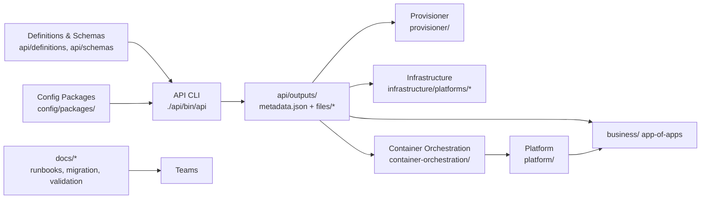
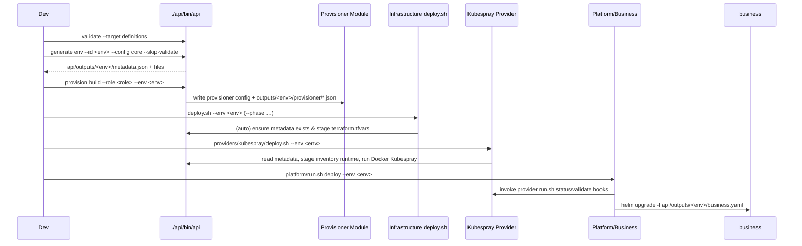

# Modular Infrastructure Architecture (v2)

This document describes how the refactored repository works end-to-end, including data flows, module contracts, and the CLI tooling that keeps everything in sync.

## System Overview



- **API CLI** is the single entry point for validation, environment generation, and provisioner orchestration. All modules consume `api/outputs/<env>/metadata.json`.
- **Config packages** provide reusable environment payloads (terraform vars, provisioner JSON, Kubespray inventory, platform/business values). Version bumps happen in `config/packages/<id>/package.json`.
- **Downstream modules** never handcraft configuration; they read paths listed in `metadata.json → files`.

## Sequence of Operations



## Module Responsibilities

### API (`api/`)

- `cmd/api` exposes `validate`, `generate env`, and `provision build` commands.
- `generate env`:
  - Loads `config/packages/<id>/package.json`.
  - Copies every referenced file/dir into `api/outputs/<env>/`.
  - Writes `metadata.json`:
    ```json
    {
      "environment": "development",
      "configPackage": {"id": "core", "version": "v0.2.0"},
      "generatedAt": "2024-12-02T09:41:55Z",
      "files": {
        "terraform": "/.../api/outputs/development/terraform.tfvars",
        "provisioner": "/.../api/outputs/development/provisioner.json",
        "kubesprayInventory": "/.../api/outputs/development/kubespray",
        "kubesprayConfig": "/.../api/outputs/development/kubesprayConfig.json",
        "business": "/.../api/outputs/development/business.yaml"
      }
    }
    ```
- `provision build`:
  - Reads metadata to find `provisioner` config.
  - Writes artifact metadata to `api/outputs/<env>/provisioner/<role>.json` (checksum, remote storage placeholders).
  - Drops the artifact into `provisioner/outputs/<env>/<role>.img` (current implementation writes a stub; swap in real build when Ansible roles are executed).

### Config (`config/`)

- Each package stores manifests + environment files. Example (`config/packages/core`):
  - `environments/development.terraform.tfvars`: canonical Terraform vars.
  - `environments/development.provisioner.json`: static/dynamic provisioner config.
  - `environments/development.kubespray.json`: metadata for Kubespray provider (inventory source, image tag, SSH key).
  - `environments/development.platform.yaml` / `development.business.yaml`: inputs for Helm/app-of-apps layers.
  - `kubespray/inventory/pn-development/`: canonical inventory tracked under config.
- `config/validate.sh` ensures manifests have valid SemVer versions, required files exist, and version bumps accompany file changes.

### Provisioner (`provisioner/`)

- Consumes the generated `provisioner.json`.
- `provisioner/scripts/smoke-test.sh` exercises CLI orchestration (generate env → provision build).
- Docs (`ORCHESTRATION.md`, `IMPLEMENTATION_PLAN.md`, `README.md`) now describe the API-driven contract and where artifacts land (`provisioner/outputs/<env>/` + `api/outputs/<env>/provisioner/*.json`).

### Infrastructure (`infrastructure/`)

- `deploy.sh` phases:
  1. **bootstrap** – runs `./api/bin/api generate env` if `api/outputs/<env>/metadata.json` is missing.
  2. **images/templates/nodes** – before each Terraform run, `stage_tfvars_for_module` copies the generated `terraform.tfvars` into the module directory.
  3. **ansible** – (legacy hook) remains optional; you can wire it to new providers as needed.
- `infrastructure/environments/<env>.yaml` now only declares `configPackage` + `environment`.
- `platforms/proxmox/terraform/*` house templates/pools/nodes modules; bare metal + cloud directories contain README scaffolds.

### Container Orchestration (`container-orchestration/`)

- `providers/kubespray/deploy.sh` + `validate.sh`:
  - Require `jq`.
  - Read `api/outputs/<env>/metadata.json`.
  - Copy the package-supplied inventory into `providers/kubespray/inventory/current/`.
  - Honor provider settings (SSH key path, Kubespray image tag) defined in `development.kubespray.json`.
- `run.sh` forwards `--env` to `deploy.sh` and marshals high-level operations (`deploy`, `reset`, `scale`, etc.).
- Environment selectors now only pick `configPackage` + `environment`. Any overrides belong in the config package.

### Platform & Business

- `platform/run.sh` now shells out to the configured container-orchestration provider before deploying stacks, ensuring Kubernetes is healthy using the same `--env`.
- Business workflow:
  1. Add an entry to `config/packages/<id>/environments/<env>.business.yaml`.
  2. Bump the package version.
  3. Run `./api/bin/api generate env --id <env> --config <id>`.
  4. Deploy the app-of-apps chart with `-f api/outputs/<env>/business.yaml`.
- Both modules only track package references in their local `environments/<env>.yaml`.

### Docs & Validation

- `docs/general/modular-architecture.md` (this file) explains the system.
- `docs/migration/modular-refactor.md` contains step-by-step guidance for teams transitioning from the legacy layout.
- `docs/validation.md` records the latest dry-run/end-to-end verification (API generate → provision build → infra deploy → Kubespray validate → platform/business dry runs).
- `scripts/backfill-api-outputs.sh` bootstraps metadata for environments created before this refactor.

## Operational Checklist

1. **Validate definitions**
   ```bash
   ./api/bin/api validate --target definitions
   ```
2. **Render environment artifacts**
   ```bash
   ./api/bin/api generate env --id development --config core --skip-validate
   ```
3. **Build provisioner image metadata**
   ```bash
   ./api/bin/api provision build --role k8s-master --env development
   ```
4. **Run infrastructure phases**
   ```bash
   cd infrastructure
   ./deploy.sh --env development --phase images
   ./deploy.sh --env development --phase templates
   ./deploy.sh --env development --phase nodes
   ```
5. **Deploy/validate Kubernetes**
   ```bash
   cd container-orchestration/providers/kubespray
   ./deploy.sh --env development
   ```
6. **Platform + Business**
   ```bash
   cd platform
   ./run.sh deploy --env development
   cd ../business
   helm upgrade --install cluster-apps charts/cluster-apps \
     -f ../api/outputs/development/business.yaml
   ```

## Tips & Troubleshooting

- **Missing metadata** – rerun the bootstrap phase: `./api/bin/api generate env --id <env> --config <pkg> --skip-validate`.
- **Terraform complaining about tfvars** – delete stale `terraform.tfvars` files under `platforms/proxmox/terraform/*` and re-run `infrastructure/deploy.sh`; it will restage the versioned tfvars.
- **Kubespray inventory drift** – update files under `config/packages/<pkg>/kubespray/inventory/<name>/` and bump the package version; the provider scripts automatically copy the updated inventory.
- **Legacy deployments** – use `scripts/backfill-api-outputs.sh` to point metadata at existing tfvars/inventory/business values until you can migrate into config packages.

By following this flow, every layer – from schema validation to business apps – consumes a single, versioned set of artifacts, making cross-team coordination significantly easier. add this to docs README? maybe references. Let's update docs README to link? require? We'll mention there when summarizing. 
