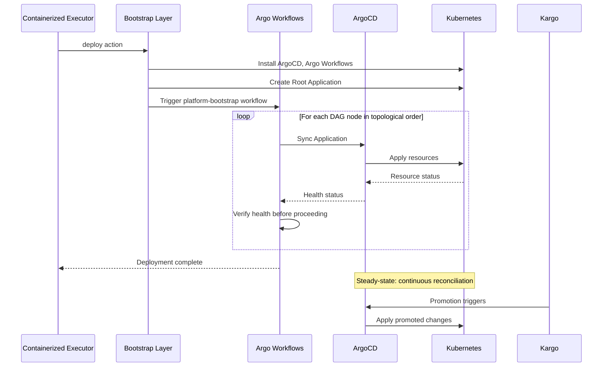

```
RFC-DEPLOY-0001                                              Section 3
Category: Standards Track                          System Architecture
```

# 3. System Architecture

[← Previous: Requirements](./02-requirements.md) | [Index](./00-index.md#table-of-contents) | [Next: Components →](./04-components.md)

---

This section defines the **macro-architecture** of the system: layers, phases,
authority domains, and trust boundaries. No component-level detail is described
here.

---

## 3.1 Architectural Overview

The deployment orchestration system is designed as a **layered, phase-driven
architecture**.

Rather than treating deployment as a single operation, the architecture
explicitly models:

- which system is authoritative at each point in the lifecycle,
- what transitions occur between phases,
- and how authority is handed off between layers.

This avoids the most common failure mode in deployment systems:

> assuming all components exist and are healthy during initial deployment.

At a high level, the platform consists of four conceptual layers:

```
┌─────────────────────────────────────────────────────────────────────────────┐
│                       BOOTSTRAP LAYER                                        │
│  Imperative setup of cluster prerequisites and orchestration primitives     │
│  Authority: Day 0-1 operations                                              │
│  Technology recommendation: Ansible with kubernetes.core collection         │
└─────────────────────────────────────────────────────────────────────────────┘
                                    │
                                    ▼
┌─────────────────────────────────────────────────────────────────────────────┐
│                    ORCHESTRATION LAYER                                       │
│  DAG-based dependency resolution and cross-application sequencing           │
│  Authority: Deployment ordering and health-gated progression                │
│  Technology: Argo Workflows                                                 │
└─────────────────────────────────────────────────────────────────────────────┘
                                    │
                                    ▼
┌─────────────────────────────────────────────────────────────────────────────┐
│                     DEPLOYMENT LAYER                                         │
│  Declarative application state management and continuous reconciliation     │
│  Authority: Application-level sync, drift detection, self-healing           │
│  Technology: ArgoCD                                                         │
└─────────────────────────────────────────────────────────────────────────────┘
                                    │
                                    ▼
┌─────────────────────────────────────────────────────────────────────────────┐
│                      PROMOTION LAYER                                         │
│  Environment-to-environment promotion with verification gates               │
│  Authority: Stage progression and verification                              │
│  Technology: Kargo, Argo Rollouts                                           │
└─────────────────────────────────────────────────────────────────────────────┘
```

Each layer activates in sequence, and authority transfers explicitly at defined
boundaries.

---

## 3.2 Phase Model Overview

The system progresses through **five distinct phases**.

These phases are **logical**, not temporal guarantees — the system MAY remain
in any phase indefinitely during failure or recovery.

---

### Phase 0 — Pre-Bootstrap (Prerequisites)

Phase 0 defines the **exact contract** that MUST be satisfied before bootstrap
can begin. These are hard requirements, not recommendations.

---

#### 3.2.1 Required CLI Tools

The following tools MUST be installed and accessible on the execution host:

| Tool | Minimum Version | Purpose | Verification Command |
|------|-----------------|---------|---------------------|
| `ansible-playbook` | 2.15+ | Playbook execution | `ansible-playbook --version` |
| `kubectl` | 1.28+ | Kubernetes API access | `kubectl version --client` |
| `helm` | 3.12+ | Chart installation | `helm version --short` |
| `kubeseal` | 0.24+ | Secret encryption | `kubeseal --version` |
| `jq` | 1.6+ | JSON processing | `jq --version` |
| `yq` | 4.0+ | YAML processing | `yq --version` |

These tools MUST be present. The executor MUST fail with exit code 3 (Invalid
Configuration) if any required tool is missing.

---

#### 3.2.2 Required Python Dependencies

Ansible requires the following Python packages:

| Package | Purpose |
|---------|---------|
| `kubernetes` | kubernetes.core collection |
| `openshift` | OpenShift integration |
| `pyyaml` | YAML parsing |
| `jsonpatch` | JSON patch operations |

These MUST be installed in the Ansible execution environment.

---

#### 3.2.3 Required Ansible Collections

The following Ansible collections MUST be installed:

| Collection | Minimum Version | Purpose |
|------------|-----------------|---------|
| `kubernetes.core` | 4.0.0 | Kubernetes module support |
| `community.general` | 4.0.0 | General modules |
| `ansible.posix` | 1.0.0 | POSIX operations |
| `ansible.utils` | 5.0.0 | Utility filters |

---

#### 3.2.4 Required Cluster State

The target Kubernetes cluster MUST satisfy:

| Requirement | Verification | Failure Mode |
|-------------|--------------|--------------|
| API server accessible | `kubectl cluster-info` returns without error | Cannot proceed |
| Authentication valid | `kubectl auth can-i create namespace` returns yes | Cannot proceed |
| cluster-admin or equivalent | RBAC check for required permissions | Cannot proceed |
| Container runtime operational | `kubectl get nodes` shows Ready nodes | Cannot proceed |
| DNS resolution working | CoreDNS pods running in kube-system | Cannot proceed |
| At least 3 worker nodes | `kubectl get nodes` count | Warning only |
| Sufficient resources | Node capacity check | Warning only |

---

#### 3.2.5 Required External Connectivity

The cluster MUST be able to reach:

| Endpoint | Purpose | Protocol |
|----------|---------|----------|
| Container registries | Image pull | HTTPS (443) |
| Git repository | Manifest source | HTTPS (443) |
| Helm repositories | Chart download | HTTPS (443) |

Air-gapped deployments MUST pre-populate an internal registry and configure
appropriate mirror settings.

---

#### 3.2.6 Required Credentials

The following credentials MUST be available:

| Credential | Format | Source |
|------------|--------|--------|
| Kubeconfig | File or base64-encoded | Mounted or environment |
| Git repository access | SSH key or token | Mounted secret |
| Container registry auth | Docker config JSON | Mounted secret |
| DNS provider credentials | Provider-specific | Mounted secret |

---

#### 3.2.7 What Does NOT Exist

At Phase 0, the following MUST NOT exist (or MUST be absent for clean install):

- ArgoCD namespace and resources
- Argo Workflows namespace and resources
- Argo Events namespace and resources
- Platform application namespaces
- Sealed-secrets controller (unless pre-existing key must be preserved)

If these exist from a previous installation, teardown MUST be executed first.

---

#### 3.2.8 Phase 0 Outputs

Phase 0 produces:

| Output | Description |
|--------|-------------|
| Validation report | Pass/fail status for each prerequisite |
| Cluster inventory | Node count, versions, capacity |
| Connectivity report | External endpoint reachability |
| Credential verification | Authentication success confirmation |

Phase 0 MUST NOT modify any cluster state. It is purely diagnostic.

---

### Phase 1 — Bootstrap (Day 0-1)

**What exists**

- Kubernetes cluster
- Bootstrap credentials and configuration

**What is created**

- ArgoCD and required CRDs
- Argo Workflows and ClusterWorkflowTemplates
- Argo Events (EventBus, EventSources, Sensors)
- Automation credentials for cross-system integration
- Root Application defining GitOps handoff point

**Authority**

Bootstrap layer (Ansible-recommended)

**Purpose**

- Establish orchestration primitives
- Create foundation for declarative management
- Define the point where GitOps takes over

---

### Phase 2 — Orchestration (DAG Execution)

**What exists**

- All orchestration primitives from Phase 1
- Dependency DAG specification

**What is created**

- Platform stacks deployed in dependency order
- All ArgoCD Applications created and synced
- Health verification completed for each node

**Authority**

Argo Workflows

**Purpose**

- Execute deployment DAG in topological order
- Gate progression on health verification
- Handle transient failures with retry logic

---

### Phase 3 — Steady-State (Day 2+)

**What exists**

- All platform applications deployed and healthy
- ArgoCD managing continuous reconciliation
- Promotion pipelines operational

**What happens**

- ArgoCD detects and corrects drift
- Kargo promotes changes through environments
- Argo Rollouts manages progressive delivery
- Argo Events triggers automation workflows

**Authority**

- ArgoCD for application state
- Kargo for promotion
- Argo Rollouts for delivery strategies

**Purpose**

- Maintain platform health without human intervention
- Enable GitOps-driven changes
- Support ongoing operations

---

### Phase 4 — Teardown (Optional)

**What exists**

- Running platform from Phase 3

**What is removed**

- Applications in reverse dependency order
- Orchestration primitives
- Platform namespaces and resources

**Authority**

Argo Workflows (or bootstrap layer for final cleanup)

**Purpose**

- Gracefully remove platform components
- Ensure no orphaned resources
- Return cluster to clean state

---

## 3.3 Authority Domains

A core design principle is that **authority MUST be singular and explicit at
every phase**.

At no point MAY two systems be equally authoritative for the same concern.

---

### Authority by Layer

| Layer         | Authority Domain                                        |
| ------------- | ------------------------------------------------------- |
| Bootstrap     | Cluster prerequisites, orchestration primitive install  |
| Orchestration | Cross-application dependency resolution, DAG execution  |
| Deployment    | Application sync, drift detection, self-healing         |
| Promotion     | Environment progression, verification, delivery strategy|

---

### Authority by Component

| Component      | Is Authoritative For                           | Is NOT Authoritative For        |
| -------------- | ---------------------------------------------- | ------------------------------- |
| Ansible        | Day 0-1 setup, ArgoCD installation             | Application state, ordering     |
| Argo Workflows | Deployment sequence, health gates              | Application configuration       |
| ArgoCD         | Application state reconciliation               | Cross-app ordering              |
| Kargo          | Promotion between environments                 | Application deployment          |
| Argo Rollouts  | Progressive delivery strategies                | Deployment ordering             |
| Argo Events    | Event-driven triggers                          | Deployment logic                |

---

### Authority Transitions

Authority transfers occur at explicit handoff points:

1. **Bootstrap → Orchestration**
   When ArgoCD and Argo Workflows are operational, bootstrap layer completes
   and triggers orchestration workflow.

2. **Orchestration → Deployment**
   When DAG execution completes successfully, Argo Workflows yields authority
   to ArgoCD for ongoing reconciliation.

3. **Deployment → Promotion**
   When applications are stable, Kargo takes authority for promoting changes
   across environments.

---

## 3.4 Trust Boundaries

The architecture defines explicit trust boundaries between systems.

---

### Bootstrap Trust Boundary

```
┌─────────────────────────────────────────────────────────────────────────────┐
│                          EXTERNAL TRUST ZONE                                 │
│  - Operator workstation or automation system                                │
│  - Configuration repository                                                 │
│  - Container registry                                                       │
└─────────────────────────────────────────────────────────────────────────────┘
                                    │
                           kubeconfig, credentials
                                    ▼
┌─────────────────────────────────────────────────────────────────────────────┐
│                          CLUSTER TRUST ZONE                                  │
│  - Kubernetes API                                                           │
│  - Bootstrap controller                                                     │
└─────────────────────────────────────────────────────────────────────────────┘
```

The bootstrap layer bridges external and cluster trust zones using credentials
that MUST be rotated after initial setup.

---

### Orchestration Trust Boundary

```
┌─────────────────────────────────────────────────────────────────────────────┐
│                    ORCHESTRATION TRUST ZONE                                  │
│  - Argo Workflows controller                                                │
│  - ClusterWorkflowTemplates                                                 │
│  - Automation service accounts                                              │
└─────────────────────────────────────────────────────────────────────────────┘
                                    │
                           ArgoCD API, health queries
                                    ▼
┌─────────────────────────────────────────────────────────────────────────────┐
│                     DEPLOYMENT TRUST ZONE                                    │
│  - ArgoCD Application Controller                                            │
│  - Application resources                                                    │
│  - Kubernetes API                                                           │
└─────────────────────────────────────────────────────────────────────────────┘
```

Argo Workflows communicates with ArgoCD through its API, not by directly
manipulating Kubernetes resources managed by ArgoCD.

---

### External Trust Boundary

```
┌─────────────────────────────────────────────────────────────────────────────┐
│                         EXTERNAL SYSTEMS                                     │
│  - Git repositories (source of intent)                                      │
│  - Container registries (image artifacts)                                   │
│  - Secret stores (external credentials)                                     │
└─────────────────────────────────────────────────────────────────────────────┘
                                    │
                           pull only, validated sources
                                    ▼
┌─────────────────────────────────────────────────────────────────────────────┐
│                         CLUSTER SYSTEMS                                      │
│  - ArgoCD (consumes Git)                                                    │
│  - Kubernetes (consumes images)                                             │
│  - External Secrets Operator (consumes secrets)                             │
└─────────────────────────────────────────────────────────────────────────────┘
```

External systems provide inputs to the cluster. The cluster MUST NOT have
write access to external sources of truth.

---

## 3.5 High-Level Control Flow

The system operates as a **one-way progression**:

1. **Bootstrap establishes primitives**
2. **Orchestration executes DAG**
3. **Deployment maintains state**
4. **Promotion advances environments**

---

### High-Level Sequence



---

## 3.6 Failure Domains and Recovery

The phase model enables **bounded failure domains**.

---

### Bootstrap Failure

- **Impact**: Orchestration cannot start
- **Recovery**: Re-run bootstrap with same inputs (idempotent)
- **Steady-state impact**: None (not yet reached)

---

### Orchestration Failure

- **Impact**: Dependent applications not deployed
- **Recovery**: Resume workflow from failure point
- **Steady-state impact**: Partial platform, explicitly known

---

### Deployment Failure (Steady-State)

- **Impact**: Individual application degraded
- **Recovery**: ArgoCD self-healing or manual sync
- **Platform impact**: Isolated to failing application

---

### Promotion Failure

- **Impact**: Environment progression blocked
- **Recovery**: Re-run promotion or manual intervention
- **Platform impact**: Current environment unaffected

---

### Cluster Loss

- **Recovery from**:
  - Git repository (source of intent)
  - Container registry (application images)
  - External secret store (credentials)
- **Process**: Re-execute from Phase 0

---

## 3.7 Runtime Dependency Failure Semantics

This section addresses a critical operational question:

> If Application B depends on Application A, and A becomes unhealthy after B
> was successfully deployed, what happens to B?

---

### 3.7.1 The Answer: Nothing Automatic

**Application B is NOT automatically removed, deleted, or modified.**

Dependencies are enforced **at deployment time**, not at runtime.

The orchestration system guarantees:
- B will not **begin deployment** until A is Healthy
- B will not **complete deployment** until B itself is Healthy

The orchestration system does NOT guarantee:
- B will remain healthy if A becomes unhealthy
- B will be removed if A is removed
- B will be notified if A degrades

---

### 3.7.2 Rationale

This is an intentional design choice:

1. **Cascading deletions are dangerous**
   Automatically deleting B because A is unhealthy could cascade through the
   entire platform, causing total outage from a single transient failure.

2. **Applications should be resilient**
   Well-designed applications handle dependency unavailability gracefully
   (retry, circuit breaker, degraded mode). Forcing deletion removes this
   possibility.

3. **Recovery is easier with B still deployed**
   When A recovers, B can immediately resume normal operation. If B were
   deleted, it would need to be re-deployed.

4. **Operational visibility is preserved**
   Operators can see that B is unhealthy because A is unavailable. Automatic
   deletion would hide this relationship.

---

### 3.7.3 What DOES Happen

When A becomes unhealthy:

| Component | Behavior |
|-----------|----------|
| Application B | Continues running, may become unhealthy due to dependency |
| ArgoCD | Reports A as Degraded, B health depends on its own probes |
| Prometheus | Alerts fire for A's degraded status |
| Operators | Notified of A's failure, investigate root cause |

---

### 3.7.4 Explicit Teardown for Dependency Removal

If A must be removed:

1. **Teardown workflow** executes in reverse dependency order
2. B is deleted first (because B depends on A)
3. A is deleted only after B is confirmed removed
4. This is **explicit**, not automatic

---

### 3.7.5 Steady-State Health Monitoring

During steady-state (Phase 3), health is monitored but not enforced:

```
Dependency Enforcement:  DEPLOYMENT-TIME ONLY
Health Monitoring:       CONTINUOUS
Automatic Remediation:   NONE (except ArgoCD drift correction)
```

This is consistent with Kubernetes' own behavior: a Pod is not deleted because
a Service it depends on becomes unavailable.

---

## 3.8 Bootstrap Timing Analysis

This section addresses deployment duration and scaling characteristics.

---

### 3.8.1 Platform Bootstrap Duration

For the current platform (43 applications across 7 dependency layers):

| Phase | Duration Range | Primary Bottleneck |
|-------|----------------|-------------------|
| Phase 0 (Pre-Bootstrap) | ~30 seconds | Connectivity checks |
| Phase 1 (Bootstrap) | 5-10 minutes | ArgoCD pod readiness |
| Phase 2 (Orchestration) | 30-60 minutes | Ceph cluster formation |
| **Total** | **35-70 minutes** | Storage initialization |

---

### 3.8.2 Layer-by-Layer Timing

| Layer | Applications | Typical Duration | Parallelism |
|-------|--------------|------------------|-------------|
| 0: Foundation | 3 (MetalLB, cert-manager, sealed-secrets) | 2-3 min | Full |
| 1: Storage | 5 (Ceph op, cluster, PG op, Redis op) | 15-25 min | Limited |
| 2: Core Infrastructure | 2 (ingress, external-dns) | 2-3 min | Full |
| 3: Security | 5 (Vault, ESO, Keycloak, Kyverno) | 5-8 min | Partial |
| 4: Data | 3 (PG clusters, Redis clusters) | 5-10 min | Partial |
| 5: Platform Services | 4 (Prometheus, Grafana, Loki, Tempo) | 5-8 min | Partial |
| 6: Developer Platform | 5 (Harbor, Backstage, Tekton) | 5-10 min | Partial |
| 7: Application Infrastructure | 3 (Temporal, Kargo, Rollouts) | 3-5 min | Partial |

**Critical path**: Layer 1 (Ceph) dominates total duration.

---

### 3.8.3 Scaling Characteristics

**Linear scaling with caveat**:

| Application Count | Estimated Duration | Notes |
|-------------------|-------------------|-------|
| 43 (current) | 35-70 min | Production baseline |
| 60 | 45-85 min | +30% if new apps in existing layers |
| 100 | 60-120 min | +70% if new layers added |
| 100+ | 90-180 min | Depends on dependency depth |

**Why not worse?**

- Parallelism within layers bounds per-layer time
- Only sequential across layers, not within
- Adding apps to existing layers adds minimal time
- Adding new dependency layers adds significant time

---

### 3.8.4 Timing Optimization Strategies

**What reduces duration**:
- Pre-pulling images to nodes
- SSD-backed storage for Ceph OSD formation
- Increased Argo Workflows parallelism
- Larger node instance types

**What does NOT reduce duration**:
- More applications in parallel (already maximized)
- More Argo Workflows controller replicas
- Skipping health checks (violates invariants)

---

### 3.8.5 Timeout Configuration

Default timeouts per application type:

| Application Type | Sync Timeout | Health Timeout |
|------------------|--------------|----------------|
| Simple deployment | 5 min | 5 min |
| Operator installation | 10 min | 10 min |
| Ceph cluster | 30 min | 30 min |
| Database cluster | 15 min | 15 min |
| Vault (with unseal) | 15 min | 15 min |

These are configurable per-node in the DAG specification.

---

## 3.9 Environment Scope

### 3.9.1 Single Production Environment

This RFC addresses **single-cluster, single-environment** deployment.

The platform deploys to **production only**. There is no:
- Development environment promotion
- Staging environment progression
- Multi-environment Kargo pipelines

---

### 3.9.2 Implications

**Kargo Usage**: Limited to application workload promotion, not platform
infrastructure promotion.

**Promotion Layer**: Effectively unused for platform deployment. The four-layer
architecture simplifies to three active layers during platform bootstrap:
- Bootstrap Layer
- Orchestration Layer
- Deployment Layer

---

### 3.9.3 Multi-Environment Deferral

Multi-environment platform deployment is explicitly deferred to
[Section 9: Future Considerations](./09-evolution.md).

When multi-environment is implemented:
- Each environment will have its own cluster
- Platform deployment will execute independently per cluster
- No cross-cluster orchestration in initial design

---

## 3.10 Summary

This high-level architecture establishes:

- A **clear four-layer model** with explicit responsibilities
- **Five deployment phases** with defined transitions
- **Singular authority** at every point
- **Explicit trust boundaries** between systems
- **Bounded failure domains** with recovery paths

It intentionally delays component-level detail until the system's **shape and
rules** are unambiguous.

---

## Document Navigation

| Previous | Index | Next |
|----------|-------|------|
| [← 2. Requirements](./02-requirements.md) | [Table of Contents](./00-index.md#table-of-contents) | [4. Components →](./04-components.md) |

---

*End of Section 3*
