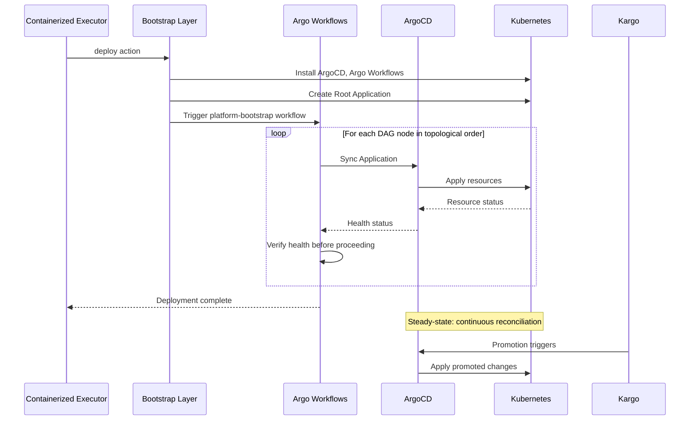

```
RFC-DEPLOY-0001                                              Section 3
Category: Standards Track                          System Architecture
```

# 3. System Architecture

[← Previous: Requirements](./02-requirements.md) | [Index](./00-index.md#table-of-contents) | [Next: Components →](./04-components.md)

---

This section defines the **macro-architecture** of the system: layers, phases,
authority domains, and trust boundaries. No component-level detail is described
here.

---

## 3.1 Architectural Overview

The deployment orchestration system is designed as a **layered, phase-driven
architecture**.

Rather than treating deployment as a single operation, the architecture
explicitly models:

- which system is authoritative at each point in the lifecycle,
- what transitions occur between phases,
- and how authority is handed off between layers.

This avoids the most common failure mode in deployment systems:

> assuming all components exist and are healthy during initial deployment.

At a high level, the platform consists of four conceptual layers:

```
┌─────────────────────────────────────────────────────────────────────────────┐
│                       BOOTSTRAP LAYER                                        │
│  Imperative setup of cluster prerequisites and orchestration primitives     │
│  Authority: Day 0-1 operations                                              │
│  Technology recommendation: Ansible with kubernetes.core collection         │
└─────────────────────────────────────────────────────────────────────────────┘
                                    │
                                    ▼
┌─────────────────────────────────────────────────────────────────────────────┐
│                    ORCHESTRATION LAYER                                       │
│  DAG-based dependency resolution and cross-application sequencing           │
│  Authority: Deployment ordering and health-gated progression                │
│  Technology: Argo Workflows                                                 │
└─────────────────────────────────────────────────────────────────────────────┘
                                    │
                                    ▼
┌─────────────────────────────────────────────────────────────────────────────┐
│                     DEPLOYMENT LAYER                                         │
│  Declarative application state management and continuous reconciliation     │
│  Authority: Application-level sync, drift detection, self-healing           │
│  Technology: ArgoCD                                                         │
└─────────────────────────────────────────────────────────────────────────────┘
                                    │
                                    ▼
┌─────────────────────────────────────────────────────────────────────────────┐
│                      PROMOTION LAYER                                         │
│  Environment-to-environment promotion with verification gates               │
│  Authority: Stage progression and verification                              │
│  Technology: Kargo, Argo Rollouts                                           │
└─────────────────────────────────────────────────────────────────────────────┘
```

Each layer activates in sequence, and authority transfers explicitly at defined
boundaries.

---

## 3.2 Phase Model Overview

The system progresses through **five distinct phases**.

These phases are **logical**, not temporal guarantees — the system MAY remain
in any phase indefinitely during failure or recovery.

---

### Phase 0 — Pre-Bootstrap (Prerequisites)

**What exists**

- Kubernetes cluster with API accessibility
- Container runtime operational
- Network connectivity established

**What does not exist**

- ArgoCD
- Argo Workflows
- Any platform applications

**Authority**

External (operator or automation system invoking the executor)

**Purpose**

- Verify cluster is ready for bootstrap
- Validate connectivity and prerequisites

---

### Phase 1 — Bootstrap (Day 0-1)

**What exists**

- Kubernetes cluster
- Bootstrap credentials and configuration

**What is created**

- ArgoCD and required CRDs
- Argo Workflows and ClusterWorkflowTemplates
- Argo Events (EventBus, EventSources, Sensors)
- Automation credentials for cross-system integration
- Root Application defining GitOps handoff point

**Authority**

Bootstrap layer (Ansible-recommended)

**Purpose**

- Establish orchestration primitives
- Create foundation for declarative management
- Define the point where GitOps takes over

---

### Phase 2 — Orchestration (DAG Execution)

**What exists**

- All orchestration primitives from Phase 1
- Dependency DAG specification

**What is created**

- Platform stacks deployed in dependency order
- All ArgoCD Applications created and synced
- Health verification completed for each node

**Authority**

Argo Workflows

**Purpose**

- Execute deployment DAG in topological order
- Gate progression on health verification
- Handle transient failures with retry logic

---

### Phase 3 — Steady-State (Day 2+)

**What exists**

- All platform applications deployed and healthy
- ArgoCD managing continuous reconciliation
- Promotion pipelines operational

**What happens**

- ArgoCD detects and corrects drift
- Kargo promotes changes through environments
- Argo Rollouts manages progressive delivery
- Argo Events triggers automation workflows

**Authority**

- ArgoCD for application state
- Kargo for promotion
- Argo Rollouts for delivery strategies

**Purpose**

- Maintain platform health without human intervention
- Enable GitOps-driven changes
- Support ongoing operations

---

### Phase 4 — Teardown (Optional)

**What exists**

- Running platform from Phase 3

**What is removed**

- Applications in reverse dependency order
- Orchestration primitives
- Platform namespaces and resources

**Authority**

Argo Workflows (or bootstrap layer for final cleanup)

**Purpose**

- Gracefully remove platform components
- Ensure no orphaned resources
- Return cluster to clean state

---

## 3.3 Authority Domains

A core design principle is that **authority MUST be singular and explicit at
every phase**.

At no point MAY two systems be equally authoritative for the same concern.

---

### Authority by Layer

| Layer         | Authority Domain                                        |
| ------------- | ------------------------------------------------------- |
| Bootstrap     | Cluster prerequisites, orchestration primitive install  |
| Orchestration | Cross-application dependency resolution, DAG execution  |
| Deployment    | Application sync, drift detection, self-healing         |
| Promotion     | Environment progression, verification, delivery strategy|

---

### Authority by Component

| Component      | Is Authoritative For                           | Is NOT Authoritative For        |
| -------------- | ---------------------------------------------- | ------------------------------- |
| Ansible        | Day 0-1 setup, ArgoCD installation             | Application state, ordering     |
| Argo Workflows | Deployment sequence, health gates              | Application configuration       |
| ArgoCD         | Application state reconciliation               | Cross-app ordering              |
| Kargo          | Promotion between environments                 | Application deployment          |
| Argo Rollouts  | Progressive delivery strategies                | Deployment ordering             |
| Argo Events    | Event-driven triggers                          | Deployment logic                |

---

### Authority Transitions

Authority transfers occur at explicit handoff points:

1. **Bootstrap → Orchestration**
   When ArgoCD and Argo Workflows are operational, bootstrap layer completes
   and triggers orchestration workflow.

2. **Orchestration → Deployment**
   When DAG execution completes successfully, Argo Workflows yields authority
   to ArgoCD for ongoing reconciliation.

3. **Deployment → Promotion**
   When applications are stable, Kargo takes authority for promoting changes
   across environments.

---

## 3.4 Trust Boundaries

The architecture defines explicit trust boundaries between systems.

---

### Bootstrap Trust Boundary

```
┌─────────────────────────────────────────────────────────────────────────────┐
│                          EXTERNAL TRUST ZONE                                 │
│  - Operator workstation or automation system                                │
│  - Configuration repository                                                 │
│  - Container registry                                                       │
└─────────────────────────────────────────────────────────────────────────────┘
                                    │
                           kubeconfig, credentials
                                    ▼
┌─────────────────────────────────────────────────────────────────────────────┐
│                          CLUSTER TRUST ZONE                                  │
│  - Kubernetes API                                                           │
│  - Bootstrap controller                                                     │
└─────────────────────────────────────────────────────────────────────────────┘
```

The bootstrap layer bridges external and cluster trust zones using credentials
that MUST be rotated after initial setup.

---

### Orchestration Trust Boundary

```
┌─────────────────────────────────────────────────────────────────────────────┐
│                    ORCHESTRATION TRUST ZONE                                  │
│  - Argo Workflows controller                                                │
│  - ClusterWorkflowTemplates                                                 │
│  - Automation service accounts                                              │
└─────────────────────────────────────────────────────────────────────────────┘
                                    │
                           ArgoCD API, health queries
                                    ▼
┌─────────────────────────────────────────────────────────────────────────────┐
│                     DEPLOYMENT TRUST ZONE                                    │
│  - ArgoCD Application Controller                                            │
│  - Application resources                                                    │
│  - Kubernetes API                                                           │
└─────────────────────────────────────────────────────────────────────────────┘
```

Argo Workflows communicates with ArgoCD through its API, not by directly
manipulating Kubernetes resources managed by ArgoCD.

---

### External Trust Boundary

```
┌─────────────────────────────────────────────────────────────────────────────┐
│                         EXTERNAL SYSTEMS                                     │
│  - Git repositories (source of intent)                                      │
│  - Container registries (image artifacts)                                   │
│  - Secret stores (external credentials)                                     │
└─────────────────────────────────────────────────────────────────────────────┘
                                    │
                           pull only, validated sources
                                    ▼
┌─────────────────────────────────────────────────────────────────────────────┐
│                         CLUSTER SYSTEMS                                      │
│  - ArgoCD (consumes Git)                                                    │
│  - Kubernetes (consumes images)                                             │
│  - External Secrets Operator (consumes secrets)                             │
└─────────────────────────────────────────────────────────────────────────────┘
```

External systems provide inputs to the cluster. The cluster MUST NOT have
write access to external sources of truth.

---

## 3.5 High-Level Control Flow

The system operates as a **one-way progression**:

1. **Bootstrap establishes primitives**
2. **Orchestration executes DAG**
3. **Deployment maintains state**
4. **Promotion advances environments**

---

### High-Level Sequence



---

## 3.6 Failure Domains and Recovery

The phase model enables **bounded failure domains**.

---

### Bootstrap Failure

- **Impact**: Orchestration cannot start
- **Recovery**: Re-run bootstrap with same inputs (idempotent)
- **Steady-state impact**: None (not yet reached)

---

### Orchestration Failure

- **Impact**: Dependent applications not deployed
- **Recovery**: Resume workflow from failure point
- **Steady-state impact**: Partial platform, explicitly known

---

### Deployment Failure (Steady-State)

- **Impact**: Individual application degraded
- **Recovery**: ArgoCD self-healing or manual sync
- **Platform impact**: Isolated to failing application

---

### Promotion Failure

- **Impact**: Environment progression blocked
- **Recovery**: Re-run promotion or manual intervention
- **Platform impact**: Current environment unaffected

---

### Cluster Loss

- **Recovery from**:
  - Git repository (source of intent)
  - Container registry (application images)
  - External secret store (credentials)
- **Process**: Re-execute from Phase 0

---

## 3.7 Summary

This high-level architecture establishes:

- A **clear four-layer model** with explicit responsibilities
- **Five deployment phases** with defined transitions
- **Singular authority** at every point
- **Explicit trust boundaries** between systems
- **Bounded failure domains** with recovery paths

It intentionally delays component-level detail until the system's **shape and
rules** are unambiguous.

---

## Document Navigation

| Previous | Index | Next |
|----------|-------|------|
| [← 2. Requirements](./02-requirements.md) | [Table of Contents](./00-index.md#table-of-contents) | [4. Components →](./04-components.md) |

---

*End of Section 3*
