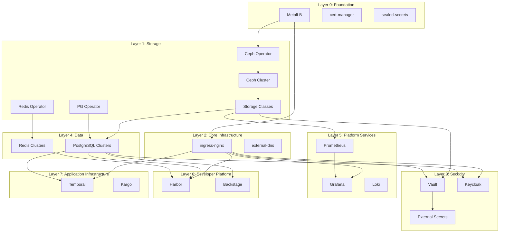
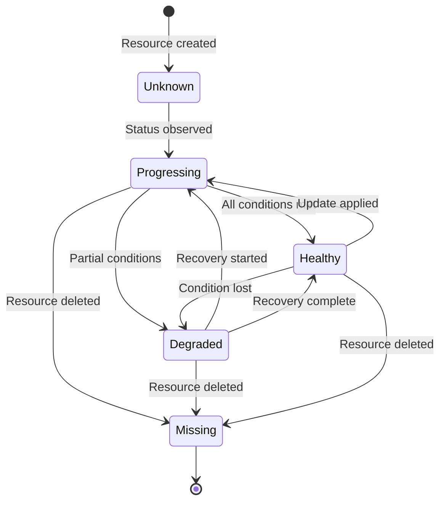

```
RFC-DEPLOY-0001                                              Section 5
Category: Standards Track                     Orchestration Mechanics
```

# 5. Orchestration Mechanics

[← Previous: Components](./04-components.md) | [Index](./00-index.md#table-of-contents) | [Next: Lifecycle Management →](./06-lifecycle-management.md)

---

This section defines the **mechanics of deployment orchestration**: how
dependencies are modeled, how execution proceeds, and how health status
propagates through the system.

---

## 5.1 Dependency DAG Specification

### DAG Fundamentals

Platform deployment dependencies form a Directed Acyclic Graph (DAG) where:

- **Nodes** represent deployable units (stacks or applications)
- **Edges** represent dependency relationships
- **Direction** flows from dependency to dependent

The graph MUST be acyclic. Circular dependencies are forbidden and MUST be
detected during validation.

---

### Node Types

**Stack Node**

A logical grouping of related applications deployed as a unit.

Properties:
- Contains one or more Application nodes
- Has inter-stack dependencies
- Deployed atomically (all applications or none)

**Application Node**

A single ArgoCD Application representing a deployable component.

Properties:
- References ArgoCD Application resource
- Has health status (Healthy, Progressing, Degraded, Unknown)
- May have intra-stack dependencies

**Resource Node** (optional granularity)

A specific Kubernetes resource type within an Application.

Properties:
- Used for fine-grained CRD dependencies
- Verifies specific resource existence and health
- Typically for operator → instance relationships

---

### Edge Semantics

**Hard Dependency**

Deployment MUST NOT proceed until the dependency is Healthy.

A hard dependency indicates that the dependent cannot function without the
dependency being operational.

**Soft Dependency** (future consideration)

Deployment MAY proceed if the dependency is unavailable, with degraded
functionality.

Soft dependencies are NOT implemented in the initial architecture. All
dependencies are treated as hard dependencies.

---

### Cycle Detection

Before execution, the DAG MUST be validated for cycles.

If a cycle is detected:
- Execution MUST NOT proceed
- The cycle MUST be reported with involved nodes
- Human intervention is required to resolve

---

## 5.2 Platform Dependency Layers

The platform applications organize into logical layers based on their
dependencies.

---

### Layer 0: Foundation

Applications with no platform dependencies. These form the base infrastructure.

| Application | Purpose |
|-------------|---------|
| MetalLB | LoadBalancer IP allocation |
| cert-manager | TLS certificate management |
| sealed-secrets | Secret encryption at rest |

**Characteristics**:
- Deploy first in parallel
- No health dependencies within layer
- Required by all subsequent layers

---

### Layer 1: Storage

Storage infrastructure required by stateful applications.

| Application | Depends On |
|-------------|------------|
| Ceph Operator | Foundation (MetalLB) |
| Ceph Cluster | Ceph Operator |
| Storage Classes | Ceph Cluster |
| Zalando PostgreSQL Operator | Foundation |
| Redis Operator | Foundation |

**Characteristics**:
- Operators must be healthy before instances
- Storage classes enable PVC provisioning
- Database operators enable managed instances

---

### Layer 2: Core Infrastructure

Core platform services required by applications.

| Application | Depends On |
|-------------|------------|
| ingress-nginx | MetalLB |
| external-dns | Foundation |

**Characteristics**:
- Enables external access to services
- Required for applications with Ingress resources

---

### Layer 3: Security

Security and identity services.

| Application | Depends On |
|-------------|------------|
| Vault | Storage Classes, ingress-nginx |
| External Secrets Operator | Foundation |
| External Secrets (ClusterSecretStore) | Vault, External Secrets Operator |
| Keycloak | PostgreSQL instance, ingress-nginx |
| Kyverno | Foundation |

**Characteristics**:
- Vault requires persistent storage
- External Secrets bridges Vault to Kubernetes
- Keycloak requires database and ingress

---

### Layer 4: Data

Database instances and data services.

| Application | Depends On |
|-------------|------------|
| PostgreSQL Clusters | PostgreSQL Operator, Storage Classes |
| Redis Clusters | Redis Operator |

**Characteristics**:
- Instances require operators to be healthy
- Provide storage for application state

---

### Layer 5: Platform Services

Observability and platform tooling.

| Application | Depends On |
|-------------|------------|
| Prometheus | Storage Classes |
| Grafana | Prometheus, ingress-nginx |
| Loki | Storage Classes |
| Tempo | Storage Classes |

**Characteristics**:
- Observability stack for platform monitoring
- May have internal dependencies (Grafana → Prometheus)

---

### Layer 6: Developer Platform

Developer-facing services and registries.

| Application | Depends On |
|-------------|------------|
| Harbor | PostgreSQL, Redis, Storage Classes, ingress-nginx |
| Backstage | PostgreSQL, ingress-nginx |
| Tekton | Foundation |

**Characteristics**:
- Container and package registries
- Developer portal services

---

### Layer 7: Application Infrastructure

Application runtime infrastructure.

| Application | Depends On |
|-------------|------------|
| Temporal | PostgreSQL, ingress-nginx |
| Kargo | ArgoCD (already installed) |
| Argo Rollouts | Foundation |

**Characteristics**:
- Workflow orchestration for applications
- Progressive delivery tooling

---

### Layer Visualization



---

## 5.3 Execution Semantics

### Topological Ordering

Nodes are executed in topological order based on the dependency DAG.

**Topological sort** produces an ordering where every node appears after all
its dependencies.

For nodes with no mutual dependencies (same layer), execution MAY proceed
in parallel.

---

### Execution Algorithm

```
1. Validate DAG (no cycles)
2. Compute topological order
3. Group nodes into execution waves (nodes with satisfied dependencies)
4. For each wave:
   a. Execute all nodes in parallel
   b. Wait for all nodes to complete
   c. Verify health status for each node
   d. Proceed to next wave only if all nodes Healthy
5. Report completion status
```

---

### Parallel Execution Rules

Within a wave, nodes MAY execute in parallel if:

- They have no dependencies on each other
- Cluster resources can support concurrent deployments
- No explicit serialization is required

Parallelization is an optimization. Correctness MUST NOT depend on parallel
execution.

---

### Health Verification Between Waves

Before proceeding to the next wave:

- All nodes in the current wave MUST report Healthy status
- Progressing status requires waiting
- Degraded or Failed status halts execution
- Unknown status is treated as failure

---

### Timeout and Retry Policies

**Node Timeout**

Each node has a maximum execution time. If health is not achieved within the
timeout, the node fails.

Timeout values SHOULD be:
- Configurable per node type
- Longer for complex resources (Ceph cluster, databases)
- Shorter for simple deployments

**Retry Policy**

Transient failures MAY trigger automatic retry:
- Maximum retry count (e.g., 3 attempts)
- Exponential backoff between retries
- Final failure after exhausting retries

---

## 5.4 Sync Wave Consolidation

### Current State

The platform currently uses sync waves ranging from -30 to +50:

- Large negative waves for foundational components
- Zero for default priority
- Large positive waves for dependent applications

This wide range is difficult to maintain and does not express cross-Application
dependencies.

---

### Target State

Consolidate to **seven meaningful waves** aligned with dependency layers:

| Wave | Purpose | Example Applications |
|------|---------|---------------------|
| -3 | CRDs and Operators | Ceph Operator, PostgreSQL Operator |
| -2 | Storage Foundation | Ceph Cluster, Storage Classes |
| -1 | Core Platform Services | Vault, MetalLB, External Secrets |
| 0 | Platform Infrastructure | ingress-nginx, cert-manager |
| 1 | Database Instances | PostgreSQL clusters, Redis clusters |
| 2 | Application Infrastructure | Temporal, message queues |
| 3+ | Application Stacks | Per-stack internal waves |

---

### Wave Semantics

Sync waves order resources **within a single Application**.

For cross-Application ordering, waves alone are insufficient. The orchestration
layer provides cross-Application ordering through DAG execution.

Waves SHOULD be used for:
- CRD before instances (within same Application)
- Namespace before resources
- ConfigMap/Secret before Deployment

Waves MUST NOT be used for:
- Cross-Application dependencies
- Cross-stack dependencies
- Health-gated progression

---

## 5.5 Health Propagation Contracts

### The Problem

ArgoCD version 1.8+ removed automatic health assessment for Application
resources. This means:

- Nested Applications (App-of-Apps) do not propagate health
- Parent Application shows Healthy even if children are Degraded
- Sync waves on Application resources do not wait for child health

This breaks health-gated deployment progression.

---

### The Solution

ArgoCD MUST be configured with custom health checks that restore Application
health propagation.

The following configuration MUST be applied to the ArgoCD ConfigMap:

**Application Health Check**

```
resource.customizations.health.argoproj.io_Application: |
  hs = {}
  hs.status = "Progressing"
  hs.message = ""
  if obj.status ~= nil then
    if obj.status.health ~= nil then
      hs.status = obj.status.health.status
      if obj.status.health.message ~= nil then
        hs.message = obj.status.health.message
      end
    end
  end
  return hs
```

This Lua script propagates the Application's health status to its parent.

---

### CRD-Specific Health Checks

Custom health checks MUST be defined for operator-managed resources:

**CephCluster**

Health is Healthy when:
- Phase equals "Ready"
- Health status equals "HEALTH_OK"

**PostgreSQL (Zalando)**

Health is Healthy when:
- Cluster status equals "Running"
- Number of ready replicas equals desired replicas

**Vault**

Health is Healthy when:
- Vault is initialized
- Vault is unsealed
- Active node exists

---

### Health Status State Machine



---

### Health Aggregation Rules

For aggregated health (stack or platform level):

| Child Status | Parent Status |
|--------------|---------------|
| All Healthy | Healthy |
| Any Progressing (none Failed) | Progressing |
| Any Degraded (none Failed) | Degraded |
| Any Failed | Failed |
| Any Missing | Degraded |

---

## Document Navigation

| Previous | Index | Next |
|----------|-------|------|
| [← 4. Components](./04-components.md) | [Table of Contents](./00-index.md#table-of-contents) | [6. Lifecycle Management →](./06-lifecycle-management.md) |

---

*End of Section 5*
