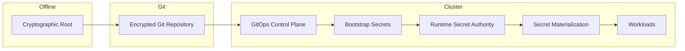
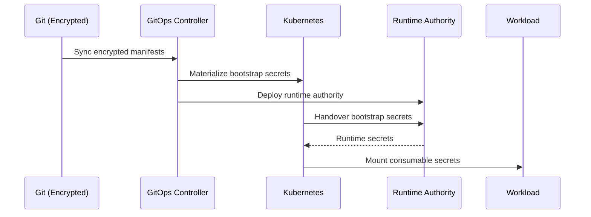

```
RFC-SECOPS-0001                                              Section 3
Category: Standards Track                          System Architecture
```

# 3. System Architecture

[← Previous: Requirements](./02-requirements.md) | [Index](./00-index.md#table-of-contents) | [Next: Components →](./04-components.md)

---

This section defines the **macro-architecture** of the system: phases, trust
boundaries, and authority handovers. No component-level configuration is
described here.

---

## 3.1 Architectural Overview

The secrets platform is designed as a **phase-driven system**.

Rather than assuming all components exist simultaneously, the architecture
explicitly models:

- what exists at each point in time,
- which system is authoritative,
- and how authority transitions occur.

This avoids the most common failure mode in secret systems:

> assuming a steady-state world during bootstrap.

At a high level, the platform consists of five conceptual layers:

1. **Cryptographic Root of Trust**
2. **GitOps Control Plane**
3. **Bootstrap Secret Layer**
4. **Runtime Secret Authority**
5. **Workload Consumption Layer**

Each layer is activated in sequence.

---

## 3.2 Phase Model

The system progresses through **five distinct phases**.

These phases are **logical**, not temporal guarantees — the system MAY remain
in any phase indefinitely during failure or recovery.

---

### Phase 0 — Root Trust Establishment

**What exists**

- Cryptographic root material (e.g., encryption keys)
- Git repository

**What does not exist**

- Kubernetes
- Vault
- Any runtime secret authority

**Purpose**

- Establish a minimal, offline root of trust
- Enable encrypted representation of bootstrap secrets in Git

This phase is intentionally external to Kubernetes.

---

### Phase 1 — GitOps Control Plane Initialization

**What exists**

- Kubernetes cluster
- GitOps controller
- Decryption capability for encrypted Git artifacts

**What does not exist**

- Vault
- Runtime secret controllers

**Purpose**

- Allow declarative materialization of bootstrap resources
- Prepare the cluster to self-host further control planes

---

### Phase 2 — Bootstrap Secret Materialization

**What exists**

- Decrypted bootstrap secrets in Kubernetes
- Minimal secrets required to bring up the runtime authority

**What does not exist**

- Secret rotation
- Runtime ownership semantics

**Purpose**

- Act as temporary scaffolding
- Enable runtime secret authority to come online

Bootstrap secrets are **explicitly transitional**.

---

### Phase 3 — Runtime Secret Authority Activation

**What exists**

- Runtime secret authority (Vault)
- Access policies
- Secret storage backend

**What changes**

- Bootstrap secrets are copied into runtime authority
- Runtime authority becomes writable and authoritative

**Purpose**

- Establish a single runtime source of truth
- Prepare for steady-state operations

---

### Phase 4 — Steady State Operation

**What exists**

- Runtime secret authority
- Secret materialization controllers
- Workload-consumable Kubernetes Secrets

**What no longer matters**

- Bootstrap secrets
- Git-defined secret values

**Purpose**

- Fully automated secret lifecycle
- Rotation, expiry, and propagation without human intervention

---

## 3.3 Authority and Trust Boundaries

A core design principle is that **authority MUST be singular and explicit at
every phase**.

At no point MAY two systems be considered equally authoritative for the same
secret.

---

### Authority by Phase

| Phase     | Authoritative System       |
| --------- | -------------------------- |
| Phase 0   | Offline cryptographic root |
| Phase 1–2 | Git (encrypted intent)     |
| Phase 3–4 | Runtime secret authority   |

Kubernetes is **NEVER** authoritative.

---

### Trust Boundary Diagram



---

## 3.4 High-Level Control Flow

The system operates as a **one-way funnel**:

1. **Intent flows downward**
2. **Authority shifts once**
3. **Values MUST NOT flow back upward**

This prevents feedback loops and ambiguity.

---

### High-Level Sequence



---

## 3.5 Failure Domains and Recovery

The phase model allows **bounded failure domains**.

---

### Git Failure

- No new intent
- Existing runtime secrets continue to function
- Steady state unaffected

---

### Vault Failure

- No rotation
- No secret updates
- Existing Kubernetes Secrets remain usable
- Recovery restores authority without Git changes

---

### Cluster Loss

- Rebuild from:
  - Git
  - cryptographic root
- Bootstrap phase repeats
- Runtime authority re-established

---

### Human Error

- Limited to:
  - initial trust setup
  - policy changes
- Day-to-day operations remain automated

---

## 3.6 Summary

This high-level architecture establishes:

- A **clear phase model**
- Explicit **authority transitions**
- Strict **trust boundaries**
- Deterministic behavior under failure

It intentionally delays implementation detail until the system's **shape and
rules** are unambiguous.

---

## Document Navigation

| Previous | Index | Next |
|----------|-------|------|
| [← 2. Requirements](./02-requirements.md) | [Table of Contents](./00-index.md#table-of-contents) | [4. Components →](./04-components.md) |

---

*End of Section 3*
