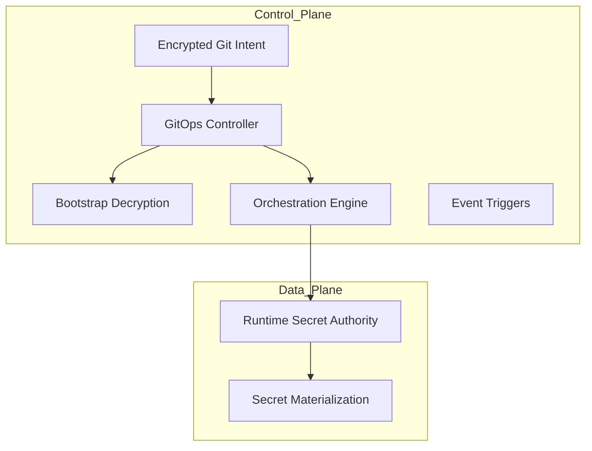
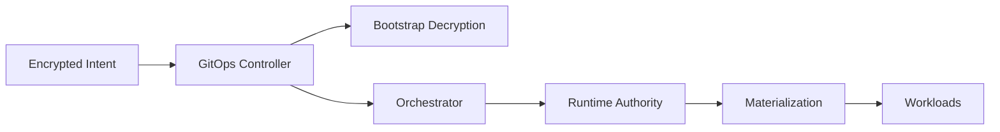

```
RFC-SECOPS-0001                                              Section 4
Category: Standards Track                          System Components
```

# 4. System Components

[← Previous: Architecture](./03-architecture.md) | [Index](./00-index.md#table-of-contents) | [Next: Mechanics →](./05-mechanics.md)

---

This section introduces the **concrete building blocks** of the system and
defines **clear responsibility boundaries** between them.

---

## 4.1 Component Taxonomy

The system is composed of **eight primary components**, each with a single,
well-defined responsibility.

They are grouped into **control-plane components** and **data-plane components**.

### Control Plane Components

1. Git Repository (Encrypted Intent)
2. GitOps Controller
3. Bootstrap Decryption Layer
4. Orchestration Engine
5. Event Triggering System

### Data Plane Components

6. Runtime Secret Authority
7. Secret Materialization Layer
8. Secret Publication Layer *(v1.1)*

Workloads consume outputs of the data plane but are **NOT part of the secret
system itself**.

---

## 4.2 Control Planes vs Data Planes

A strict separation is enforced:

- **Control planes decide *what SHOULD exist***
- **Data planes decide *what value exists right now***

This distinction is critical to prevent hidden authority and unintended coupling.

---

### Control Plane Responsibilities

- Declare intent
- Orchestrate transitions
- Enforce ordering
- Trigger automation

### Data Plane Responsibilities

- Store secret values
- Enforce access control
- Rotate credentials
- Serve consumers

---

### Control vs Data Plane Diagram



---

## 4.3 Responsibility Boundaries

Each component has **exclusive ownership** of a specific concern.

No two components MAY share responsibility for the same lifecycle decision.

---

### 4.3.1 Git Repository (Encrypted Intent)

**Responsibilities**

- Declare which secrets exist
- Declare their classification (bootstrap vs runtime)
- Store bootstrap secrets in encrypted form
- Define policies, not values

**Explicitly Not Responsible For**

- Runtime secret values
- Rotation
- Expiry tracking

---

### 4.3.2 GitOps Controller

**Responsibilities**

- Reconcile Git intent into the cluster
- Enforce ordering and dependencies
- Act as the sole deployment authority

**Explicitly Not Responsible For**

- Secret generation
- Secret rotation
- Value mutation

---

### 4.3.3 Bootstrap Decryption Layer

**Responsibilities**

- Decrypt encrypted bootstrap artifacts
- Materialize temporary Kubernetes Secrets
- Enable runtime authority bootstrap

**Explicitly Not Responsible For**

- Long-term secret storage
- Runtime access control
- Rotation

---

### 4.3.4 Orchestration Engine

**Responsibilities**

- Coordinate multi-step transitions
- Perform controlled handovers
- Execute rotation workflows
- Enforce sequencing beyond GitOps primitives

**Explicitly Not Responsible For**

- Storing secrets long-term
- Acting as an authority

---

### 4.3.5 Event Triggering System

**Responsibilities**

- Trigger workflows based on:
  - time
  - external signals
  - state changes
- Decouple detection from execution

**Explicitly Not Responsible For**

- Business logic
- Decision making

---

### 4.3.6 Runtime Secret Authority

**Responsibilities**

- Store runtime secrets
- Enforce access policies
- Track metadata and expiry
- Rotate secrets

**Explicitly Not Responsible For**

- Bootstrap
- Declarative intent
- Deployment ordering

---

### 4.3.7 Secret Materialization Layer

**Responsibilities**

- Translate runtime secrets into consumable artifacts
- Maintain synchronization
- Propagate updates

**Explicitly Not Responsible For**

- Secret ownership
- Rotation logic
- Policy enforcement

---

### 4.3.8 Secret Publication Layer *(v1.1)*

**Responsibilities**

- Watch source secrets in producer namespaces
- Push selected secret data to runtime authority (Vault)
- Maintain synchronization between source and runtime authority
- Bridge operator-generated secrets to the centralized authority

**Explicitly Not Responsible For**

- Secret generation (operator responsibility)
- Secret ownership (operator responsibility)
- Rotation logic (operator responsibility)
- Consumer-side materialization (materialization layer responsibility)

This component enables the **internal distribution framework** defined in
[Section 5a](./05a-internal-distribution.md), allowing operator-generated
secrets to be distributed across namespaces via Vault.

---

## 4.4 Component Interaction Model

All interactions follow a **directed, non-cyclic graph**.

Secrets and intent flow **downward only**.

---

### Interaction Diagram



No component SHOULD ever:

- read "upward"
- mutate its input source
- bypass the orchestrator

---

## 4.5 Phase-to-Component Mapping

Each phase activates a specific subset of components.

| Phase   | Active Components                                           |
| ------- | ----------------------------------------------------------- |
| Phase 0 | Git Repository                                              |
| Phase 1 | Git Repository, GitOps Controller                           |
| Phase 2 | + Bootstrap Decryption                                      |
| Phase 3 | + Runtime Secret Authority, Orchestrator                    |
| Phase 4 | + Materialization Layer, Publication Layer, Event Triggers  |

This mapping ensures:

- minimal surface area during bootstrap
- maximum automation in steady state
- internal distribution capabilities in steady state *(v1.1)*

---

## 4.6 Failure and Recovery Scenarios

### GitOps Controller Failure

- No reconciliation
- Runtime secrets unaffected
- Recovery resumes reconciliation deterministically

---

### Orchestrator Failure

- Rotation pauses
- No data loss
- Workflows resume idempotently

---

### Runtime Authority Failure

- No new secrets
- Existing secrets continue to function
- Recovery restores authority without Git changes

---

### Event System Failure

- Time-based triggers pause
- Manual triggers remain available
- No state corruption

---

## 4.7 Summary

This component architecture:

- Assigns **exactly one responsibility per component**
- Prevents authority overlap
- Makes orchestration explicit
- Creates a system that can evolve without redesign

It prepares the ground for the **operational mechanics**, where CRDs, workflows,
and exact procedures are defined.

---

## Document Navigation

| Previous | Index | Next |
|----------|-------|------|
| [← 3. Architecture](./03-architecture.md) | [Table of Contents](./00-index.md#table-of-contents) | [5. Mechanics →](./05-mechanics.md) |

---

*End of Section 4*
