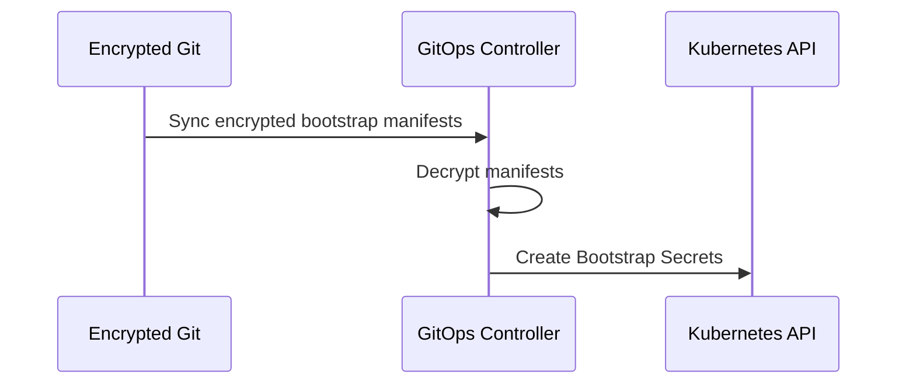
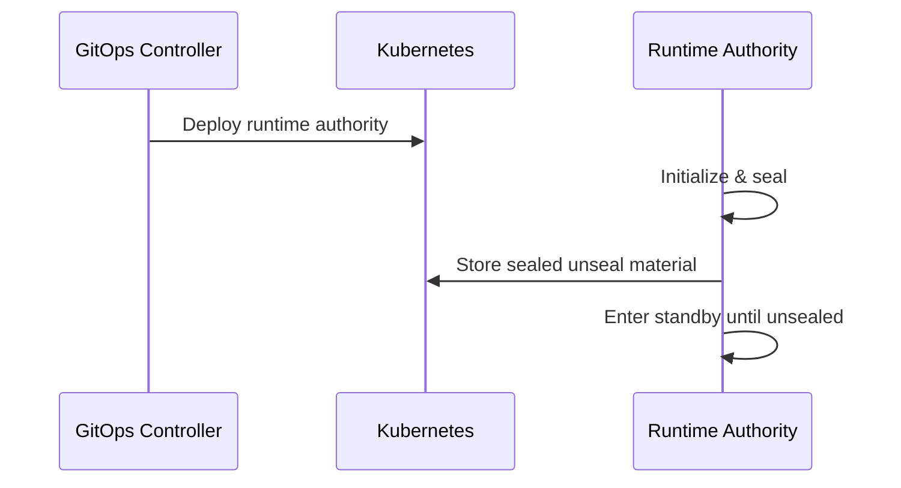
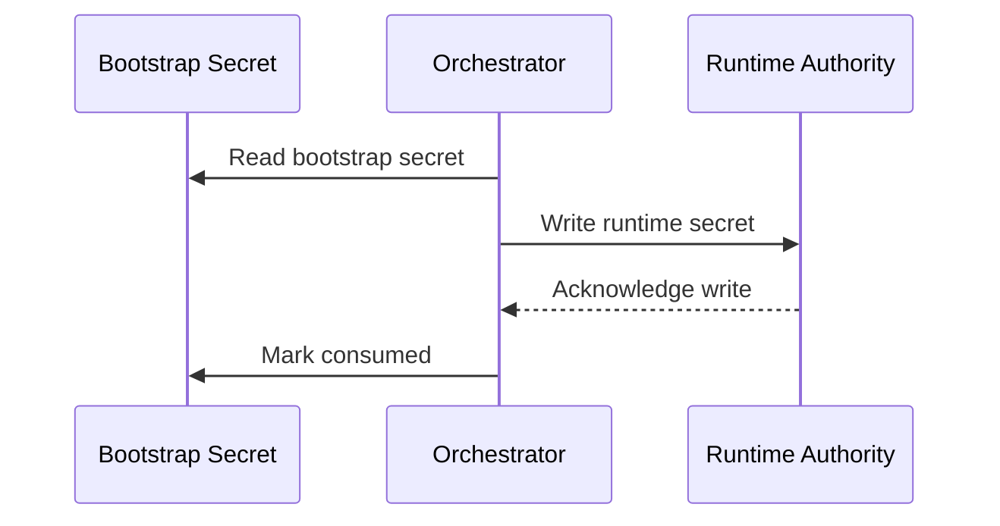
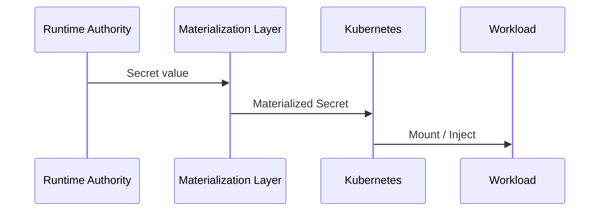
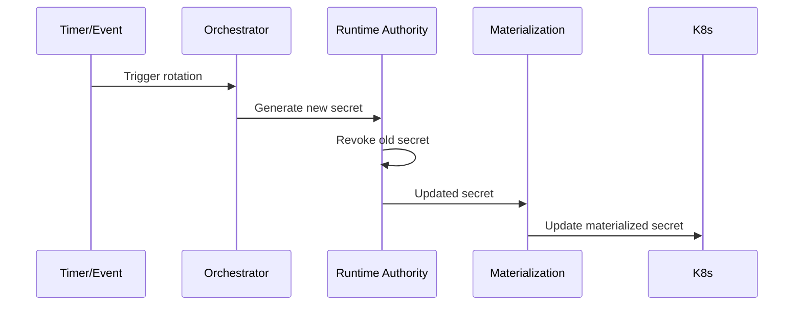

```
RFC-SECOPS-0001                                              Section 5
Category: Standards Track                      Operational Mechanics
```

# 5. Operational Mechanics

[← Previous: Components](./04-components.md) | [Index](./00-index.md#table-of-contents) | [Next: Rotation →](./06-rotation.md)

---

This is the **first section that is prescriptive**. Anything defined here is
considered **normative behavior** for the system.

---

## 5.1 Terminology and Resource Types

To avoid ambiguity, the following terms are used consistently.

### Secret Classifications

- **Bootstrap Secret**
  A secret required to initialize the runtime system. Exists *before* runtime
  authority.

- **Runtime Secret**
  A secret owned and lifecycle-managed by the runtime authority.

- **Derived Secret**
  A secret produced by infrastructure or controllers and pushed into runtime
  authority.

---

### Core Resource Types

| Resource               | Purpose                                          |
| ---------------------- | ------------------------------------------------ |
| Encrypted Manifest     | Stores bootstrap secrets encrypted in Git        |
| Bootstrap Secret       | Temporary Kubernetes Secret                      |
| Runtime Secret         | Secret stored in runtime authority               |
| Materialized Secret    | Kubernetes Secret derived from runtime authority |
| Orchestration Workflow | Declarative multi-step automation                |
| Event Trigger          | Time- or signal-based workflow trigger           |
| PushSecret *(v1.1)*    | Syncs K8s Secret to runtime authority            |
| Internal Secret *(v1.1)* | Operator-generated secret for distribution     |
| Internal Configuration *(v1.1)* | Service endpoint data for distribution   |

---

## 5.2 Bootstrap Mechanics (Pre-Vault)

### Initial Conditions

At time zero:

- Git repository exists
- Encrypted secret manifests exist
- Kubernetes cluster is empty
- No runtime authority exists

---

### Bootstrap Flow



---

### Key Properties

- Bootstrap secrets:
  - MUST be decrypted only inside the cluster
  - MUST NOT be written back to Git
  - MUST be scoped to minimal namespaces

- Decryption keys MUST NOT be stored in Git
- Bootstrap secrets MUST be explicitly labeled and traceable

---

### Security Invariant

> Bootstrap secrets MAY exist **only until runtime authority is established**.

---

## 5.3 Runtime Authority Initialization

The runtime secret authority is deployed **using bootstrap secrets only for
its own initialization**.

### Responsibilities

- Initialize storage backend
- Generate master keys
- Produce unseal material
- Establish internal access policies

The runtime authority becomes **self-sufficient** once initialized.

---

### Initialization Sequence



---

### Invariant

Once initialized, the runtime authority:

- MUST NOT depend on bootstrap secrets
- MUST persist state independently of Git

---

## 5.4 Explicit Authority Handover

Authority handover is the **most critical operation** in the system.

It MUST be:

- explicit
- auditable
- idempotent

---

### Handover Workflow



---

### Handover Rules

- Bootstrap secret is **copied**, never moved
- Runtime authority becomes authoritative immediately
- Bootstrap secret is:
  - deleted, or
  - rendered inert, or
  - ignored by all consumers

This operation happens **once per secret**.

---

## 5.5 Steady-State Secret Lifecycle

After handover, all secret lifecycle operations occur **exclusively** in the
runtime authority.

---

### Read Path



---

### Write Path

- No writes originate from Git
- No writes originate from Kubernetes
- All writes originate from:
  - orchestrated workflows
  - runtime secret engines
  - PushSecret synchronization from operator-generated secrets *(v1.1)*

---

### Internal Distribution *(v1.1)*

For secrets generated within the cluster by operators or controllers that require
cross-namespace distribution, the steady-state lifecycle includes an additional
publication phase. These **internal secrets** traverse Vault via the PushSecret
mechanism before being consumed via ExternalSecret.

See [Section 5a](./05a-internal-distribution.md) for the complete internal
distribution framework, including decision criteria, path conventions, and
component responsibilities.

---

## 5.6 Rotation and Expiry Handling

Rotation is **NOT a Git operation**.

### Rotation Flow



---

### Rotation Guarantees

- Rotation MUST be idempotent
- Rotation MUST be auditable
- Rotation MUST NOT require cluster redeploy
- Consumers MUST receive updates automatically

---

## 5.7 Failure Modes and Recovery

### Bootstrap Failure

- No runtime authority created
- Safe to retry
- No partial state

---

### Handover Failure

- Runtime authority remains unchanged
- Bootstrap secret remains authoritative
- Workflow retries safely

---

### Runtime Authority Failure

- No rotation
- Existing secrets remain valid
- Recovery resumes lifecycle automatically

---

### Cluster Loss

- Re-run bootstrap
- Re-establish runtime authority
- Restore secrets from runtime storage backend

---

## 5.8 Security and Trust Guarantees

This design guarantees:

- **Single authority at any time**
- **No secret sprawl**
- **No hidden mutation paths**
- **Minimal blast radius**
- **Auditable lifecycle**

---

## 5.9 Summary

This operational mechanics section:

- makes bootstrap explicit,
- removes ambiguity from authority transitions,
- and enables full automation without scripts.

It completes the mechanical foundation of the system.

---

## Document Navigation

| Previous | Index | Next |
|----------|-------|------|
| [← 4. Components](./04-components.md) | [Table of Contents](./00-index.md#table-of-contents) | [5a. Internal Distribution →](./05a-internal-distribution.md) |

---

*End of Section 5*
