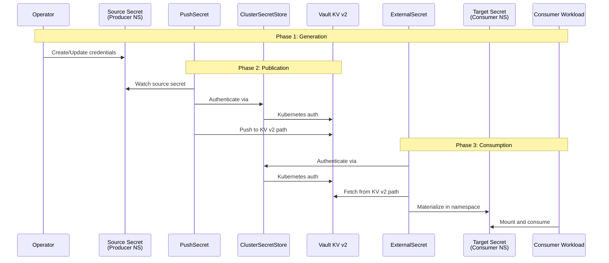

```
RFC-SECOPS-0001                                              Section 5a
Category: Standards Track           Internal Distribution Mechanics
```

# Section 5a: Internal Secret and Configuration Distribution

This section defines the framework for distributing secrets and configuration
data generated within the same Kubernetes cluster to consumers in other
namespaces. This framework ensures deterministic, auditable, and centralized
cross-namespace secret distribution.

---

## Table of Contents

- [5a.1 Scope and Applicability](#5a1-scope-and-applicability)
- [5a.2 Internal Secret Classification](#5a2-internal-secret-classification)
- [5a.3 Distribution Framework](#5a3-distribution-framework)
- [5a.4 Decision Framework](#5a4-decision-framework)
- [5a.5 Vault Path Conventions](#5a5-vault-path-conventions)
- [5a.6 Component Roles](#5a6-component-roles)
- [5a.7 Prerequisites and Dependencies](#5a7-prerequisites-and-dependencies)
- [5a.8 Integration Points](#5a8-integration-points)

---

## 5a.1 Scope and Applicability

This section defines WHERE, WHEN, and WHAT the internal distribution
framework covers, along with explicit non-applicability statements.

### 5a.1.1 Definitions

**Internal Secret**

A secret generated by an operator or controller within the same Kubernetes
cluster, requiring distribution to consumers in other namespaces.

**Internal Configuration**

Non-sensitive configuration data (endpoints, ports, connection parameters)
generated or managed within the cluster that requires cross-namespace
distribution.

**External Secret**

A secret sourced from outside the cluster (cloud provider API keys,
third-party service credentials). NOT covered by this section.

### 5a.1.2 WHERE This Framework Applies

This framework MUST be used for:

- Cross-namespace secret distribution within a single Kubernetes cluster
- Operator-generated credentials requiring consumption by multiple services
- Configuration data requiring centralized distribution and discovery

### 5a.1.3 WHEN To Use This Framework

This framework MUST be used when ALL of the following conditions are met:

1. The secret or configuration is generated within the cluster
2. The producer and consumer exist in different namespaces
3. Audit trail and centralized lifecycle management is required

This framework SHOULD be used when:

- Multiple consumers in different namespaces require the same secret
- Rotation coordination across namespaces is needed
- Centralized policy enforcement is desired

### 5a.1.4 WHAT This Framework Covers

**Secrets**

- Database credentials generated by operators (e.g., Zalando postgres-operator)
- Service account tokens created by controllers
- API keys generated by internal services
- TLS certificates issued by in-cluster certificate authorities

**Configuration**

- Service endpoints (host, port)
- Connection parameters
- Discovery information for internal services

### 5a.1.5 Explicit Non-Applicability

This framework MUST NOT be used for:

| Scenario | Alternative |
|----------|-------------|
| Bootstrap secrets | Section 5.2 (Bootstrap Materialization) |
| External/third-party credentials | Section 5.3 (External Sources) |
| Secrets remaining within a single namespace | Direct Kubernetes Secret reference |
| Secrets sourced from cloud providers | Cloud provider secret stores |
| Manual/human-created secrets | Bootstrap flow with encrypted Git |

---

## 5a.2 Internal Secret Classification

### 5a.2.1 Resource Type Taxonomy

| Resource Type | Description | Example |
|---------------|-------------|---------|
| Operator-Generated | Credentials created by Kubernetes operators | Zalando postgres-operator database credentials |
| Internal Config | Endpoint and connection data for internal services | PostgreSQL pooler service endpoint |
| Derived Internal | Secrets derived from other internal secrets | Connection strings combining credentials + endpoints |

### 5a.2.2 Classification Criteria

A secret qualifies as "internal" when it meets ALL of the following criteria:

**Origin**

- Generated within the cluster by a controller, operator, or internal service
- NOT sourced from external systems, cloud providers, or human input

**Scope**

- Required by consumers in namespaces other than the producer namespace
- Cannot be satisfied by direct Kubernetes Secret reference

**Lifecycle**

- Managed by the generating operator or controller
- Rotation, expiry, and deletion controlled by the producer

---

## 5a.3 Distribution Framework

The internal distribution framework operates in three distinct phases.

### 5a.3.1 Phase 1 — Generation

The operator or controller creates the secret in its managed namespace.

**Characteristics**

- Secret exists as a standard Kubernetes Secret resource
- Producer (operator) maintains full lifecycle ownership
- Secret is authoritative within the producer namespace

**Producer Responsibilities**

- Create secret with appropriate keys and values
- Handle rotation according to operator policy
- Delete secret when no longer needed

### 5a.3.2 Phase 2 — Publication

The PushSecret resource watches the source Secret and syncs selected keys
to the runtime secret authority (Vault).

**Characteristics**

- PushSecret is a Kubernetes custom resource (external-secrets.io/v1alpha1)
- Watches a specific source Secret in the same namespace
- Pushes selected keys to specified Vault paths
- Operates continuously with configurable refresh interval

**Publication Rules**

- PushSecret MUST reference a ClusterSecretStore (cluster-wide scope)
- PushSecret MUST specify explicit key mappings (no wildcard sync)
- PushSecret MUST use standardized Vault path conventions (Section 5a.5)
- Vault becomes the authoritative distribution point after publication

### 5a.3.3 Phase 3 — Consumption

The ExternalSecret resource in the consumer namespace pulls from Vault
and materializes a Kubernetes Secret.

**Characteristics**

- ExternalSecret is a Kubernetes custom resource (external-secrets.io/v1)
- References the same ClusterSecretStore as the PushSecret
- Pulls specified keys from Vault paths
- Creates/updates a target Kubernetes Secret in the consumer namespace

**Consumption Rules**

- ExternalSecret MUST reference the same ClusterSecretStore as PushSecret
- Consumer workloads MUST NOT access Vault directly
- Consumer workloads MUST mount the materialized Kubernetes Secret
- Multiple ExternalSecrets MAY reference the same Vault path

### 5a.3.4 Distribution Flow Diagram



### 5a.3.5 Rotation Propagation

When the source operator rotates a secret:

1. Operator updates the source Kubernetes Secret
2. PushSecret detects change (within refresh interval)
3. PushSecret pushes new value to Vault
4. ExternalSecret detects change in Vault (within refresh interval)
5. ExternalSecret updates target Kubernetes Secret
6. Consumer workload receives updated secret (restart may be required)

Total propagation delay: Up to 2x refresh interval (default: 2 hours maximum)

---

## 5a.4 Decision Framework

This section provides deterministic criteria for deciding when to use the
internal distribution framework.

### 5a.4.1 Decision Tree

```
Is the secret generated within the cluster?
│
├── NO → Do NOT use this framework
│        Use: Bootstrap flow (Section 5.2) or external sources
│
└── YES → Does the consumer exist in the same namespace as producer?
    │
    ├── YES → Do NOT use this framework
    │         Use: Direct Kubernetes Secret reference
    │
    └── NO → Does the secret require cross-namespace distribution?
        │
        ├── NO → Do NOT use this framework
        │        Re-evaluate requirement
        │
        └── YES → USE THIS FRAMEWORK
                  PushSecret → Vault → ExternalSecret
```

### 5a.4.2 Decision Criteria Table

| Criterion | Use Internal Distribution | Do NOT Use | Alternative |
|-----------|---------------------------|------------|-------------|
| Producer and consumer in same namespace | NO | YES | Direct Secret reference |
| Single cross-namespace consumer | YES | NO | N/A |
| Multiple cross-namespace consumers | YES | NO | N/A |
| External/third-party credential | NO | YES | Bootstrap or external flow |
| Operator-generated credential | YES | NO | N/A |
| Dynamic endpoint configuration | YES | NO | N/A |
| Static configuration (never changes) | OPTIONAL | OPTIONAL | ConfigMap replication |
| Bootstrap-phase secret | NO | YES | Section 5.2 |
| Human-created secret | NO | YES | Encrypted Git + bootstrap |

### 5a.4.3 Configuration Distribution Decision

For configuration data (non-sensitive):

```
Is the configuration for a cluster-internal service endpoint?
│
├── NO → Do NOT use this framework
│        Use: ConfigMap or application configuration
│
└── YES → Does the endpoint need discovery by multiple namespaces?
    │
    ├── NO → Do NOT use this framework
    │        Use: Direct service reference (service.namespace.svc)
    │
    └── YES → MAY use this framework
              Benefits: Centralized discovery, audit trail
              Trade-off: Additional complexity
```

---

## 5a.5 Vault Path Conventions

Standardized path conventions ensure consistency and enable policy enforcement.

### 5a.5.1 Path Schema

**Secrets Path**

```
platform-data/{datasource}/{consumer}
```

- `platform-data/` — Fixed prefix for all internal secrets
- `{datasource}` — The system generating the secret (e.g., postgres, redis)
- `{consumer}` — The consuming service identifier (e.g., temporal, backstage)

**Configuration Path**

```
platform-config/{datasource}/{instance}
```

- `platform-config/` — Fixed prefix for all internal configuration
- `{datasource}` — The system providing the configuration (e.g., postgres)
- `{instance}` — The specific instance identifier (e.g., platform-postgres)

### 5a.5.2 Path Examples

| Type | Path | Contents |
|------|------|----------|
| Secret | `platform-data/postgres/temporal` | `{username, password}` |
| Secret | `platform-data/postgres/backstage` | `{username, password}` |
| Secret | `platform-data/redis/temporal` | `{password}` |
| Config | `platform-config/postgres/platform-postgres` | `{host, port}` |
| Config | `platform-config/redis/platform-redis` | `{host, port}` |

### 5a.5.3 Path Selection Rules

1. Secrets MUST use `platform-data/` prefix
2. Configuration MUST use `platform-config/` prefix
3. Datasource identifier MUST match the generating system type
4. Consumer/instance identifier MUST be unique within datasource scope
5. Paths MUST NOT contain environment identifiers (handled by Vault namespaces)
6. Paths MUST use lowercase with hyphens for multi-word identifiers

### 5a.5.4 Property Naming

Properties within Vault paths MUST use consistent naming:

| Property | Description | Example Value |
|----------|-------------|---------------|
| `username` | Database or service username | `temporal` |
| `password` | Database or service password | `<generated>` |
| `host` | Service hostname (FQDN or short) | `platform-postgres.platform-data.svc` |
| `port` | Service port number | `5432` |
| `token` | API or service token | `<generated>` |

---

## 5a.6 Component Roles

### 5a.6.1 Responsibility Matrix

| Component | Create | Watch | Push | Store | Pull | Materialize | Consume |
|-----------|--------|-------|------|-------|------|-------------|---------|
| Operator | YES | - | - | - | - | - | - |
| Source Secret | - | - | - | - | - | - | - |
| PushSecret | - | YES | YES | - | - | - | - |
| Vault | - | - | - | YES | - | - | - |
| ClusterSecretStore | - | - | - | - | - | - | - |
| ExternalSecret | - | - | - | - | YES | YES | - |
| Target Secret | - | - | - | - | - | - | - |
| Consumer Workload | - | - | - | - | - | - | YES |

### 5a.6.2 Component Responsibilities

**Operator**

- Generate and rotate source secrets
- Manage secret lifecycle (creation, rotation, deletion)
- NOT responsible for distribution

**PushSecret**

- Watch source secrets in producer namespaces
- Push selected secret data to runtime authority (Vault)
- Maintain synchronization between source and Vault
- NOT responsible for secret generation or ownership

**Vault (Runtime Authority)**

- Store, version, and serve secrets and configuration
- Enforce access policies
- Provide audit logging
- NOT responsible for generation or consumption

**ClusterSecretStore**

- Provide cluster-wide Vault authentication configuration
- Define connection parameters and authentication method
- NOT responsible for data movement

**ExternalSecret**

- Pull from Vault to consumer namespace
- Materialize Kubernetes Secret in target namespace
- Maintain synchronization with Vault
- NOT responsible for generation or policy enforcement

**Consumer Workload**

- Mount and use materialized Kubernetes Secret
- NOT responsible for any secret management operations

### 5a.6.3 Component Interaction Rules

1. PushSecret MUST reference a ClusterSecretStore (not namespace-scoped SecretStore)
2. ExternalSecret MUST reference the same ClusterSecretStore
3. Consumer workloads MUST NOT access Vault directly
4. Operators MUST NOT manage secrets outside their designated namespace
5. PushSecret and ExternalSecret MUST be managed by GitOps controller

---

## 5a.7 Prerequisites and Dependencies

### 5a.7.1 Required Infrastructure

| Component | Requirement | Purpose |
|-----------|-------------|---------|
| HashiCorp Vault | Operational, KV v2 engine enabled | Runtime secret authority |
| External Secrets Operator | Installed cluster-wide | PushSecret/ExternalSecret CRDs |
| ClusterSecretStore | Named `vault-backend`, configured | Vault authentication |
| Kubernetes Auth | Configured in Vault | Service account authentication |

### 5a.7.2 Required Vault Configuration

**KV v2 Secrets Engine**

- Mount point: `secret/`
- Version: v2 (versioning enabled)

**Kubernetes Authentication**

- Auth method path: `kubernetes`
- Role for ESO: `external-secrets`
- Bound service account: `external-secrets` in `external-secrets` namespace

**Policies**

PushSecret write policy:

```
path "secret/data/platform-data/*" {
  capabilities = ["create", "update", "read"]
}

path "secret/data/platform-config/*" {
  capabilities = ["create", "update", "read"]
}
```

ExternalSecret read policy:

```
path "secret/data/platform-data/*" {
  capabilities = ["read"]
}

path "secret/data/platform-config/*" {
  capabilities = ["read"]
}
```

### 5a.7.3 Required Kubernetes RBAC

External Secrets Operator requires:

- ClusterRole to create Secrets in any namespace
- ServiceAccount in `external-secrets` namespace
- ClusterRoleBinding for cluster-wide access

### 5a.7.4 Assumptions

1. **Single Kubernetes Cluster Scope**
   - This framework operates within a single cluster
   - Multi-cluster scenarios are addressed in Section 9 (Evolution)

2. **Vault Operational State**
   - Vault is in Phase 3+ (Runtime Authority operational)
   - Bootstrap has completed successfully

3. **GitOps Management**
   - PushSecret and ExternalSecret manifests are managed by GitOps controller
   - Changes are version-controlled and auditable

4. **Operator Lifecycle Management**
   - Source operators manage secret lifecycle (rotation, deletion)
   - Distribution framework does not interfere with operator behavior

---

## 5a.8 Integration Points

### 5a.8.1 Integration with RFC Sections

| Section | Integration Point |
|---------|-------------------|
| Section 3 (Architecture) | Internal distribution operates in Phase 4 (Steady State) |
| Section 4 (Components) | Extends Secret Materialization Layer with Publication Layer |
| Section 5 (Mechanics) | Supplements steady-state secret lifecycle with distribution path |
| Section 6 (Rotation) | Rotation propagates through push/pull chain automatically |
| Section 7 (Security) | Trust boundaries maintained via Vault policies |

### 5a.8.2 Phase Model Alignment

Internal distribution is a **Phase 4 (Steady State)** operation:

- Requires Vault to be operational (Phase 3 complete)
- Requires GitOps controller to be managing manifests
- Operates continuously with automated synchronization
- Does NOT require human intervention for nominal operations

### 5a.8.3 Security Boundary Alignment

The internal distribution framework maintains security boundaries by:

- Using Vault as the single authoritative distribution point
- Enforcing access policies at the Vault layer
- Providing audit trail for all secret access
- Preventing direct namespace-to-namespace secret copying

### 5a.8.4 Integration with Other RFCs

| RFC | Integration |
|-----|-------------|
| RFC-DEPLOY-OPS (placeholder) | PushSecret/ExternalSecret deployment ordering |
| RFC-PLATFORM-OPS (placeholder) | Operational runbooks for distribution framework |

---

## Document Navigation

| Previous | Up | Next |
|----------|-----|------|
| [Section 5: Mechanics](./05-mechanics.md) | [Index](./00-index.md) | [Section 6: Rotation](./06-rotation.md) |
