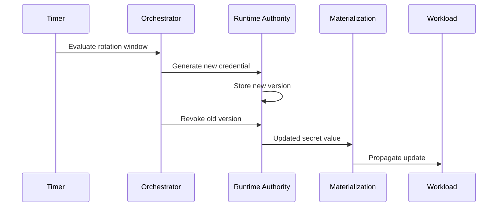
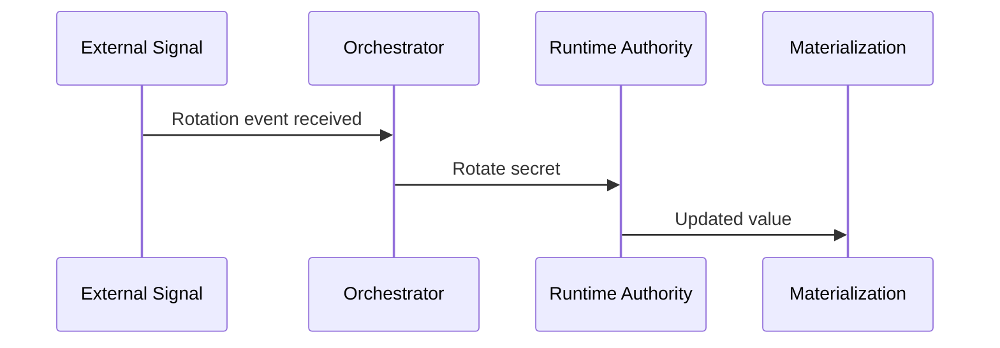
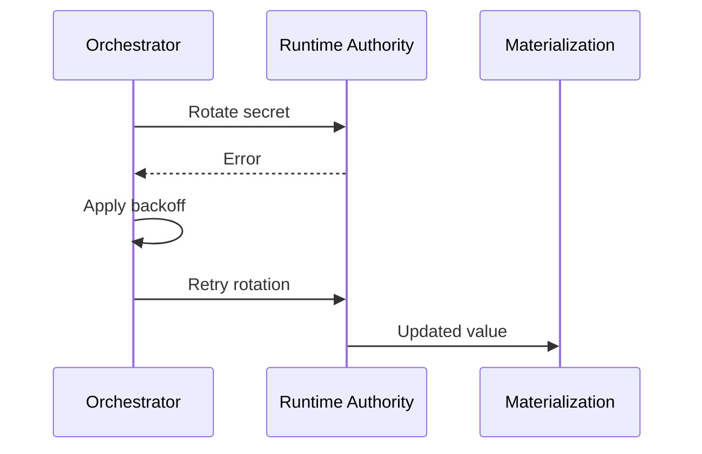

```
RFC-SECOPS-0001                                              Section 6
Category: Standards Track                         Rotation Framework
```

# 6. Rotation Framework

[← Previous: Mechanics](./05-mechanics.md) | [Index](./00-index.md#table-of-contents) | [Next: Security →](./07-security.md)

---

This section formalizes **rotation as a first-class system capability**,
explains **how orchestration and eventing work together**, and makes it
explicit **how secrets remain correct without human intervention**.

---

## 6.1 Rotation as a System Property

Secret rotation is often treated as an operational task:

- tracked via calendars,
- performed through dashboards,
- executed manually or semi-manually,
- validated reactively after failure.

This approach does not scale and violates the architectural invariants
defined in [Section 2](./02-requirements.md).

In this system:

> **Rotation is not an operation — it is a property of the system.**

If a secret has a lifetime, the system MUST:

- know that lifetime,
- enforce it,
- and recover automatically if rotation fails.

---

## 6.2 Rotation Principles and Invariants

The following principles are **MANDATORY**.

---

### Invariant 1 — Rotation Is Runtime-Owned

Rotation MUST be initiated and executed **entirely within the runtime
authority and orchestration layer**.

Git MUST NOT be involved.

---

### Invariant 2 — Rotation MUST Be Idempotent

A rotation workflow:

- MAY be retried,
- MAY be interrupted,
- MAY partially fail,

without causing:

- secret loss,
- duplication of authority,
- or invalid state.

---

### Invariant 3 — Rotation MUST Be Observable

Every rotation MUST produce:

- a traceable execution,
- explicit success or failure signals,
- metadata updates (timestamps, versions).

Silent rotation is forbidden.

---

### Invariant 4 — Rotation MUST Be Non-Disruptive by Default

The system MUST:

- update consumers automatically,
- avoid manual restarts where possible,
- and minimize downtime.

Application-level behavior is out of scope, but propagation MUST be guaranteed.

---

## 6.3 Rotation Policy Model

Each runtime secret is associated with a **rotation policy**.

Rotation policies are **data**, not code.

---

### Rotation Policy Attributes

| Attribute          | Description                         |
| ------------------ | ----------------------------------- |
| `rotation_type`    | static | time-based | event-based   |
| `ttl`              | Maximum allowed lifetime            |
| `rotate_before`    | Safety window before expiry         |
| `revoke_old`       | Whether old credentials are revoked |
| `max_overlap`      | Allowed validity overlap            |
| `failure_strategy` | retry | alert | hold                |

---

### Policy Attachment Model

Policies are:

- stored alongside secrets,
- evaluated by the orchestration layer,
- enforced consistently.

Policies do **NOT** live in Git.

---

## 6.4 Orchestration Responsibilities

The orchestration layer is responsible for **executing intent**, not defining it.

---

### Primary Responsibilities

- Evaluate rotation eligibility
- Execute rotation workflows
- Coordinate multi-step updates
- Handle retries and backoff
- Emit audit events

---

### Explicit Non-Responsibilities

- Secret storage
- Access control
- Value encryption

The orchestrator MUST NOT become an authority.

---

## 6.5 Event Sources and Triggers

Rotation workflows MAY be triggered by **multiple independent event sources**.

---

### 6.5.1 Time-Based Triggers

Used for:

- TTL-bound secrets
- Predictable rotation schedules

Example:

- Daily evaluation
- Rotate secrets expiring within 7 days

---

### 6.5.2 Event-Based Triggers

Used for:

- credential compromise
- upstream key rotation
- policy changes

Examples:

- webhook from external provider
- manual annotation indicating compromise

---

### 6.5.3 Manual Triggers

Permitted for:

- emergency rotation
- testing
- recovery scenarios

Manual triggers MUST still execute the same workflow path.

---

## 6.6 End-to-End Rotation Flows

### 6.6.1 Time-Based Rotation Flow



---

### 6.6.2 Event-Based Rotation Flow



---

### 6.6.3 Failure and Retry Flow



---

## 6.7 Observability and Auditability

Every rotation MUST emit:

- structured logs,
- workflow execution records,
- updated metadata on the secret.

Auditors MUST be able to answer:

- when a secret was last rotated,
- why it was rotated,
- which workflow executed it,
- and whether it succeeded.

---

## 6.8 Failure Modes and Recovery

### Orchestrator Failure

- Rotation pauses
- No secret corruption
- Resume is safe

---

### Runtime Authority Failure

- No rotation
- Existing secrets remain valid
- Recovery resumes rotation evaluation

---

### Materialization Failure

- Runtime secret is correct
- Consumers temporarily stale
- Automatic reconciliation restores state

---

## 6.9 Summary

This rotation framework:

- removes humans from the rotation loop,
- makes expiry a system-enforced invariant,
- and ensures secret freshness without Git interaction.

Rotation becomes predictable, observable, and safe.

---

## Document Navigation

| Previous | Index | Next |
|----------|-------|------|
| [← 5. Mechanics](./05-mechanics.md) | [Table of Contents](./00-index.md#table-of-contents) | [7. Security →](./07-security.md) |

---

*End of Section 6*
