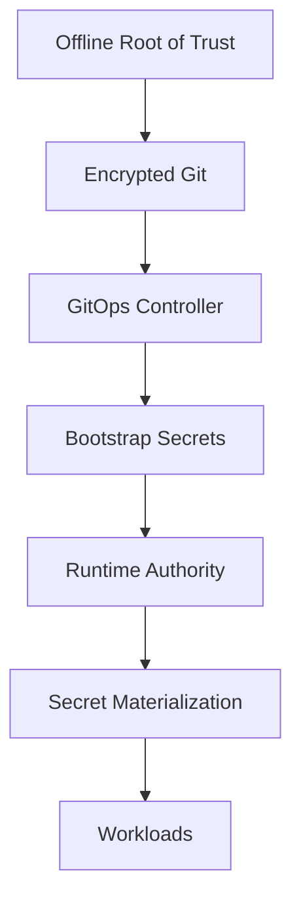

```
RFC-SECOPS-0001                                              Section 7
Category: Standards Track                    Security Considerations
```

# 7. Security Considerations

[← Previous: Rotation](./06-rotation.md) | [Index](./00-index.md#table-of-contents) | [Next: Rationale →](./08-rationale.md)

---

This section formalizes the **security posture** of the system and provides a
structured **threat analysis**.

---

## 7.1 Security Objectives

The security model of this system is designed to satisfy the following
objectives:

- Prevent unauthorized disclosure of secrets
- Prevent unauthorized mutation of secret values
- Minimize the impact of inevitable compromises
- Make authority explicit and auditable
- Eliminate implicit trust in human operators
- Preserve recoverability after partial or total failure

Security is treated as a **structural property**, not a configuration detail.

---

## 7.2 Trust Model and Root of Trust

### 7.2.1 Root of Trust Definition

The system has a **single cryptographic root of trust** established outside
Kubernetes.

This root consists of:

- encryption keys used to protect bootstrap secrets in Git
- unseal key material used to initialize the runtime authority

This root:

- MUST be created once,
- MUST be stored securely offline,
- MUST NOT be committed to source control,
- and MUST NOT be regenerated during normal operation.

---

### 7.2.2 Trust Establishment Timeline

Trust is not global or permanent; it evolves by phase.

| Phase    | Trusted Entities                   |
| -------- | ---------------------------------- |
| Phase 0  | Offline cryptographic root         |
| Phase 1  | Git repository + GitOps controller |
| Phase 2  | Kubernetes bootstrap secrets       |
| Phase 3+ | Runtime secret authority           |

At no point does the system assume trust in:

- developer workstations,
- CI/CD runners,
- SaaS dashboards.

---

## 7.3 Trust Boundaries

Trust boundaries are **explicit and enforced**.

### Primary Trust Boundaries

1. **Offline → Git**
   Encrypted intent crosses this boundary.

2. **Git → Kubernetes Control Plane**
   Declarative intent is reconciled.

3. **Bootstrap → Runtime Authority**
   One-time handover of secret values.

4. **Runtime Authority → Workloads**
   Controlled, read-only consumption.

---

### Trust Boundary Diagram



No trust flows upward across these boundaries.

---

## 7.4 Identity and Authentication Model

### 7.4.1 Control Plane Identity

- GitOps controller authenticates to Kubernetes using native RBAC
- Orchestration and event systems authenticate using service accounts
- No shared credentials across components

---

### 7.4.2 Runtime Authority Authentication

- Kubernetes-native authentication mechanisms are used
- Each consuming system has:
  - a unique identity
  - scoped authentication permissions

No component authenticates as another.

---

### 7.4.3 Workload Authentication

Workloads:

- MUST NOT authenticate directly to the runtime authority
- consume secrets only through materialized Kubernetes Secrets

This reduces credential sprawl and attack surface.

---

## 7.5 Authorization and Access Control

### 7.5.1 Principle of Least Privilege

Each component MUST be granted:

- the minimum access required,
- scoped to namespace, path, or secret class.

---

### 7.5.2 Separation of Duties

| Capability             | Authorized Component  |
| ---------------------- | --------------------- |
| Secret storage         | Runtime authority     |
| Secret rotation        | Orchestration layer   |
| Secret materialization | Materialization layer |
| Secret consumption     | Workloads             |
| Intent definition      | Git                   |

No component spans multiple authority domains.

---

## 7.6 Threat Model

### Assumed Threats

- Compromised workload pod
- Compromised namespace
- Expired or leaked credentials
- Operator error
- Partial cluster compromise

---

### Explicitly Out-of-Scope Threats

- Kernel-level node compromise
- Physical access attacks
- Malicious Kubernetes control plane

These require separate mitigations.

---

## 7.7 Blast Radius Analysis

### Compromised Workload

- Access limited to its own secrets
- No write capability
- No lateral movement via secret system

---

### Compromised Kubernetes Namespace

- Affects only materialized secrets in that namespace
- Runtime authority remains intact
- Rotation can invalidate exposed credentials

---

### Compromised Git Repository

- Secrets are encrypted
- No runtime secrets stored
- Rotation not affected

---

### Compromised Runtime Authority

- Most severe scenario
- Requires:
  - secret rotation
  - potential re-bootstrap
- Impact contained by:
  - access policies
  - audit logs
  - explicit authority boundaries

---

## 7.8 Compromise Scenarios and Recovery

### Credential Leak

- Trigger event-based rotation
- Revoke old credentials
- Propagate updates automatically

---

### Unseal Key Exposure

- Rotate master keys
- Re-encrypt storage
- Re-establish root trust if necessary

---

### Cluster Loss

- Rebuild cluster
- Reapply Git intent
- Restore runtime authority backend
- Resume steady-state operation

---

## 7.9 Security Guarantees and Limitations

### Guaranteed

- Single authority at any time
- Encrypted secrets at rest and in transit
- Auditable lifecycle
- Minimal blast radius
- Deterministic recovery

---

### Not Guaranteed

- Protection against malicious cluster administrators
- Zero downtime under all failure conditions
- Application-level secret misuse

These require complementary controls.

---

## 7.10 Summary

This security model:

- makes trust explicit,
- confines authority,
- and treats compromise as a recoverable event.

Security is achieved not by hiding complexity, but by **structuring it
correctly**.

---

## Document Navigation

| Previous | Index | Next |
|----------|-------|------|
| [← 6. Rotation](./06-rotation.md) | [Table of Contents](./00-index.md#table-of-contents) | [8. Rationale →](./08-rationale.md) |

---

*End of Section 7*
