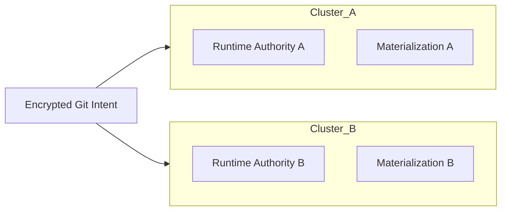
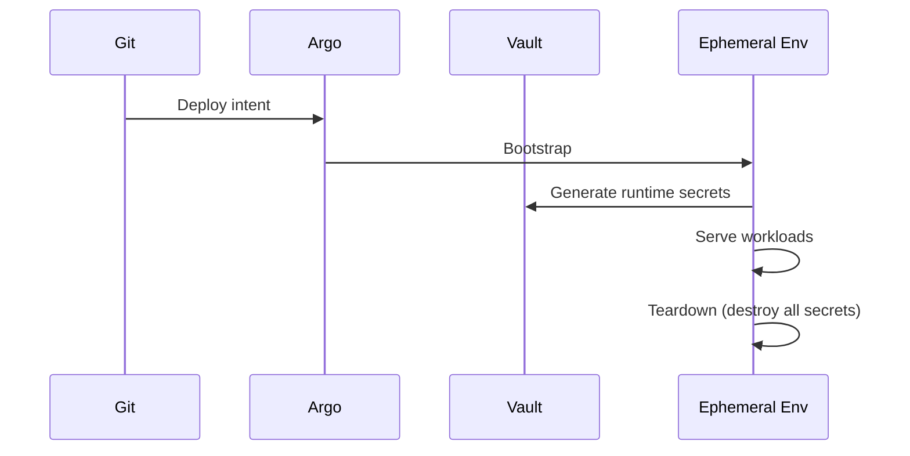
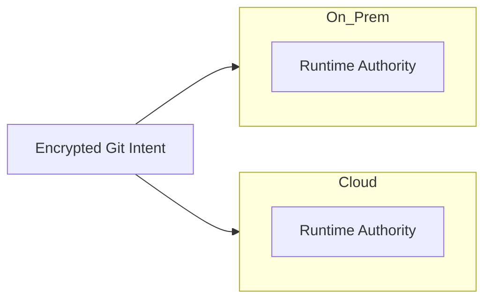

```
RFC-SECOPS-0001                                              Section 9
Category: Standards Track                      Future Considerations
```

# 9. Future Considerations

[← Previous: Rationale](./08-rationale.md) | [Index](./00-index.md#table-of-contents) | [Next: Appendix A →](./appendix-a-glossary.md)

---

This section is **forward-looking** and intentionally **non-prescriptive** in
areas where future requirements MAY vary.

---

## 9.1 Design for Change

One of the primary motivations for this architecture is **longevity**.

Secrets management systems often fail not because they are insecure, but because:

- they encode assumptions about scale,
- they hard-code environment boundaries,
- or they require redesign when infrastructure topology changes.

This system is explicitly designed so that **future growth does not require
revisiting core decisions**.

---

## 9.2 Multi-Cluster Expansion

### 9.2.1 Design Assumptions

The architecture assumes:

- multiple Kubernetes clusters MAY exist concurrently,
- clusters MAY be destroyed and recreated,
- clusters MAY serve different purposes (prod, dev, ephemeral).

Each cluster is treated as:

> **An independent execution environment, not a shared secret authority.**

---

### 9.2.2 Cluster Independence Model

Each cluster:

- runs its own GitOps controller,
- bootstraps from the same encrypted Git intent,
- hosts its own runtime secret authority instance (or logical partition),
- maintains independent materialization layers.

No cluster requires:

- direct access to another cluster's secrets,
- cross-cluster secret replication.

---

### Multi-Cluster Diagram



This preserves:

- isolation,
- blast-radius containment,
- independent recovery.

---

## 9.3 Multi-Environment Support

### 9.3.1 Environment as a First-Class Dimension

Environments are modeled as:

- separate namespaces,
- separate secret scopes,
- separate runtime authorities where required.

They are **NOT** modeled as branches with implicit behavior.

---

### 9.3.2 Environment-Specific Secret Behavior

- Bootstrap secrets MAY differ per environment
- Runtime secrets are isolated by path or instance
- Rotation policies MAY vary (e.g., shorter TTLs in prod)

Git defines:

- *which* secrets exist per environment

Vault defines:

- *how* they behave

---

## 9.4 Ephemeral and Preview Environments

### 9.4.1 Problem Statement

Modern workflows require:

- short-lived environments,
- per-branch or per-PR clusters,
- disposable infrastructure.

Secrets systems often break here.

---

### 9.4.2 How This Architecture Supports Ephemerality

Ephemeral environments:

- reuse encrypted bootstrap intent,
- initialize runtime authority dynamically,
- generate secrets on demand,
- destroy everything on teardown.

No manual cleanup is required.

---

### Ephemeral Lifecycle



This guarantees:

- no secret reuse,
- no long-lived credentials,
- minimal risk.

---

## 9.5 Hybrid and Cloud-Adaptive Deployments

### 9.5.1 Cloud Agnosticism by Design

Because:

- bootstrap secrets are encrypted in Git,
- runtime authority is self-hosted,
- orchestration is cluster-native,

the architecture does not depend on:

- cloud KMS,
- managed secret stores,
- provider-specific IAM.

---

### 9.5.2 Optional Cloud Integrations

Cloud-native features MAY be added:

- KMS-backed unseal
- Cloud IAM secret engines
- Managed storage backends

These are **extensions**, not requirements.

---

### Hybrid Model



Each environment remains autonomous.

---

## 9.6 What Does Not Need to Change

The following remain invariant regardless of scale:

- Authority model
- Bootstrap → runtime handover
- Rotation mechanics
- Git's role as intent, not value
- Kubernetes as consumer, not owner

This is the strongest indicator of architectural soundness.

---

## 9.7 Anticipated Trade-offs and Limits

This architecture intentionally trades:

- simplicity for correctness,
- implicit workflows for explicit phases,
- convenience shortcuts for long-term safety.

Known limits:

- Does not protect against malicious cluster administrators
- Requires disciplined Git hygiene
- Assumes operational maturity

These are acceptable and documented trade-offs.

---

## 9.8 Summary

This architecture:

- scales horizontally across clusters,
- vertically across environments,
- and laterally across infrastructure providers,

**without redesigning the core system**.

Future growth is an extension of the existing model, not a refactor.

---

## Document Navigation

| Previous | Index | Next |
|----------|-------|------|
| [← 8. Rationale](./08-rationale.md) | [Table of Contents](./00-index.md#table-of-contents) | [Appendix A: Glossary →](./appendix-a-glossary.md) |

---

*End of Section 9*
