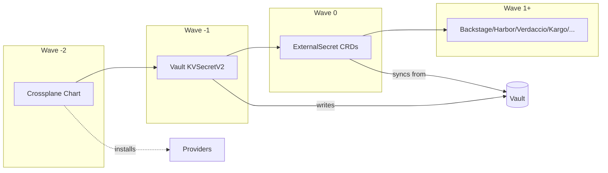
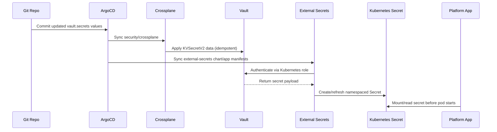
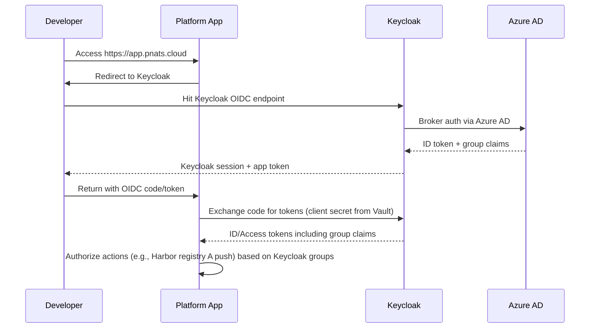

# Developer Platform Security Integration

This document captures how the developer-platform and development-workloads stacks now consume the security stack (Crossplane ➜ Vault ➜ External Secrets ➜ Keycloak) and how to operate the flow end to end.

## ArgoCD Sync Order

1. `security/crossplane` – installs provider-vault + `KVSecretV2` resources that push GitOps-defined secrets into Vault.
2. `security/external-secrets` – ensures the `vault-backend` ClusterSecretStore is ready.
3. Target stack applications (Backstage, Harbor, Verdaccio, Kargo, etc.)
   - Sync wave `-1/0`: ExternalSecret manifests materialize Kubernetes Secrets per namespace.
   - Sync wave `0+`: Workloads start and mount the secrets.
4. oauth2-proxy sidecars (Verdaccio et al.) come up before their ingress.

Use `argocd app sync <stack>` to reconcile. Failures usually mean Vault policy/secret typos; inspect `ExternalSecret.status.conditions` for details.

## Vault GitOps Lifecycle

1. Update the relevant SecretSpec under `platform/bootstrap/secrets/specs/` (or delete its cached state file) and re-run `platform/bootstrap/scripts/render-secrets.sh --apply`.
2. Commit the regenerated SealedSecret/PushSecret manifests and let Argo apply – PushSecrets will upsert KV v2 data at the requested path.
3. ESO refresh interval (default 1h) re-syncs secrets; force immediate rotation via `kubectl annotate externalsecret <name> external-secrets.io/refresh=now`.
4. Validate with:

   ```bash
      kubectl get externalsecret -A
      kubectl describe externalsecret <name>
      kubectl get secret <target> -n <ns>
   ```

5. PushSecret resources are applied immediately during bootstrap and remain in a retry state until `vault-backend` and the ESO `ClusterSecretStore` are healthy, so no additional scripting is required once the security stack syncs.

> **Harbor S3 automation:** the storage stack (`ceph-cluster` chart) now provisions the RGW user/bucket for Harbor (`harborObjectStore` values), captures the generated access/secret keys, and publishes them to Vault via a dedicated `PushSecret`. You no longer need `HARBOR_S3_*` entries in `.env.local`.

> **Vault admin token automation:** after the Vault chart sync completes, the `rootTokenSync` PostSync job copies `vault-init/root_token` into `crossplane-system/vault-admin-token`, so `VAULT_ADMIN_TOKEN` never needs to be pasted into `.env.local`.

> **ArgoCD provider token automation:** once ArgoCD is synced, the `providerTokenSync` PostSync job logs in using the initial admin password, generates a long-lived token, and stores it in `crossplane-system/argocd-admin-token` for the Crossplane provider—no `.env` inputs required.

## Keycloak + Azure AD RBAC

- `platform/stacks/security/charts/keycloak/values.yaml` adds clients for Harbor, Verdaccio, Backstage, Kargo, Tekton, and Argo Rollouts plus fine-grained groups (e.g., `harbor-registry-a-push`).
- Azure AD remains the upstream IdP; assign Azure groups to Keycloak groups via mappers or manually add members post-login.
- Harbor authorization model: map Keycloak groups to Harbor project roles (e.g., `harbor-registry-a-push` ➜ project developer). By removing a user from that group you prevent pushes to Registry A while preserving access elsewhere.
- Verdaccio ingress is protected by oauth2-proxy; only users in `verdaccio-publishers`/`verdaccio-readers` can reach the registry endpoints.
- Kargo/Tekton/Argo Rollouts clients are in place so we can front their dashboards with oauth2-proxy (Tekton chart already exposes ingress values that can be wired similarly).

## Verification Checklist

1. `kubectl get kvsecretv2.secrets.vault.upbound.io -n security` – all GitOps KV entries synced.
2. `kubectl get externalsecret -n <ns>` – `Ready=True` for backstage, harbor, verdaccio, kargo.
3. Login flows:
   - Backstage ➜ Keycloak (Azure AD login) ➜ portal loads developer catalog.
   - Harbor ➜ “Sign in with OIDC” uses Keycloak; user group membership enforces per-registry permissions.
   - Verdaccio ➜ oauth2 redirect; only Keycloak groups allowed.
   - Kargo ➜ Keycloak login; bootstrap users removed once Azure groups assigned.
4. Secret rotation dry-run: change a value in `crossplane/values.yaml`, `argocd app sync security-crossplane`, and confirm Kubernetes secret updates.

## Runbooks

- **Grant Harbor push to Registry A**: add Azure AD user to group “Harbor Registry A Push” → sync through Keycloak → verify Harbor project membership auto-updates.
- **Add new tool**: define Vault secret entry ➜ add ExternalSecret manifest in the tool’s chart ➜ create Keycloak client/group as needed.
- **Onboard developer**: ensure Backstage + Verdaccio groups assigned; Backstage surfaces links to Harbor, Tekton, Kargo, Argo Rollouts for quick navigation.

## References

- `platform/stacks/security/charts/crossplane/templates/vault-secrets.yaml`
- `platform/stacks/developer-platform/charts/*/templates/externalsecret*.yaml`
- `platform/stacks/security/charts/keycloak/values.yaml`

## Visual Reference

### Sync Waves & Dependencies



### Secret Lifecycle Sequence



### Auth Flow (Keycloak + Azure AD)



## Azure AD Federation Checklist

1. **Enable Azure AD Provider (optional)**  
   - Ensure `providerConfig.azuread.enabled: true` and the `azuread-service-principal` secret exist in `crossplane-system`.
2. **Apply the Azure sample resources**  
   - Use `platform/stacks/security/charts/crossplane/examples/azuread-keycloak-federation.yaml` to provision the Azure App Registration, Service Principal, client secret, and baseline groups.  
   - Approve Microsoft Graph API permissions in the Azure portal after Crossplane creates the application.
3. **Sync Keycloak**  
   - ArgoCD will reconcile the Keycloak chart; the `azuread` identity provider automatically reads the client secret from the `azuread-keycloak-oidc-credentials` secret created in step 2.
4. **Map Groups**  
   - Azure AD groups (e.g., “Platform Admins”) flow into Keycloak via the `oidc-advanced-group-idp-mapper`.  
   - Assign groups to Keycloak roles (`platform-admins`, `harbor-registry-a-push`, etc.) to grant or restrict capabilities like Harbor registry access.
5. **Verify Login**  
   - Use `kubectl get identityprovider -n keycloak` to confirm readiness, then log in to Backstage/Harbor with an Azure AD account to validate the flow.

## Additional Notes

- **Sync wave enforcement** ensures workloads never start without their secrets—Argo will block application pods until the preceding waves succeed.
- **Secret rotation** is handled entirely in Git → Crossplane → Vault; no direct `kubectl create secret` commands should be needed going forward.
- **RBAC granularity**: Harbor push scopes, Verdaccio publish rights, and dashboard access are entirely group-driven. Add/remove users from Azure AD groups to affect permissions across every app simultaneously.
