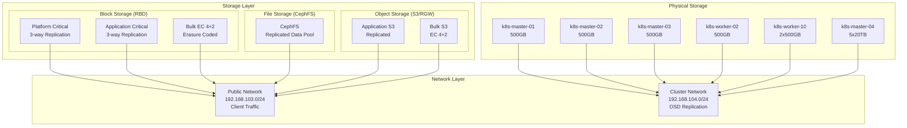

# Ceph Distributed Storage Architecture

> **Context:** Storage sits behind the platform layer in the new module stack (`api → config → infrastructure → provisioner → container-orchestration → platform → business`). Make sure the infrastructure + provisioner phases have published the correct image metadata before applying these storage charts.

**Status**: Production
**Version**: 1.0.0
**Rook Version**: v1.18.7
**Ceph Version**: v18.2.4 (Reef)
**Last Updated**: 2025-11-24

---

## Overview

This documentation describes the comprehensive Ceph distributed storage architecture deployed on the ProficientNow platform using Rook-Ceph operator. The architecture implements a tiered storage strategy with both replication and erasure coding for optimal balance between performance, capacity, and reliability.



---

## Documentation Structure

### Architecture Documents
- **[Pool Architecture](./architecture/pools.md)** - Detailed pool design, replication vs erasure coding strategy, failure domains
- **[Network Configuration](./architecture/network.md)** - Dedicated storage VLANs, public/cluster network separation
- **[Resource Topology](./architecture/topology.md)** - Node layout, OSD distribution, daemon placement

### Configuration Guides
- **[Storage Classes](./configuration/storage-classes.md)** - Kubernetes StorageClass definitions and usage guidelines
- **[Object Storage (S3)](./configuration/object-storage.md)** - RGW configuration, S3 endpoints, user management
- **[Multi-Site Setup](./configuration/multisite.md)** - Realm/Zone configuration for future multi-AZ deployment

### Operations
- **[Daily Operations](./operations/daily-ops.md)** - Monitoring, health checks, common tasks
- **[Troubleshooting](./operations/troubleshooting.md)** - Common issues and solutions
- **[Scaling Guide](./operations/scaling.md)** - Adding nodes, OSDs, and expanding capacity

---

## Quick Reference

### Storage Pools Summary

| Pool Name | Type | Failure Domain | Capacity Efficiency | Use Case |
|-----------|------|----------------|---------------------|----------|
| `plt-critical-replicated` | Replicated (3x) | host | 33% | Platform databases, K8s backups |
| `app-critical-replicated` | Replicated (3x) | host | 33% | Application databases, critical data |
| `bulk-ec` | EC 4+2 | osd | 67% | Telemetry, logs, metrics, traces |

### StorageClasses

| StorageClass | Pool | Default | Type | Purpose |
|--------------|------|---------|------|---------|
| `plt-blk-hdd-repl` | plt-critical-replicated | No | RBD | Platform storage |
| `app-blk-hdd-repl` | app-critical-replicated | **Yes** | RBD | Application storage |
| `infra-blk-hdd-ec` | bulk-ec | No | RBD | Infrastructure telemetry |
| `ceph-filesystem` | cephfs | No | CephFS | Shared filesystem |
| `app-obj-s3` | app-objectstore | No | S3 | Application object storage |
| `infra-obj-s3` | bulk-objectstore | No | S3 | Infrastructure backups/logs |

### Network Endpoints

| Service | Endpoint | Description |
|---------|----------|-------------|
| Ceph Dashboard | https://ceph.pnats.cloud | Cluster management UI |
| S3 API (App) | https://s3.pnats.cloud | Application object storage |
| S3 API (Bulk) | Internal only | Infrastructure object storage |

### Preflight Verification

Before applying the storage stack, run the verification helper to ensure the node
and device map in `platform/stacks/storage/charts/ceph-cluster/values.yaml` matches
what Kubernetes sees:

```bash
platform/stacks/storage/scripts/verify-osd-devices.sh
```

The script checks node readiness, prints applied labels, and uses `kubectl debug`
to confirm every declared block device exists on the host. Fix any reported
issues before installing or upgrading the Ceph cluster.

---

## Key Design Decisions

### Why Erasure Coding for Bulk Data?

**Problem**: With ~2TB raw capacity (Phase 1), 3-way replication provides only ~667GB usable storage.

**Solution**: Erasure Coding (EC 4+2) for non-critical bulk data:
- **Efficiency**: 67% usable vs 33% with replication
- **Reliability**: Can lose 2 chunks (equivalent to 2 disk failures)
- **Trade-off**: Slightly higher latency, acceptable for logs/metrics

**Reasoning**:
- Critical application data still uses 3-way replication (safety)
- Telemetry data volume grows faster than application data
- EC maximizes capacity for data that can tolerate slightly higher latency
- Future-proof for Phase 2 expansion (160TB+ raw capacity)

### Why Host-Level Failure Domain?

**Current**: `failureDomain: host` for replicated pools, `failureDomain: osd` for EC pools

**Reasoning**:
- **Replicated pools**: Data distributed across physical nodes (survive node failure)
- **EC pools**: OSD-level domain allows EC to work on single large node (k8s-master-04 with 5×20TB)
- **Phase 2 ready**: When more large nodes are added, can change EC to `failureDomain: host`

### Why Dedicated Storage Networks?

**Networks**:
- **Public** (`192.168.103.0/24`): Client traffic (applications → Ceph)
- **Cluster** (`192.168.104.0/24`): OSD replication traffic (OSD → OSD)

**Reasoning**:
- **Performance**: Client I/O doesn't compete with replication traffic
- **Isolation**: Heavy rebalancing doesn't impact application performance
- **Security**: Internal replication traffic separated from client network
- **Scalability**: Dedicated bandwidth for each network type

---

## Current Capacity (Phase 1)

### Raw Capacity
- **4× 500GB nodes**: 2TB
- **Total**: ~2TB raw

### Usable Capacity
- **Replicated pools** (size=3): ~667GB
- **EC pools** (4+2): Would provide ~1.3TB if all space was EC

### Actual Allocation
- **Critical replicated**: ~1.5TB raw → **500GB usable**
- **Remaining for EC/expansion**: ~500GB raw → **~330GB usable** with EC

---

## Future Expansion (Phase 2)

### Additional Hardware
- **1 node**: 6× 20TB = 120TB (after redistribution from 8×20TB)
- **1 node**: 2× 20TB = 40TB
- **1 node**: 800GB M.2 NVMe (hot tier)

### Projected Capacity
- **Total raw**: ~182TB
- **Critical replicated**: ~20TB usable
- **EC bulk storage**: ~80TB usable
- **Hot tier (NVMe)**: ~800GB usable

See [docs/platform/rfcs/STORAGE-ARCHITECTURE-QNA.md](../rfcs/STORAGE-ARCHITECTURE-QNA.md) for detailed Phase 2 planning.

---

## References

### Upstream Documentation
- [Rook Ceph Documentation](https://rook.io/docs/rook/latest-release/Storage-Configuration/Advanced/ceph-configuration/)
- [Ceph Reef Documentation](https://docs.ceph.com/en/reef/)
- [Erasure Coding Guide](https://docs.ceph.com/en/reef/rados/operations/erasure-code/)
- [Pool Management](https://docs.ceph.com/en/reef/rados/operations/pools/)

### Internal References
- [Storage Architecture Q&A](../rfcs/STORAGE-ARCHITECTURE-QNA.md) - Phase 2 planning
- [Chart Source](../../../platform/stacks/storage/charts/rook-ceph-cluster/) - Helm chart configuration

---

## Getting Started

1. **For Platform Engineers**: Start with [Pool Architecture](./architecture/pools.md) to understand the design
2. **For Developers**: Review [Storage Classes](./configuration/storage-classes.md) for usage guidelines
3. **For Operations**: Check [Daily Operations](./operations/daily-ops.md) for monitoring and maintenance

---

**Maintained by**: Platform Team
**Contact**: snoorullah@proficientnowtech.com
