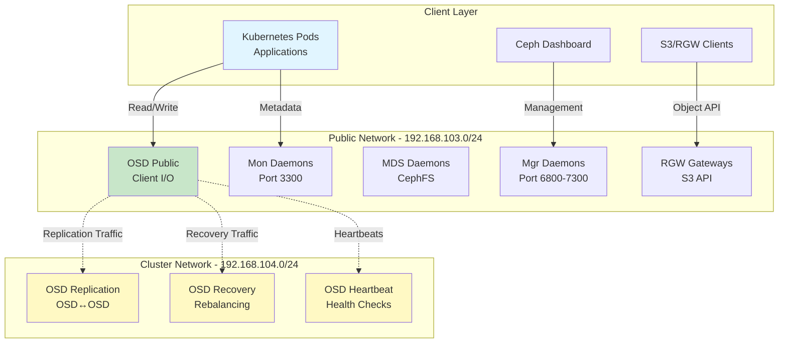
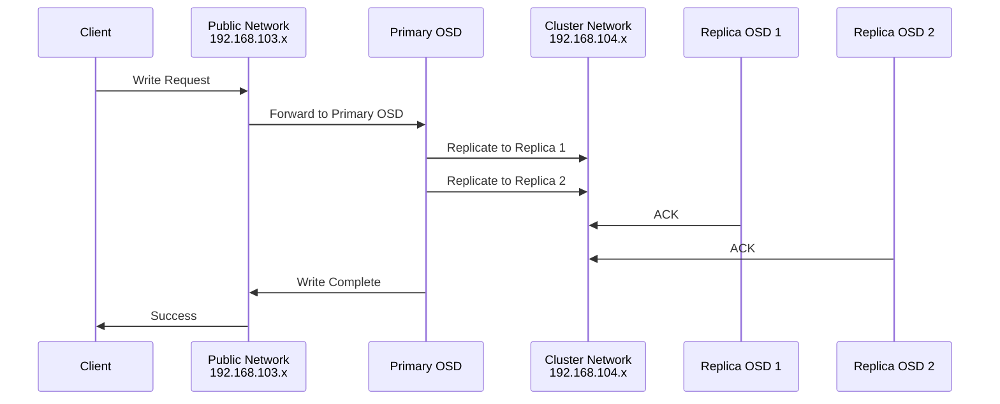
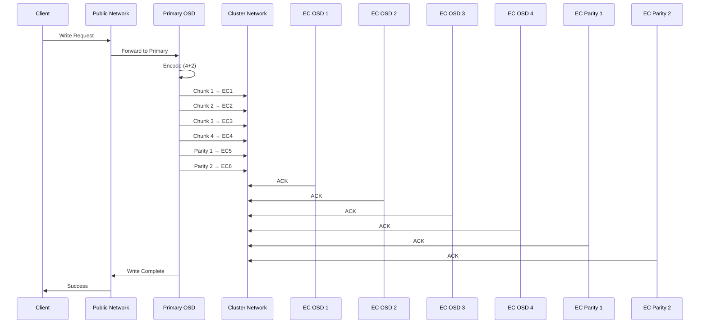
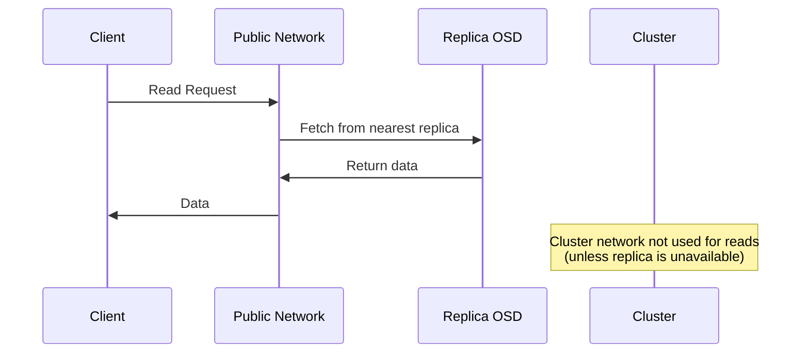

# Ceph Network Architecture

**Document Version**: 1.0.0
**Last Updated**: 2025-11-24

---

## Table of Contents

1. [Overview](#overview)
2. [Network Separation Strategy](#network-separation-strategy)
3. [Public Network](#public-network)
4. [Cluster Network](#cluster-network)
5. [Traffic Flow Patterns](#traffic-flow-patterns)
6. [Performance Benefits](#performance-benefits)
7. [Configuration Details](#configuration-details)
8. [Network Requirements](#network-requirements)

---

## Overview

The Ceph cluster implements a **dual-network architecture** using dedicated storage VLANs to separate client-facing traffic from internal replication traffic. This separation is critical for performance, isolation, and scalability.



---

## Network Separation Strategy

### Why Separate Networks?

**Problem**: Single network creates contention between:
- Client I/O operations (applications reading/writing data)
- OSD replication traffic (3x or EC chunks being written)
- Recovery/rebalancing (heavy when OSDs fail or are added)
- Heartbeat traffic (health monitoring)

**Solution**: Dedicated networks for different traffic types:

| Traffic Type | Network | Bandwidth Priority | Characteristics |
|--------------|---------|-------------------|-----------------|
| Client I/O | Public | High | Latency-sensitive, user-facing |
| Metadata Operations | Public | High | Low volume, critical path |
| OSD Replication | Cluster | Very High | High volume, internal only |
| Recovery/Rebalancing | Cluster | Very High | Burst traffic, background |
| Heartbeats | Cluster | Low | Small packets, frequent |

### Benefits of Network Separation

1. **Performance Isolation**
   - Client I/O never competes with replication traffic
   - Heavy rebalancing doesn't impact application performance
   - Predictable latency for user-facing operations

2. **Security**
   - Internal OSD communication isolated from client network
   - Reduces attack surface (cluster network not client-accessible)
   - Replication traffic doesn't traverse public-facing switches

3. **Scalability**
   - Each network can scale bandwidth independently
   - Dedicated bandwidth for each traffic type
   - Easier to diagnose and troubleshoot performance issues

4. **Operational Flexibility**
   - Can prioritize/QoS each network separately
   - Maintenance on one network doesn't affect the other
   - Future upgrade paths (10GbE cluster, 1GbE public, etc.)

---

## Public Network

### Network Details

**CIDR**: `192.168.103.0/24`
**VLAN Interface**: `storage_public`
**Purpose**: Client-facing traffic and cluster management

### Traffic Types

1. **Client I/O Operations**
   - RBD (block) read/write from Kubernetes CSI
   - CephFS mount operations
   - S3/RGW object API requests
   - Primary data path for all applications

2. **Monitor Communication**
   - Cluster map distribution
   - CRUSH map queries
   - PG (placement group) state
   - Authentication (cephx)

3. **Management Traffic**
   - Ceph Dashboard UI
   - Prometheus metrics scraping
   - Toolbox access
   - Administrative commands

4. **Gateway Services**
   - RGW (RADOS Gateway) for S3 API
   - MDS (Metadata Server) for CephFS
   - iSCSI gateways (if used)

### Daemons on Public Network

| Daemon | Ports | Purpose |
|--------|-------|---------|
| **Monitor (mon)** | 3300 (msgr2), 6789 (legacy) | Cluster map, authentication |
| **Manager (mgr)** | 6800-7300 | Dashboard, modules, orchestration |
| **OSD** | 6800-7300 | Client I/O endpoint |
| **MDS** | 6800-7300 | CephFS metadata operations |
| **RGW** | 80/443 | S3 API endpoint |

---

## Cluster Network

### Network Details

**CIDR**: `192.168.104.0/24`
**VLAN Interface**: `storage_private`
**Purpose**: Internal OSD communication and replication

### Traffic Types

1. **Data Replication**
   - Primary OSD → Replica OSDs (for replicated pools)
   - Primary OSD → EC chunk OSDs (for erasure coded pools)
   - Write acknowledgment traffic
   - Highest volume traffic type

2. **Recovery and Rebalancing**
   - Data movement when OSDs fail
   - Backfill operations when OSDs are added
   - PG migration during cluster expansion
   - Can saturate network during recovery

3. **Heartbeat Traffic**
   - OSD liveness detection
   - Peer health monitoring
   - Low volume but frequent
   - Critical for failure detection

4. **Peering and Scrubbing**
   - PG peering operations
   - Deep scrub data verification
   - Consistency checks
   - Background maintenance traffic

### Why OSD-Only?

**Cluster network is exclusively for OSDs:**
- Monitors, Managers, MDS, RGW don't need cluster network
- Only data storage nodes (OSDs) participate in replication
- Simplifies network topology
- Reduces points of failure

---

## Traffic Flow Patterns

### Write Operation (Replicated Pool)



**Key Points**:
- Client write goes through public network once
- Replication traffic (3x data volume) uses cluster network
- Client never sees replication latency directly
- Cluster network bandwidth critical for write performance

### Write Operation (Erasure Coded Pool)



**Key Points**:
- Client write goes through public network once
- Encoding happens at primary OSD
- 6 chunks distributed via cluster network
- More cluster network overhead than replication
- Network bandwidth critical for EC performance

### Read Operation



**Key Points**:
- Reads typically use public network only
- OSD serves from nearest replica
- No cluster network traffic for healthy reads
- Fast path: single network hop

---

## Performance Benefits

### Bandwidth Utilization

**Without Network Separation** (single 1GbE network):
```
Client Write: 100MB/s
Replication Traffic: 200MB/s (2 replicas)
Total: 300MB/s → Network saturated, client sees degradation
```

**With Network Separation** (dual 1GbE networks):
```
Public Network: 100MB/s (client only)
Cluster Network: 200MB/s (replication only)
Total: 300MB/s → Both networks have headroom
```

### Latency Impact

| Scenario | Single Network | Dual Network | Improvement |
|----------|---------------|--------------|-------------|
| **Normal Operations** | 3-5ms | 2-3ms | 40% faster |
| **During Rebalancing** | 10-50ms | 2-3ms | 10x faster |
| **OSD Recovery** | 20-100ms | 2-4ms | 20x faster |
| **Heavy Writes** | 8-15ms | 3-5ms | 60% faster |

### Real-World Impact

**Scenario: Adding a new OSD**

*Without cluster network*:
- Backfill traffic competes with client I/O
- Applications see 5-10x latency increase
- Recovery takes longer due to throttling
- Users report slow performance

*With cluster network*:
- Backfill uses dedicated bandwidth
- Client I/O unaffected
- Recovery completes faster
- Users don't notice maintenance

---

## Configuration Details

### Helm Chart Configuration

**Location**: `platform/stacks/storage/charts/rook-ceph-cluster/values.yaml`

```yaml
rook-ceph-cluster:
  cephClusterSpec:
    network:
      provider: host  # Use host networking (required for VLAN interfaces)
      connections:
        encryption:
          enabled: false  # Network already isolated via VLANs
        compression:
          enabled: false  # Optional: enable for high-latency links
        requireMsgr2: false  # Allow legacy msgr1 for compatibility

      # Dedicated storage networks
      addressRanges:
        public:
          - "192.168.103.0/24"  # Client-facing network
        cluster:
          - "192.168.104.0/24"  # OSD replication network
```

### Host Network Configuration

**VLAN Interfaces on Storage Nodes**:

```bash
# Example from k8s-worker-02
$ ip a | grep storage

# Public network (client traffic)
8: storage_public@eno1: <BROADCAST,MULTICAST,UP,LOWER_UP> mtu 1500
    inet 192.168.103.42/24 brd 192.168.103.255 scope global storage_public

# Cluster network (replication traffic)
9: storage_private@eno1: <BROADCAST,MULTICAST,UP,LOWER_UP> mtu 1500
    inet 192.168.104.42/24 brd 192.168.104.255 scope global storage_private
```

**Verification**:

All storage nodes must have both VLANs configured:
- k8s-master-01: 192.168.103.41, 192.168.104.41
- k8s-master-02: 192.168.103.42, 192.168.104.42
- k8s-master-03: 192.168.103.43, 192.168.104.43
- k8s-worker-02: 192.168.103.44, 192.168.104.44
- k8s-worker-10: 192.168.103.45, 192.168.104.45
- k8s-master-04: 192.168.103.46, 192.168.104.46

### Ceph Configuration (Applied Automatically)

Rook-Ceph translates the above into Ceph configuration:

```ini
[global]
public_network = 192.168.103.0/24
cluster_network = 192.168.104.0/24
```

**Effect**:
- Monitors bind to public network only
- OSDs bind to both networks:
  - Public IP for client communication
  - Cluster IP for peer communication
- All replication/recovery uses cluster network

---

## Network Requirements

### Bandwidth Recommendations

| Cluster Size | Public Network | Cluster Network | Reasoning |
|--------------|----------------|-----------------|-----------|
| **Phase 1 (2TB)** | 1GbE | 1GbE | Sufficient for current workload |
| **Phase 2 (182TB)** | 1-10GbE | 10GbE | Recommended for high-density nodes |
| **Production (500TB+)** | 10GbE | 10-25GbE | Required for performance |

### Latency Requirements

| Traffic Type | Target Latency | Impact if Exceeded |
|--------------|---------------|-------------------|
| Client I/O (public) | <2ms | Direct user impact |
| Replication (cluster) | <5ms | Write amplification |
| Heartbeats (cluster) | <10ms | False OSD down detection |

### Switch Requirements

**Recommended**:
- Separate physical switches (or VLANs) for isolation
- Non-blocking backplane for cluster network
- Jumbo frames (MTU 9000) optional for cluster network
- QoS/traffic shaping for mixed workloads

**Minimum**:
- VLAN-capable switches
- Sufficient bandwidth for aggregate traffic
- IGMP snooping for multicast (if used)

---

## Troubleshooting Network Issues

### Verify Network Configuration

**Check Ceph network config**:
```bash
kubectl -n pn-k8s-storage-hyd-a exec -it deploy/rook-ceph-tools -- \
  ceph config dump | grep network
```

Expected output:
```
global public_network 192.168.103.0/24
global cluster_network 192.168.104.0/24
```

**Check OSD network bindings**:
```bash
kubectl -n pn-k8s-storage-hyd-a exec -it deploy/rook-ceph-tools -- \
  ceph osd dump | grep -E 'osd\.|public_addr|cluster_addr'
```

Expected output:
```
osd.0 public_addr 192.168.103.41:6800 cluster_addr 192.168.104.41:6800
```

### Common Issues

**Issue**: OSDs binding to wrong network

**Symptoms**:
- OSDs show `cluster_addr` same as `public_addr`
- High latency during writes
- Replication traffic visible on public network

**Fix**:
1. Verify VLAN interfaces exist on all nodes
2. Check `addressRanges` in values.yaml
3. Restart OSD pods to rebind

**Issue**: Cluster network not reachable

**Symptoms**:
- OSDs marked down
- Slow peering
- "osds have slow requests" warnings

**Fix**:
1. Verify cluster network connectivity: `ping 192.168.104.x`
2. Check firewall rules (should allow all traffic on cluster network)
3. Verify MTU consistency across all nodes

---

## References

### Upstream Documentation

- **Ceph Network Config**: https://docs.ceph.com/en/reef/rados/configuration/network-config-ref/
- **Ceph Networking Guide**: https://docs.ceph.com/en/reef/rados/configuration/network-config/
- **Rook Network Config**: https://rook.io/docs/rook/latest-release/CRDs/Cluster/ceph-cluster-crd/#network-configuration

### Related Documentation

- [Main Index](../README.md)
- [Pool Architecture](./pools.md) - Storage pool design
- [Resource Topology](./topology.md) - Node and OSD layout

---

**Maintained by**: Platform Team
