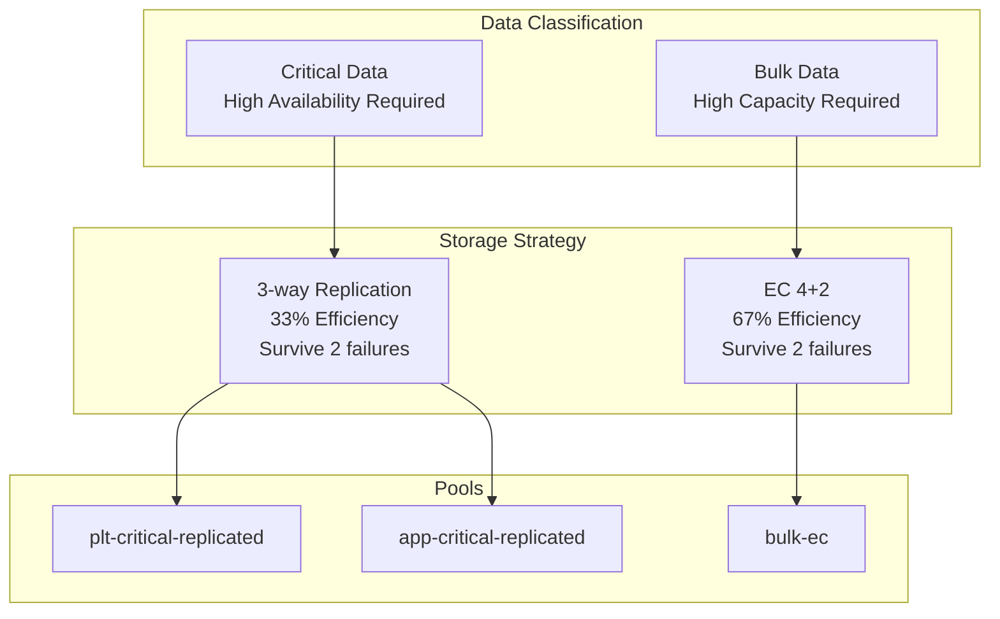
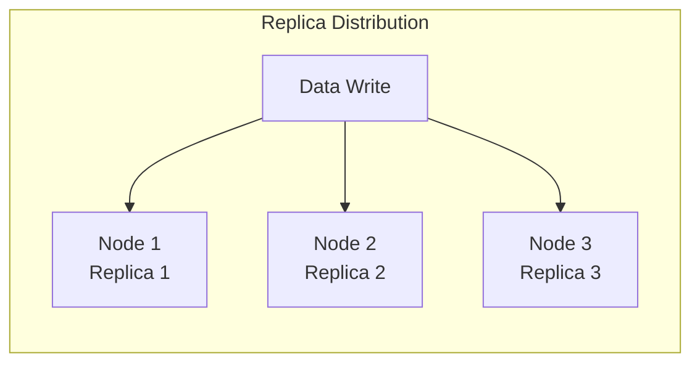
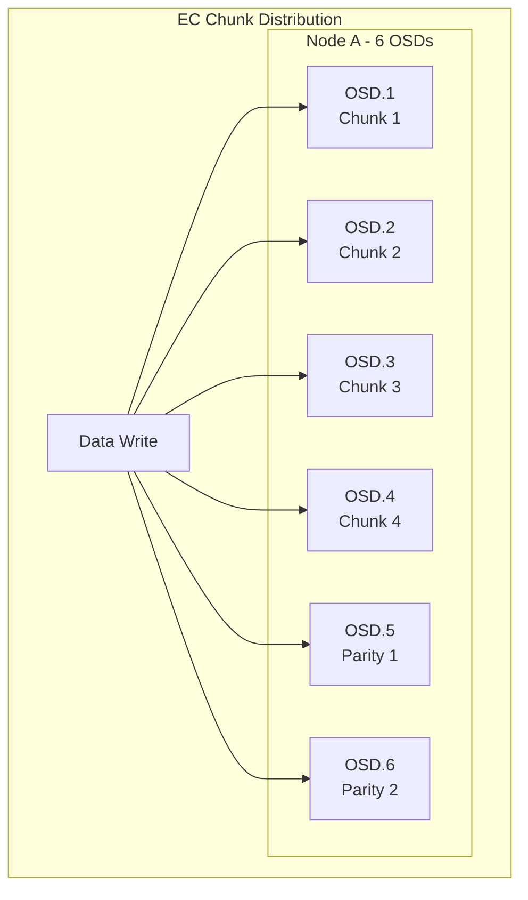

# Ceph Pool Architecture

**Document Version**: 1.0.0
**Last Updated**: 2025-11-24

---

## Table of Contents

1. [Overview](#overview)
2. [Pool Design Philosophy](#pool-design-philosophy)
3. [Replication vs Erasure Coding](#replication-vs-erasure-coding)
4. [Pool Definitions](#pool-definitions)
5. [Failure Domains](#failure-domains)
6. [Capacity Planning](#capacity-planning)
7. [Performance Characteristics](#performance-characteristics)

---

## Overview

The Ceph cluster implements a **tiered pool strategy** that balances reliability, performance, and capacity efficiency based on data criticality and access patterns. This architecture uses three distinct approaches:

1. **3-way Replication** - For critical data requiring maximum safety
2. **Erasure Coding (4+2)** - For bulk data requiring capacity efficiency
3. **Layered approach** - Separating platform, application, and infrastructure data



---

## Pool Design Philosophy

### Design Principles

1. **Safety First**: Critical data (databases, configs) uses replication for maximum reliability
2. **Efficiency Where Possible**: Bulk data (logs, metrics) uses EC for capacity optimization
3. **Layer Separation**: Platform and application data isolated in separate pools
4. **Future-Proof**: Design accommodates Phase 2 expansion to 180TB+

### Why Multiple Pools?

**Problem**: Single pool approach creates conflicts between competing requirements:
- Critical data needs high reliability (replication)
- Bulk data needs high capacity (erasure coding)
- Different data types have different performance characteristics

**Solution**: Dedicated pools per data type:
- **Platform pool**: For infrastructure services (Authentik, secrets, GitOps)
- **Application pool**: For application workloads (databases, user data)
- **Bulk pool**: For high-volume, lower-criticality data (telemetry)

---

## Replication vs Erasure Coding

### When to Use Replication

**Use replication when**:
- Data is critical (databases, secrets, configuration)
- Low latency required (sub-millisecond reads)
- Small, frequently-accessed data
- High IOPS workloads

**Characteristics**:
- **Write**: 1x write replicated to N nodes (parallel writes)
- **Read**: Read from closest replica (low latency)
- **Failure tolerance**: Can lose (N-1) replicas
- **Capacity**: 1/N efficiency (33% for size=3)

### When to Use Erasure Coding

**Use erasure coding when**:
- Data is bulk/archival (logs, metrics, backups)
- Capacity efficiency more important than latency
- Large, sequentially-accessed data
- Moderate/low IOPS workloads

**Characteristics**:
- **Write**: Data split into K chunks + M parity chunks
- **Read**: Reconstruct from K chunks (slight overhead)
- **Failure tolerance**: Can lose M chunks
- **Capacity**: K/(K+M) efficiency (67% for 4+2)

### Comparison Table

| Aspect | Replication (3x) | Erasure Coding (4+2) |
|--------|------------------|----------------------|
| **Usable Capacity** | 33% | 67% |
| **Failure Tolerance** | Lose 2 of 3 copies | Lose 2 of 6 chunks |
| **Write Latency** | Low | Moderate |
| **Read Latency** | Very Low | Low-Moderate |
| **IOPS** | High | Moderate |
| **Network Overhead** | 3x | 1.5x |
| **CPU Overhead** | Minimal | Moderate (encoding) |
| **Best For** | Databases, hot data | Logs, archives, cold data |

---

## Pool Definitions

### Pool 1: Platform Critical Replicated

**CephBlockPool**: `plt-critical-replicated`
**StorageClass**: `plt-blk-hdd-repl`

```yaml
spec:
  failureDomain: host
  replicated:
    size: 3
    requireSafeReplicaSize: true
```

**Purpose**:
- Platform databases (Authentik, Keycloak, Vault/Infisical)
- Kubernetes etcd backups
- GitOps state (ArgoCD repositories)
- Platform configuration and secrets

**Characteristics**:
- **Replication**: 3-way across hosts
- **Failure Domain**: host (survives node failure)
- **Safety**: requireSafeReplicaSize ensures writes wait for 2 replicas
- **Performance**: Optimized for low-latency database workloads

**Capacity Planning** (Phase 1):
- **Allocated**: ~500GB raw → **~167GB usable**
- **Expected Usage**: ~50-100GB (platform databases are small)
- **Headroom**: Sufficient for platform growth

**Decision Rationale**:
- Platform infrastructure must survive multiple node failures
- Configuration and secrets are irreplaceable
- Platform databases are typically small (<50GB)
- Replication overhead acceptable for critical infrastructure

---

### Pool 2: Application Critical Replicated

**CephBlockPool**: `app-critical-replicated`
**StorageClass**: `app-blk-hdd-repl` (default)

```yaml
spec:
  failureDomain: host
  replicated:
    size: 3
    requireSafeReplicaSize: true
```

**Purpose**:
- Application databases (StackGres clusters)
- User-generated critical data
- Application configuration
- Stateful application data

**Characteristics**:
- **Replication**: 3-way across hosts
- **Failure Domain**: host
- **Default**: True (applications use this by default)
- **Performance**: Database-optimized

**Capacity Planning** (Phase 1):
- **Allocated**: ~1TB raw → **~333GB usable**
- **Expected Usage**: ~100-250GB (1-year projection)
- **Growth**: ~12.5GB per 2 weeks (linear)

**Decision Rationale**:
- Application data is business-critical
- Database performance directly impacts user experience
- Users expect high availability (99.9%+)
- Growing application needs prioritized capacity allocation
- Default StorageClass simplifies developer experience

---

### Pool 3: Bulk Erasure Coded

**CephBlockPool**: `bulk-ec`
**StorageClass**: `infra-blk-hdd-ec`

```yaml
spec:
  failureDomain: osd
  erasureCoded:
    dataChunks: 4
    codingChunks: 2
```

**Purpose**:
- Telemetry data (logs, metrics, traces)
- Build artifacts and CI/CD caches
- Temporary/scratch data
- Non-critical backups

**Characteristics**:
- **Encoding**: EC 4+2 (67% efficiency)
- **Failure Domain**: osd (allows EC on fewer nodes)
- **Capacity**: 2x more efficient than replication
- **Latency**: Slightly higher than replication

**Capacity Planning** (Phase 1):
- **Allocated**: ~500GB raw → **~330GB usable**
- **Expected Usage**: Grows with platform scale
- **Efficiency**: Maximizes capacity for high-volume data

**EC 4+2 Explained**:
```
Original Data: [A][B][C][D]  (4 data chunks)
Parity: [P1][P2]              (2 parity chunks)
Stored: [A][B][C][D][P1][P2]  (6 total chunks)

Can lose ANY 2 chunks and reconstruct data
Efficiency: 4/6 = 67% usable capacity
```

**Decision Rationale**:
- Telemetry data volume grows faster than application data
- Logs/metrics can tolerate slight latency increase
- 2x capacity efficiency critical for limited Phase 1 capacity
- Failure tolerance (2 chunks) matches replication safety
- OSD-level domain allows EC to work on current hardware

---

## Failure Domains

### Host-Level Failure Domain (Replicated Pools)

```yaml
failureDomain: host
replicated:
  size: 3
```

**Behavior**:
- Data replicas distributed across **3 different nodes**
- Can survive **2 node failures**
- Requires **minimum 3 nodes** in cluster



**Why Host-Level?**:
- **Survive node failures**: Complete node loss doesn't affect data availability
- **Maintenance friendly**: Can take down 1 node for maintenance
- **Rack-aware ready**: Can extend to rack-level domain in future

---

### OSD-Level Failure Domain (EC Pool)

```yaml
failureDomain: osd
erasureCoded:
  dataChunks: 4
  codingChunks: 2
```

**Behavior**:
- EC chunks distributed across **6 different OSDs**
- Can survive **2 OSD failures**
- Allows EC on nodes with **multiple OSDs**



**Why OSD-Level?**:
- **Phase 1 compatibility**: Works with current hardware (k8s-master-04 has 5 OSDs)
- **Phase 2 ready**: When more large nodes added, can change to `failureDomain: host`
- **Capacity maximization**: Allows using large single-node storage
- **Acceptable risk**: Bulk data can tolerate node failure

**Phase 2 Migration**:
When multiple large storage nodes available:
```yaml
failureDomain: host  # Change from 'osd'
# Chunks now distributed across nodes instead of OSDs
```

---

## Capacity Planning

### Current Capacity (Phase 1)

| Pool | Raw Allocation | Usable | Efficiency | Reserved For |
|------|----------------|--------|------------|--------------|
| `plt-critical-replicated` | 500GB | 167GB | 33% | Platform (50-100GB) |
| `app-critical-replicated` | 1TB | 333GB | 33% | Applications (100-250GB) |
| `bulk-ec` | 500GB | 330GB | 67% | Telemetry (growing) |
| **Total** | **2TB** | **~830GB** | **42% avg** | |

### Capacity Efficiency Comparison

**If all storage used replication**:
- 2TB raw → **667GB usable** (33%)

**Current mixed approach**:
- 2TB raw → **830GB usable** (42%)
- **25% more usable capacity** vs pure replication

---

## Performance Characteristics

### Replicated Pools

**Write Performance**:
```
Client → Primary OSD → Replicas (parallel)
Latency: ~2-5ms (network + disk)
```

**Read Performance**:
```
Client → Nearest Replica
Latency: ~1-2ms (single disk read)
```

**IOPS**: High (limited by disk, not encoding)

---

### Erasure Coded Pools

**Write Performance**:
```
Client → Primary OSD
       → Encode (CPU)
       → Distribute chunks (network)
Latency: ~5-10ms (encoding + network)
```

**Read Performance**:
```
Client → Read K chunks (parallel)
       → Decode (CPU, if needed)
Latency: ~3-8ms (multiple reads + decode)
```

**IOPS**: Moderate (encoding overhead)

### Performance Tuning

**For replicated pools**:
- Increase `min_size=2` to allow degraded writes
- Use NVMe for WAL/DB devices (future)
- Enable BlueStore compression for appropriate workloads

**For EC pools**:
- Use fast CPU for encoding
- Ensure network bandwidth (GbE minimum)
- Consider layered approach (replicated metadata, EC data)

---

## References

### Upstream Documentation

- **Ceph Pool Basics**: https://docs.ceph.com/en/reef/rados/operations/pools/
- **Erasure Coding**: https://docs.ceph.com/en/reef/rados/operations/erasure-code/
- **CRUSH Maps**: https://docs.ceph.com/en/reef/rados/operations/crush-map/
- **Rook Pool CRD**: https://rook.io/docs/rook/latest-release/CRDs/Block-Storage/ceph-block-pool-crd/

### Related Documentation

- [Main Index](../README.md)
- [Network Configuration](./network.md)
- [Storage Classes](../configuration/storage-classes.md)

---

**Maintained by**: Platform Team
