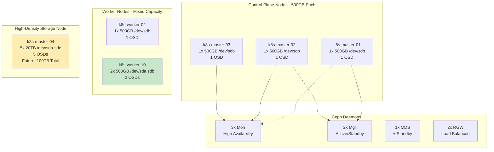
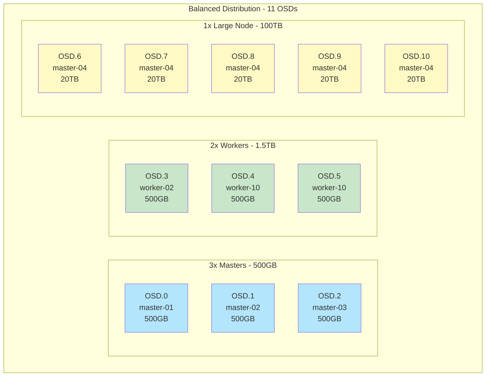
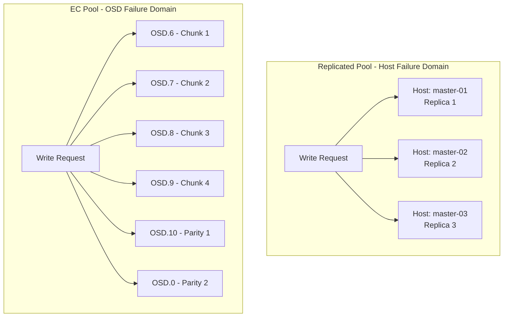

# Ceph Resource Topology

**Document Version**: 1.0.0
**Last Updated**: 2025-11-24

---

## Table of Contents

1. [Overview](#overview)
2. [Node Layout](#node-layout)
3. [OSD Distribution](#osd-distribution)
4. [Daemon Placement](#daemon-placement)
5. [CRUSH Hierarchy](#crush-hierarchy)
6. [Resource Allocation](#resource-allocation)
7. [Scaling Strategy](#scaling-strategy)

---

## Overview

The Ceph cluster topology defines how storage resources (OSDs) and management daemons (Mon, Mgr, MDS, RGW) are distributed across Kubernetes nodes. This architecture balances high availability, performance, and capacity efficiency across **6 storage nodes** with varying hardware configurations.



---

## Node Layout

### Phase 1 Hardware (Current)

| Node | Role | Disks | OSDs | Raw Capacity | Networks | Notes |
|------|------|-------|------|--------------|----------|-------|
| **k8s-master-01** | Control Plane + Storage | 1x 500GB (/dev/sdb) | 1 | 500GB | 103.41, 104.41 | Mon, Mgr |
| **k8s-master-02** | Control Plane + Storage | 1x 500GB (/dev/sdb) | 1 | 500GB | 103.42, 104.42 | Mon, Mgr |
| **k8s-master-03** | Control Plane + Storage | 1x 500GB (/dev/sdb) | 1 | 500GB | 103.43, 104.43 | Mon |
| **k8s-worker-02** | Worker + Storage | 1x 500GB (/dev/sdb) | 1 | 500GB | 103.44, 104.44 | OSD only |
| **k8s-worker-10** | Worker + Storage | 2x 500GB (/dev/sda, /dev/sdb) | 2 | 1TB | 103.45, 104.45 | OSD only |
| **k8s-master-04** | Storage (Heavy) | 5x 20TB (/dev/sda-sde) | 5 | 100TB | 103.46, 104.46 | Future expansion |

**Total Phase 1**: 11 OSDs, ~102TB raw capacity

### Phase 2 Expansion (Planned)

Additional hardware to be integrated:

| Hardware | Capacity | Purpose | Integration Plan |
|----------|----------|---------|------------------|
| **8x 20TB drives** | 160TB raw | Bulk storage (EC pools) | Redistribute to 2 nodes: 6×20TB + 2×20TB |
| **1x 800GB NVMe** | 800GB | Hot tier / WAL+DB | Dedicated fast storage node |

**Post-Phase 2**: ~262TB raw capacity (102TB + 160TB)

---

## OSD Distribution

### Current OSD Layout (Phase 1)



### OSD Distribution Strategy

**Why this distribution?**

1. **Balanced small nodes** (k8s-master-01/02/03, worker-02):
   - Provide base capacity (~2TB)
   - Enable host-level failure domain for replicated pools
   - Allow cluster to survive multiple node failures

2. **Medium worker node** (k8s-worker-10):
   - 2 OSDs provide additional capacity
   - Helps with load distribution
   - Still fits host-level replication

3. **High-density node** (k8s-master-04):
   - 5 OSDs (5× 20TB = 100TB)
   - Primary target for EC pools (failureDomain: osd)
   - Future capacity expansion ready

---

## Daemon Placement

### Monitor (Mon) Daemons

**Count**: 3 (quorum size)
**Placement**: k8s-master-01, k8s-master-02, k8s-master-03

```yaml
mon:
  count: 3
  allowMultiplePerNode: false  # Spread across nodes for HA
```

**Reasoning**:
- **Quorum**: Minimum 3 for fault tolerance (can lose 1 mon)
- **Control plane nodes**: Already have high availability requirements
- **Network access**: Control plane nodes have reliable connectivity
- **Resource availability**: Monitors are lightweight (<1GB RAM)

**Resource Allocation**:
```yaml
resources:
  limits:
    cpu: "2000m"
    memory: "2Gi"
  requests:
    cpu: "500m"
    memory: "1Gi"
```

---

### Manager (Mgr) Daemons

**Count**: 2 (active + standby)
**Placement**: k8s-master-01, k8s-master-02

```yaml
mgr:
  count: 2
  allowMultiplePerNode: false
  modules:
    - name: pg_autoscaler
      enabled: true
    - name: rook
      enabled: true
```

**Reasoning**:
- **High availability**: Active/standby for automatic failover
- **Control plane**: Managers run orchestration, suited for master nodes
- **Dashboard access**: Ingress configured for mgr dashboard

**Resource Allocation**:
```yaml
resources:
  limits:
    cpu: "1000m"
    memory: "1Gi"
  requests:
    cpu: "500m"
    memory: "512Mi"
```

---

### OSD Daemons

**Count**: 11 (1 per disk)
**Placement**: All storage nodes

```yaml
storage:
  useAllNodes: false
  useAllDevices: false
  nodes:
    - name: "k8s-master-01"
      devices:
        - name: "/dev/sdb"
    # ... (see values.yaml for full list)
```

**Reasoning**:
- **Explicit device selection**: Prevents accidental disk consumption
- **One OSD per disk**: Standard Ceph best practice
- **No OS disk usage**: /dev/sda often reserved for OS (except worker-10)

**Resource Allocation**:
```yaml
resources:
  limits:
    cpu: "2000m"
    memory: "4Gi"
  requests:
    cpu: "1000m"
    memory: "2Gi"
```

**Per-OSD consumption**: ~1-2GB RAM, ~1 CPU core under load

---

### Metadata Server (MDS) - CephFS

**Count**: 1 active + 1 standby
**Placement**: Dynamic (controlled by Rook)

```yaml
metadataServer:
  activeCount: 1
  activeStandby: true
```

**Reasoning**:
- **Single active**: Sufficient for Phase 1 CephFS load
- **Standby ready**: Automatic failover on MDS failure
- **Scalable**: Can increase `activeCount` for higher load

**Resource Allocation**:
```yaml
resources:
  limits:
    cpu: "1000m"
    memory: "4Gi"
  requests:
    cpu: "500m"
    memory: "1Gi"
```

---

### RADOS Gateway (RGW) - S3

**Count**: 2 per object store
**Placement**: Dynamic (controlled by Rook)

```yaml
gateway:
  port: 80
  instances: 2  # Per object store
```

**Object Stores**:
- **app-objectstore**: 2 RGW instances (load balanced)
- **bulk-objectstore**: 1 RGW instance (lower priority)

**Reasoning**:
- **High availability**: Multiple RGW instances for app store
- **Load balancing**: Kubernetes Service distributes requests
- **Resource efficiency**: Bulk store has fewer instances

**Resource Allocation**:

*App object store*:
```yaml
resources:
  limits:
    cpu: "1000m"
    memory: "2Gi"
  requests:
    cpu: "500m"
    memory: "1Gi"
```

*Bulk object store*:
```yaml
resources:
  limits:
    cpu: "500m"
    memory: "1Gi"
  requests:
    cpu: "250m"
    memory: "512Mi"
```

---

## CRUSH Hierarchy

### Current Hierarchy

```
root default
├── host k8s-master-01
│   └── osd.0 (500GB)
├── host k8s-master-02
│   └── osd.1 (500GB)
├── host k8s-master-03
│   └── osd.2 (500GB)
├── host k8s-worker-02
│   └── osd.3 (500GB)
├── host k8s-worker-10
│   ├── osd.4 (500GB)
│   └── osd.5 (500GB)
└── host k8s-master-04
    ├── osd.6 (20TB)
    ├── osd.7 (20TB)
    ├── osd.8 (20TB)
    ├── osd.9 (20TB)
    └── osd.10 (20TB)
```

### Failure Domains

**Replicated Pools** (`failureDomain: host`):
- Replicas distributed across **different hosts**
- Can survive complete node failure
- Requires minimum 3 nodes (for size=3)
- Example: Data written to master-01, master-02, master-03

**Erasure Coded Pools** (`failureDomain: osd`):
- Chunks distributed across **different OSDs**
- Can survive OSD failures (even on same host)
- Allows EC on single large node (master-04)
- Example: 6 chunks spread across master-04's 5 OSDs + other nodes



### CRUSH Weights

**Automatic weighting** based on disk size:

| OSD | Size | Weight | % of Total |
|-----|------|--------|------------|
| osd.0-5 | 500GB each | 0.488 | ~0.5% each |
| osd.6-10 | 20TB each | 19.53 | ~19% each |

**Effect**:
- Large OSDs (master-04) receive proportionally more data
- Small OSDs balanced across masters/workers
- CRUSH algorithm ensures even distribution within weight classes

---

## Resource Allocation

### Node-Level Resources

**Total cluster resources required**:

| Daemon Type | Count | CPU Request | Memory Request | Total CPU | Total Memory |
|-------------|-------|-------------|----------------|-----------|--------------|
| Mon | 3 | 500m | 1Gi | 1.5 CPU | 3GB |
| Mgr | 2 | 500m | 512Mi | 1 CPU | 1GB |
| OSD | 11 | 1000m | 2Gi | 11 CPU | 22GB |
| MDS | 2 | 500m | 1Gi | 1 CPU | 2GB |
| RGW (App) | 2 | 500m | 1Gi | 1 CPU | 2GB |
| RGW (Bulk) | 1 | 250m | 512Mi | 0.25 CPU | 0.5GB |
| **Total** | **21** | - | - | **15.75 CPU** | **30.5GB** |

### Priority Classes

**Critical daemons** ensure scheduling during resource pressure:

```yaml
priorityClassNames:
  mon: system-node-critical        # Highest priority
  osd: system-node-critical        # Highest priority
  mgr: system-cluster-critical     # High priority
  mds: system-cluster-critical     # High priority (CephFS)
  rgw: system-cluster-critical     # High priority (S3)
```

**Effect**:
- Ceph daemons won't be evicted under memory pressure
- Guaranteed scheduling even if cluster is full
- Application pods evicted before storage daemons

---

## Scaling Strategy

### Phase 2 Integration Plan

**Goal**: Add 160TB raw capacity without disrupting existing cluster

#### Step 1: Redistribute 8× 20TB Drives

**Current**: 8× 20TB drives in k8s-master-04
**Target**: Split into 2 nodes

1. **Node A** (6× 20TB = 120TB):
   - Label as storage node
   - Add 6 disks to Ceph cluster
   - Creates 6 new OSDs

2. **Node B** (2× 20TB = 40TB):
   - Label as storage node
   - Add 2 disks to Ceph cluster
   - Creates 2 new OSDs

**Total new OSDs**: 8 (bringing total to 19 OSDs)

#### Step 2: Change EC Failure Domain

**Before** (Phase 1):
```yaml
spec:
  failureDomain: osd  # Required for EC on few nodes
```

**After** (Phase 2):
```yaml
spec:
  failureDomain: host  # Preferred for EC across nodes
```

**Effect**:
- EC chunks distributed across different hosts
- Improved reliability (survive node failure, not just OSD failure)
- Better performance (parallel reads from different nodes)

#### Step 3: Add NVMe Hot Tier

**Node C** (800GB NVMe):
- Dedicated fast storage node
- Used for:
  - BlueStore WAL/DB devices (accelerate HDDs)
  - Cache tier for replicated pools
  - High-IOPS workloads

```yaml
# Future configuration
storage:
  nodes:
    - name: "k8s-nvme-01"
      config:
        storeType: bluestore
      devices:
        - name: "/dev/nvme0n1"  # 800GB NVMe
```

#### Step 4: Rebalance Data

**Automatic rebalancing** after adding OSDs:
- CRUSH algorithm redistributes data
- Existing PGs migrate to new OSDs
- Controlled by:
  - `osd_max_backfills` (default: 1 per OSD)
  - `osd_recovery_max_active` (default: 3)
  - `osd_recovery_sleep` (throttling)

**Expected timeline**:
- **Small pools** (500GB): ~2-4 hours
- **Large pools** (100TB+): ~24-48 hours
- **Network bound**: Limited by cluster network bandwidth

---

## Verification Commands

### Check OSD Distribution

```bash
kubectl -n pn-k8s-storage-hyd-a exec -it deploy/rook-ceph-tools -- \
  ceph osd tree
```

Expected output:
```
ID  CLASS  WEIGHT   TYPE NAME               STATUS
-1         99.0000  root default
-3          0.4880      host k8s-master-01
 0    hdd   0.4880          osd.0               up
-5          0.4880      host k8s-master-02
 1    hdd   0.4880          osd.1               up
...
```

### Check Daemon Placement

```bash
kubectl -n pn-k8s-storage-hyd-a get pods -o wide | grep -E 'mon|mgr|osd|mds|rgw'
```

### Check CRUSH Map

```bash
kubectl -n pn-k8s-storage-hyd-a exec -it deploy/rook-ceph-tools -- \
  ceph osd crush tree
```

### Check Resource Usage

```bash
kubectl -n pn-k8s-storage-hyd-a top pods
```

---

## References

### Upstream Documentation

- **CRUSH Maps**: https://docs.ceph.com/en/reef/rados/operations/crush-map/
- **Adding/Removing OSDs**: https://docs.ceph.com/en/reef/rados/operations/add-or-rm-osds/
- **Placement Groups**: https://docs.ceph.com/en/reef/rados/operations/placement-groups/
- **Rook Node Selection**: https://rook.io/docs/rook/latest-release/CRDs/Cluster/ceph-cluster-crd/#node-settings

### Related Documentation

- [Main Index](../README.md)
- [Pool Architecture](./pools.md) - Storage pool design and failure domains
- [Network Configuration](./network.md) - Dedicated storage VLANs

---

**Maintained by**: Platform Team
