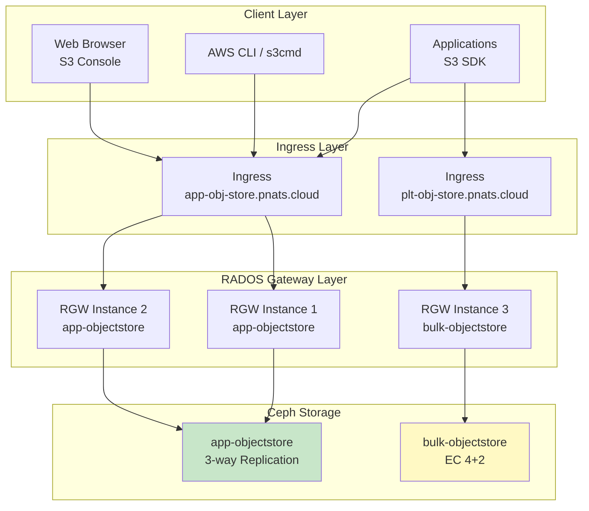
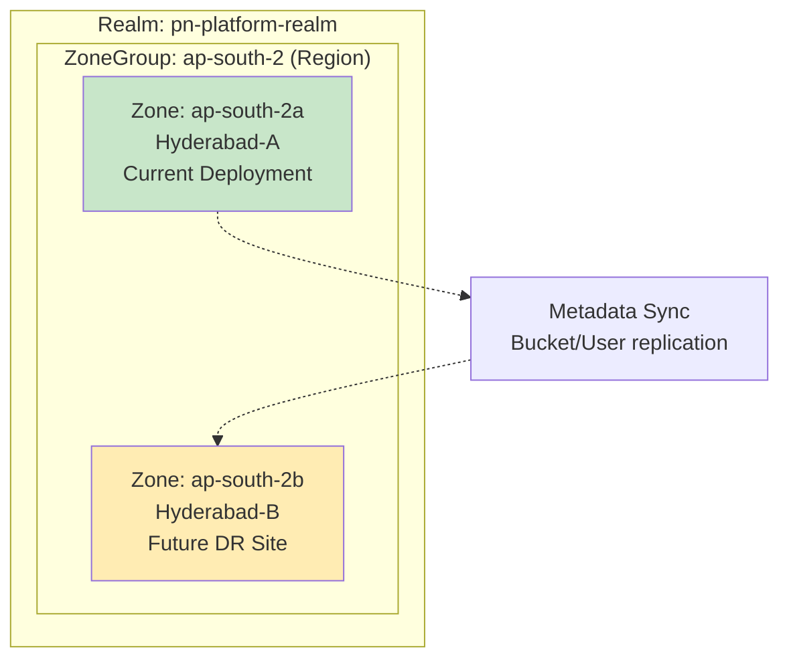

# Object Storage (S3) Configuration

**Document Version**: 1.0.0
**Last Updated**: 2025-11-24

---

## Table of Contents

1. [Overview](#overview)
2. [Object Store Architecture](#object-store-architecture)
3. [Application Object Store](#application-object-store)
4. [Bulk Object Store](#bulk-object-store)
5. [S3 User Management](#s3-user-management)
6. [Multi-Site Configuration](#multi-site-configuration)
7. [Usage Examples](#usage-examples)
8. [Troubleshooting](#troubleshooting)

---

## Overview

The Ceph cluster provides **S3-compatible object storage** via RADOS Gateway (RGW). Two object stores are configured with different characteristics to match workload requirements:

1. **app-objectstore**: High-reliability replicated storage for user-facing data
2. **bulk-objectstore**: Capacity-efficient EC storage for telemetry and backups



---

## Object Store Architecture

### RGW (RADOS Gateway)

**RADOS Gateway** is the S3/Swift-compatible API layer for Ceph object storage:

- **S3 API Compatibility**: Supports majority of AWS S3 API operations
- **High Availability**: Multiple RGW instances behind load balancer
- **Stateless**: No local state (all metadata in Ceph)
- **Scalable**: Add more RGW instances for higher throughput

### Object Store Components

Each object store consists of:

1. **Metadata Pool**: Stores bucket index, object metadata (replicated for reliability)
2. **Data Pool**: Stores actual object data (replicated or EC depending on store)
3. **RGW Gateway Pods**: API endpoints (load balanced)
4. **Ingress**: External HTTPS endpoint with TLS

---

## Application Object Store

### Configuration

**Name**: `app-objectstore`
**Endpoint**: `https://app-obj-store.pnats.cloud`
**TLS**: Let's Encrypt (cert-manager)

```yaml
cephObjectStores:
- name: app-objectstore
  spec:
    # Metadata Pool - Always replicated for reliability
    metadataPool:
      failureDomain: host
      replicated:
        size: 3

    # Data Pool - Replicated for low-latency user access
    dataPool:
      failureDomain: host
      replicated:
        size: 3

    preservePoolsOnDelete: true  # Safety: don't delete pools on uninstall

    # RGW Gateway Configuration
    gateway:
      port: 80  # Internal port (ingress handles TLS)
      instances: 2  # High availability
      priorityClassName: system-cluster-critical
      resources:
        limits:
          cpu: "1000m"
          memory: "2Gi"
        requests:
          cpu: "500m"
          memory: "1Gi"

  # Ingress Configuration
  ingress:
    enabled: true
    ingressClassName: nginx
    annotations:
      cert-manager.io/cluster-issuer: letsencrypt-production
      nginx.ingress.kubernetes.io/proxy-body-size: "0"  # No upload size limit
      nginx.ingress.kubernetes.io/proxy-buffering: "off"  # Stream large files
    host:
      name: app-obj-store.pnats.cloud
      path: /
    tls:
      - hosts:
          - app-obj-store.pnats.cloud
        secretName: ceph-rgw-s3-tls
```

### Characteristics

| Aspect | Configuration | Reasoning |
|--------|---------------|-----------|
| **Data Pool** | 3-way Replication | User data is critical, needs low latency |
| **Metadata Pool** | 3-way Replication | Bucket index must be fast and reliable |
| **Failure Domain** | host | Survive node failures |
| **Capacity Efficiency** | 33% | Trade efficiency for safety |
| **RGW Instances** | 2 | High availability, load distribution |
| **Endpoint** | Public (TLS) | User-facing, external access |

### Use Cases

- **User file uploads**: Resumes, documents, images
- **Application assets**: Static files, media content
- **User backups**: Application-generated backups
- **Multi-tenant data**: Isolated per user/bucket

### S3 Users

Pre-configured users for application object store:

#### 1. Database Backup User

```yaml
cephObjectStoreUsers:
- name: db-user
  store: app-objectstore
  displayName: "Databases Backup User"
  quotas:
    maxSize: "100Gi"
    maxObjects: 10000
```

**Purpose**: Automated database backups
**Quota**: 100GB, 10K objects

#### 2. Admin User

```yaml
- name: admin
  store: app-objectstore
  displayName: "Admin User"
  quotas:
    maxSize: "256Gi"
    maxObjects: 1000000
  capabilities:
    user: "*"      # Full user management
    bucket: "*"    # Full bucket management
```

**Purpose**: Administrative operations, user management
**Quota**: 256GB, 1M objects
**Capabilities**: Full control over users and buckets

---

## Bulk Object Store

### Configuration

**Name**: `bulk-objectstore`
**Endpoint**: `https://plt-obj-store.pnats.cloud`
**TLS**: Let's Encrypt (cert-manager)

```yaml
cephObjectStores:
- name: bulk-objectstore
  spec:
    # Metadata Pool - Always replicated (even for EC stores)
    metadataPool:
      failureDomain: host
      replicated:
        size: 3

    # Data Pool - Erasure Coded for capacity efficiency
    dataPool:
      failureDomain: osd  # OSD-level for Phase 1
      erasureCoded:
        dataChunks: 4
        codingChunks: 2

    preservePoolsOnDelete: true

    # RGW Gateway Configuration
    gateway:
      port: 80
      instances: 1  # Single instance (lower priority workload)
      priorityClassName: system-cluster-critical
      resources:
        limits:
          cpu: "500m"
          memory: "1Gi"
        requests:
          cpu: "250m"
          memory: "512Mi"

  # Ingress Configuration
  ingress:
    enabled: true
    ingressClassName: nginx
    annotations:
      cert-manager.io/cluster-issuer: letsencrypt-production
      nginx.ingress.kubernetes.io/proxy-body-size: "0"
      nginx.ingress.kubernetes.io/proxy-buffering: "off"
    host:
      name: plt-obj-store.pnats.cloud
      path: /
    tls:
      - hosts:
          - plt-obj-store.pnats.cloud
        secretName: ceph-rgw-s3-tls
```

### Characteristics

| Aspect | Configuration | Reasoning |
|--------|---------------|-----------|
| **Data Pool** | EC 4+2 | Capacity efficiency for high-volume data |
| **Metadata Pool** | 3-way Replication | Fast bucket operations |
| **Failure Domain** | osd (Phase 1) | Works with limited nodes, upgrade to host in Phase 2 |
| **Capacity Efficiency** | 67% | 2× more efficient than replication |
| **RGW Instances** | 1 | Lower resource usage for infrastructure workload |
| **Endpoint** | Public (TLS) | Internal services access |

### Use Cases

- **Telemetry data**: Logs, metrics, traces
- **Build artifacts**: CI/CD output, package caches
- **Non-critical backups**: Application logs, audit trails
- **Archive storage**: Long-term data retention

### S3 Users

Pre-configured users for bulk object store:

#### Telemetry Service User

```yaml
cephObjectStoreUsers:
- name: telemetry-user
  store: bulk-objectstore
  displayName: "Telemetry Service User"
  quotas:
    maxSize: "500Gi"
    maxObjects: 10000000
```

**Purpose**: Loki, Tempo, long-term metric storage
**Quota**: 500GB, 10M objects

---

## S3 User Management

### Creating S3 Users

**Via Helm values**:
```yaml
cephObjectStoreUsers:
- name: my-app-user
  store: app-objectstore
  displayName: "My Application User"
  quotas:
    maxSize: "50Gi"
    maxObjects: 100000
  capabilities:
    bucket: "read, write"  # Bucket operations only
```

**Apply changes**:
```bash
cd platform/stacks/storage/charts/rook-ceph-cluster
helm upgrade rook-ceph-cluster . -n pn-k8s-storage-hyd-a
```

### Accessing User Credentials

**Credentials stored in Kubernetes Secret**:
```bash
kubectl -n pn-k8s-storage-hyd-a get secret rook-ceph-object-user-app-objectstore-my-app-user -o yaml
```

**Secret contains**:
- `AccessKey`: S3 access key ID
- `SecretKey`: S3 secret access key
- `Endpoint`: RGW endpoint URL

**Extract credentials**:
```bash
# Access Key
kubectl -n pn-k8s-storage-hyd-a get secret \
  rook-ceph-object-user-app-objectstore-my-app-user \
  -o jsonpath='{.data.AccessKey}' | base64 -d

# Secret Key
kubectl -n pn-k8s-storage-hyd-a get secret \
  rook-ceph-object-user-app-objectstore-my-app-user \
  -o jsonpath='{.data.SecretKey}' | base64 -d
```

### User Capabilities

**Available capabilities** (per Ceph RGW):

| Capability | Permissions | Description |
|------------|-------------|-------------|
| `user` | `read`, `write`, `*` | Manage users |
| `bucket` | `read`, `write`, `*` | Manage buckets |
| `metadata` | `read`, `write`, `*` | Manage metadata |
| `usage` | `read`, `write`, `*` | View usage stats |
| `zone` | `read`, `write`, `*` | Manage zones (multi-site) |

**Example - Read-only user**:
```yaml
capabilities:
  bucket: "read"
  user: "read"
```

**Example - Full admin**:
```yaml
capabilities:
  user: "*"
  bucket: "*"
  metadata: "*"
  usage: "*"
```

---

## Multi-Site Configuration

### Realm, ZoneGroup, Zone

**Multi-site support** for future geo-redundancy:

```yaml
# Realm - Top-level container
cephObjectRealm:
  enabled: true
  name: pn-platform-realm

# ZoneGroup - Logical grouping of zones (region-level)
cephObjectZoneGroup:
  enabled: true
  name: ap-south-2
  realm: pn-platform-realm

# Zone - Physical deployment location
cephObjectZone:
  enabled: true
  name: ap-south-2a
  zoneGroup: ap-south-2
  metadataPool:
    failureDomain: host
    replicated:
      size: 3
  dataPool:
    failureDomain: host
    replicated:
      size: 3
```

### Multi-Site Architecture



### Multi-Site Benefits

1. **Geo-redundancy**: Data replicated across zones
2. **Disaster recovery**: Failover to secondary zone
3. **Read locality**: Serve requests from nearest zone
4. **Active-active**: Both zones can accept writes

### Future Expansion

**Phase 2 - Add secondary zone**:
1. Deploy second Ceph cluster in different location
2. Create zone `ap-south-2b` in same ZoneGroup
3. Configure metadata sync between zones
4. Enable data sync for selected buckets

**Configuration for secondary zone**:
```yaml
cephObjectZone:
  enabled: true
  name: ap-south-2b
  zoneGroup: ap-south-2
  # ... pool configuration
```

---

## Usage Examples

### Example 1: AWS CLI Configuration

**Configure AWS CLI**:
```bash
aws configure --profile pnats-app
AWS Access Key ID: <from secret>
AWS Secret Access Key: <from secret>
Default region name: ap-south-2
Default output format: json
```

**Set endpoint**:
```bash
export AWS_ENDPOINT=https://app-obj-store.pnats.cloud
```

**Create bucket**:
```bash
aws --profile pnats-app --endpoint-url $AWS_ENDPOINT s3 mb s3://my-app-bucket
```

**Upload file**:
```bash
aws --profile pnats-app --endpoint-url $AWS_ENDPOINT \
  s3 cp file.txt s3://my-app-bucket/
```

**List objects**:
```bash
aws --profile pnats-app --endpoint-url $AWS_ENDPOINT \
  s3 ls s3://my-app-bucket/
```

---

### Example 2: Python Application (boto3)

```python
import boto3
from botocore.client import Config

# S3 client configuration
s3_client = boto3.client(
    's3',
    endpoint_url='https://app-obj-store.pnats.cloud',
    aws_access_key_id='<access-key>',
    aws_secret_access_key='<secret-key>',
    config=Config(signature_version='s3v4'),
    region_name='ap-south-2'
)

# Create bucket
s3_client.create_bucket(Bucket='my-app-bucket')

# Upload file
with open('file.txt', 'rb') as f:
    s3_client.upload_fileobj(f, 'my-app-bucket', 'file.txt')

# Download file
with open('downloaded.txt', 'wb') as f:
    s3_client.download_fileobj('my-app-bucket', 'file.txt', f)

# List objects
response = s3_client.list_objects_v2(Bucket='my-app-bucket')
for obj in response.get('Contents', []):
    print(f"Key: {obj['Key']}, Size: {obj['Size']}")
```

---

### Example 3: Kubernetes Pod with S3 Access

**Create secret from CephObjectStoreUser**:
```bash
# Secret auto-created by Rook
kubectl -n pn-k8s-storage-hyd-a get secret \
  rook-ceph-object-user-app-objectstore-db-user
```

**Pod using S3 credentials**:
```yaml
apiVersion: v1
kind: Pod
metadata:
  name: app-with-s3
  namespace: my-app
spec:
  containers:
  - name: app
    image: my-app:latest
    env:
    # S3 Endpoint
    - name: S3_ENDPOINT
      value: "https://app-obj-store.pnats.cloud"
    - name: S3_REGION
      value: "ap-south-2"

    # Credentials from Rook-generated secret
    - name: S3_ACCESS_KEY
      valueFrom:
        secretKeyRef:
          name: rook-ceph-object-user-app-objectstore-db-user
          key: AccessKey
    - name: S3_SECRET_KEY
      valueFrom:
        secretKeyRef:
          name: rook-ceph-object-user-app-objectstore-db-user
          key: SecretKey
```

---

### Example 4: Backup Script with s3cmd

**Install s3cmd**:
```bash
apt-get install s3cmd
```

**Configure s3cmd** (`~/.s3cfg`):
```ini
[default]
access_key = <access-key>
secret_key = <secret-key>
host_base = app-obj-store.pnats.cloud
host_bucket = app-obj-store.pnats.cloud
use_https = True
signature_v2 = False
```

**Backup database**:
```bash
#!/bin/bash
BACKUP_FILE="db-backup-$(date +%Y%m%d-%H%M%S).sql.gz"

# Create backup
pg_dump mydb | gzip > $BACKUP_FILE

# Upload to S3
s3cmd put $BACKUP_FILE s3://db-backups/

# Cleanup old local backup
rm $BACKUP_FILE

# Delete backups older than 30 days
s3cmd ls s3://db-backups/ | \
  awk '{if ($1 < date -d "30 days ago") print $4}' | \
  xargs -I {} s3cmd del {}
```

---

## Troubleshooting

### Check RGW Status

**RGW pods**:
```bash
kubectl -n pn-k8s-storage-hyd-a get pods -l app=rook-ceph-rgw
```

**RGW logs**:
```bash
kubectl -n pn-k8s-storage-hyd-a logs -l app=rook-ceph-rgw-app-objectstore --tail=100
```

### Check Object Store Status

```bash
kubectl -n pn-k8s-storage-hyd-a get cephobjectstore
```

Expected:
```
NAME              PHASE
app-objectstore   Ready
bulk-objectstore  Ready
```

### Test S3 Connectivity

**From toolbox pod**:
```bash
kubectl -n pn-k8s-storage-hyd-a exec -it deploy/rook-ceph-tools -- bash

# Install s3cmd
yum install -y s3cmd

# Test connectivity
s3cmd --host=rook-ceph-rgw-app-objectstore.pn-k8s-storage-hyd-a \
      --host-bucket=rook-ceph-rgw-app-objectstore.pn-k8s-storage-hyd-a \
      --access_key=<key> --secret_key=<secret> \
      ls
```

### Common Issues

#### Issue 1: "SignatureDoesNotMatch" Error

**Cause**: Incorrect signature version
**Fix**: Use signature v4:
```python
config=Config(signature_version='s3v4')
```

#### Issue 2: RGW Pod Not Starting

**Check events**:
```bash
kubectl -n pn-k8s-storage-hyd-a describe pod <rgw-pod-name>
```

**Common causes**:
- Pools not ready
- Resource limits exceeded
- Network policy blocking traffic

#### Issue 3: Upload Fails (413 Entity Too Large)

**Cause**: Nginx ingress default body size limit
**Fix**: Already configured in ingress annotations:
```yaml
nginx.ingress.kubernetes.io/proxy-body-size: "0"  # Unlimited
```

#### Issue 4: Slow Upload/Download

**Check**:
1. RGW resource limits (CPU/memory)
2. Network bandwidth to cluster
3. Pool performance (check slow ops)

**Increase RGW resources**:
```yaml
gateway:
  resources:
    limits:
      cpu: "2000m"  # Increase from 1000m
      memory: "4Gi"  # Increase from 2Gi
```

---

## References

### Upstream Documentation

- **Ceph RGW**: https://docs.ceph.com/en/reef/radosgw/
- **RGW Admin Guide**: https://docs.ceph.com/en/reef/radosgw/admin/
- **S3 API**: https://docs.ceph.com/en/reef/radosgw/s3/
- **Multi-Site**: https://docs.ceph.com/en/reef/radosgw/multisite/
- **Rook Object Storage**: https://rook.io/docs/rook/latest-release/Storage-Configuration/Object-Storage-RGW/object-storage/

### S3 Client Documentation

- **AWS CLI**: https://docs.aws.amazon.com/cli/latest/reference/s3/
- **boto3 (Python)**: https://boto3.amazonaws.com/v1/documentation/api/latest/guide/s3.html
- **s3cmd**: https://s3tools.org/s3cmd

### Related Documentation

- [Main Index](../README.md)
- [Storage Classes](./storage-classes.md) - S3 StorageClass usage
- [Pool Architecture](../architecture/pools.md) - Understanding EC vs replication

---

**Maintained by**: Platform Team
