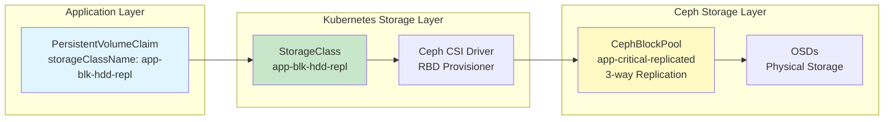
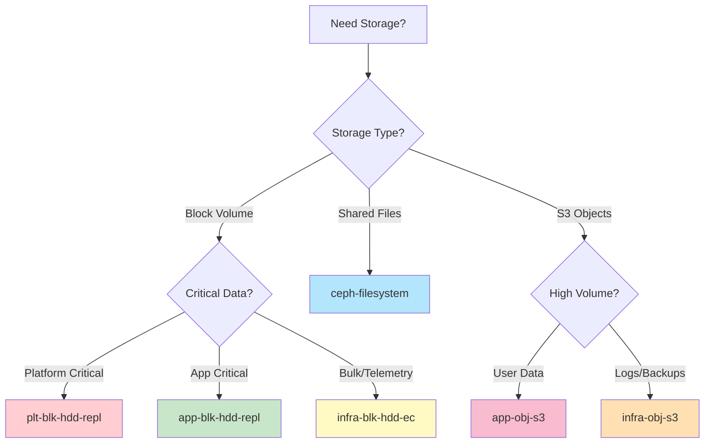

# Kubernetes StorageClasses

**Document Version**: 1.0.0
**Last Updated**: 2025-11-24

---

## Table of Contents

1. [Overview](#overview)
2. [StorageClass Naming Convention](#storageclass-naming-convention)
3. [Block Storage (RBD)](#block-storage-rbd)
4. [Filesystem Storage (CephFS)](#filesystem-storage-cephfs)
5. [Object Storage (S3)](#object-storage-s3)
6. [Usage Guidelines](#usage-guidelines)
7. [Examples](#examples)

---

## Overview

Kubernetes StorageClasses provide an abstraction layer between applications and underlying Ceph pools. Each StorageClass maps to a specific Ceph pool with defined characteristics (replication, erasure coding, performance tier).



---

## StorageClass Naming Convention

**Format**: `{layer}-{type}-{medium}-{tier}`

| Component | Values | Description |
|-----------|--------|-------------|
| **layer** | `plt`, `app`, `infra` | Platform, Application, or Infrastructure |
| **type** | `blk`, `obj`, `fs` | Block (RBD), Object (S3), or Filesystem (CephFS) |
| **medium** | `hdd`, `ssd`, `nvme` | Storage medium type |
| **tier** | `repl`, `ec`, `hot`, `cold` | Replication strategy or performance tier |

**Examples**:
- `plt-blk-hdd-repl`: Platform block storage, HDD, replicated
- `app-blk-hdd-repl`: Application block storage, HDD, replicated
- `infra-blk-hdd-ec`: Infrastructure block storage, HDD, erasure coded
- `app-obj-s3`: Application object storage (S3)

---

## Block Storage (RBD)

### 1. Platform Critical Replicated

**StorageClass**: `plt-blk-hdd-repl`
**Pool**: `plt-critical-replicated`
**Default**: Yes (currently, will be changed to `app-blk-hdd-repl`)

```yaml
apiVersion: storage.k8s.io/v1
kind: StorageClass
metadata:
  name: plt-blk-hdd-repl
provisioner: rook-ceph.rbd.csi.ceph.com
parameters:
  clusterID: pn-k8s-storage-hyd-a
  pool: plt-critical-replicated
  imageFormat: "2"
  imageFeatures: layering
  csi.storage.k8s.io/provisioner-secret-name: rook-csi-rbd-provisioner
  csi.storage.k8s.io/provisioner-secret-namespace: pn-k8s-storage-hyd-a
  csi.storage.k8s.io/controller-expand-secret-name: rook-csi-rbd-provisioner
  csi.storage.k8s.io/controller-expand-secret-namespace: pn-k8s-storage-hyd-a
  csi.storage.k8s.io/node-stage-secret-name: rook-csi-rbd-node
  csi.storage.k8s.io/node-stage-secret-namespace: pn-k8s-storage-hyd-a
  csi.storage.k8s.io/fstype: ext4
reclaimPolicy: Delete
allowVolumeExpansion: true
volumeBindingMode: Immediate
```

**Characteristics**:
- **Replication**: 3-way across hosts
- **Failure Tolerance**: Survive 2 node failures
- **Capacity Efficiency**: 33% (3× overhead)
- **Performance**: Low-latency, high IOPS

**Use Cases**:
- Platform databases (Authentik, Keycloak, Vault/Infisical)
- Kubernetes etcd backups
- GitOps state (ArgoCD repositories)
- Platform configuration and secrets

**Storage Path**:
```
PVC → StorageClass (plt-blk-hdd-repl) → Pool (plt-critical-replicated) → OSDs (3 replicas)
```

---

### 2. Application Critical Replicated

**StorageClass**: `app-blk-hdd-repl`
**Pool**: `app-critical-replicated`
**Default**: No (should be set to default)

```yaml
apiVersion: storage.k8s.io/v1
kind: StorageClass
metadata:
  name: app-blk-hdd-repl
provisioner: rook-ceph.rbd.csi.ceph.com
parameters:
  clusterID: pn-k8s-storage-hyd-a
  pool: app-critical-replicated
  imageFormat: "2"
  imageFeatures: layering
  csi.storage.k8s.io/provisioner-secret-name: rook-csi-rbd-provisioner
  csi.storage.k8s.io/provisioner-secret-namespace: pn-k8s-storage-hyd-a
  csi.storage.k8s.io/controller-expand-secret-name: rook-csi-rbd-provisioner
  csi.storage.k8s.io/controller-expand-secret-namespace: pn-k8s-storage-hyd-a
  csi.storage.k8s.io/node-stage-secret-name: rook-csi-rbd-node
  csi.storage.k8s.io/node-stage-secret-namespace: pn-k8s-storage-hyd-a
  csi.storage.k8s.io/fstype: ext4
reclaimPolicy: Delete
allowVolumeExpansion: true
volumeBindingMode: Immediate
```

**Characteristics**:
- **Replication**: 3-way across hosts
- **Failure Tolerance**: Survive 2 node failures
- **Capacity Efficiency**: 33% (3× overhead)
- **Performance**: Database-optimized

**Use Cases**:
- Application databases (PostgreSQL, MySQL, StackGres)
- User-generated critical data
- Application configuration
- Stateful application data

**Why Default?**:
- Most applications require replicated storage
- Developers don't need to specify storageClassName
- Simplifies PVC creation
- Safe default (high reliability)

**Storage Path**:
```
PVC → StorageClass (app-blk-hdd-repl) → Pool (app-critical-replicated) → OSDs (3 replicas)
```

---

### 3. Infrastructure Bulk Erasure Coded

**StorageClass**: `infra-blk-hdd-ec`
**Pool**: `bulk-ec`
**Default**: No

```yaml
apiVersion: storage.k8s.io/v1
kind: StorageClass
metadata:
  name: infra-blk-hdd-ec
provisioner: rook-ceph.rbd.csi.ceph.com
parameters:
  clusterID: pn-k8s-storage-hyd-a
  pool: bulk-ec
  imageFormat: "2"
  imageFeatures: layering
  csi.storage.k8s.io/provisioner-secret-name: rook-csi-rbd-provisioner
  csi.storage.k8s.io/provisioner-secret-namespace: pn-k8s-storage-hyd-a
  csi.storage.k8s.io/controller-expand-secret-name: rook-csi-rbd-provisioner
  csi.storage.k8s.io/controller-expand-secret-namespace: pn-k8s-storage-hyd-a
  csi.storage.k8s.io/node-stage-secret-name: rook-csi-rbd-node
  csi.storage.k8s.io/node-stage-secret-namespace: pn-k8s-storage-hyd-a
  csi.storage.k8s.io/fstype: ext4
reclaimPolicy: Delete
allowVolumeExpansion: true
volumeBindingMode: Immediate
```

**Characteristics**:
- **Erasure Coding**: EC 4+2 (4 data + 2 parity chunks)
- **Failure Tolerance**: Survive 2 chunk failures
- **Capacity Efficiency**: 67% (1.5× overhead)
- **Performance**: Moderate latency, moderate IOPS

**Use Cases**:
- Telemetry data (logs, metrics, traces)
- Build artifacts and CI/CD caches
- Temporary/scratch data
- Non-critical backups

**Trade-offs**:
- **Pros**: 2× more capacity efficient than replication
- **Cons**: Slightly higher latency (encoding/decoding overhead)
- **Best for**: High-volume, low-criticality data

**Storage Path**:
```
PVC → StorageClass (infra-blk-hdd-ec) → Pool (bulk-ec) → OSDs (6 EC chunks)
```

---

## Filesystem Storage (CephFS)

### Shared Filesystem

**StorageClass**: `ceph-filesystem`
**Filesystem**: `cephfs`
**Data Pool**: `data-replicated`
**Default**: No

```yaml
apiVersion: storage.k8s.io/v1
kind: StorageClass
metadata:
  name: ceph-filesystem
provisioner: rook-ceph.cephfs.csi.ceph.com
parameters:
  clusterID: pn-k8s-storage-hyd-a
  fsName: cephfs
  pool: data-replicated
  csi.storage.k8s.io/provisioner-secret-name: rook-csi-cephfs-provisioner
  csi.storage.k8s.io/provisioner-secret-namespace: pn-k8s-storage-hyd-a
  csi.storage.k8s.io/controller-expand-secret-name: rook-csi-cephfs-provisioner
  csi.storage.k8s.io/controller-expand-secret-namespace: pn-k8s-storage-hyd-a
  csi.storage.k8s.io/node-stage-secret-name: rook-csi-cephfs-node
  csi.storage.k8s.io/node-stage-secret-namespace: pn-k8s-storage-hyd-a
reclaimPolicy: Delete
allowVolumeExpansion: true
volumeBindingMode: Immediate
```

**Characteristics**:
- **Access Mode**: ReadWriteMany (multiple pods can read/write)
- **Replication**: 3-way (metadata and data)
- **Performance**: POSIX-compliant filesystem
- **Use Case**: Shared data across multiple pods

**Use Cases**:
- Shared configuration files
- Multi-pod read/write workloads
- Collaborative editing applications
- Shared caches

**Differences from RBD**:
| Aspect | RBD (Block) | CephFS (File) |
|--------|-------------|---------------|
| Access Mode | RWO (single pod) | RWX (multi-pod) |
| Protocol | Block device | POSIX filesystem |
| Use Case | Databases, single-writer | Shared files, multi-writer |
| Performance | Lower latency | Higher latency (metadata overhead) |

**Storage Path**:
```
PVC → StorageClass (ceph-filesystem) → CephFS → Data Pool (replicated) + Metadata Pool → OSDs
```

---

## Object Storage (S3)

### 1. Application Object Storage

**StorageClass**: `app-obj-s3`
**Object Store**: `app-objectstore`
**Default**: No

```yaml
apiVersion: storage.k8s.io/v1
kind: StorageClass
metadata:
  name: app-obj-s3
provisioner: rook-ceph.ceph.rook.io/bucket
parameters:
  objectStoreName: app-objectstore
  objectStoreNamespace: pn-k8s-storage-hyd-a
  region: ap-south-2
reclaimPolicy: Delete
volumeBindingMode: Immediate
```

**Characteristics**:
- **Protocol**: S3-compatible API
- **Replication**: 3-way (metadata and data)
- **Access**: Multi-application, multi-user
- **Endpoint**: `https://app-obj-store.pnats.cloud`

**Use Cases**:
- User-uploaded files (resumes, documents, images)
- Application backups
- Static assets for web applications
- Object versioning and lifecycle management

**S3 Features**:
- Bucket operations (create, list, delete)
- Object operations (put, get, delete, copy)
- Multipart uploads
- Versioning
- Lifecycle policies

**Storage Path**:
```
S3 Client → RGW Gateway → Object Store (app-objectstore) → Data Pool (replicated) → OSDs
```

---

### 2. Infrastructure/Bulk Object Storage

**StorageClass**: `infra-obj-s3`
**Object Store**: `bulk-objectstore`
**Default**: No

```yaml
apiVersion: storage.k8s.io/v1
kind: StorageClass
metadata:
  name: infra-obj-s3
provisioner: rook-ceph.ceph.rook.io/bucket
parameters:
  objectStoreName: bulk-objectstore
  objectStoreNamespace: pn-k8s-storage-hyd-a
  region: ap-south-2
reclaimPolicy: Delete
volumeBindingMode: Immediate
```

**Characteristics**:
- **Protocol**: S3-compatible API
- **Erasure Coding**: EC 4+2 (data pool)
- **Capacity**: 2× more efficient than replicated
- **Endpoint**: `https://plt-obj-store.pnats.cloud`

**Use Cases**:
- Telemetry data (logs, metrics, traces)
- Database backups (non-critical)
- CI/CD build artifacts
- Long-term archives

**Trade-offs**:
- **Pros**: 2× capacity efficiency
- **Cons**: Slightly higher latency
- **Best for**: Large objects, infrequent access

**Storage Path**:
```
S3 Client → RGW Gateway → Object Store (bulk-objectstore) → Data Pool (EC 4+2) → OSDs
```

---

## Usage Guidelines

### When to Use Each StorageClass



### Decision Matrix

| Requirement | Recommended StorageClass | Reasoning |
|-------------|--------------------------|-----------|
| **PostgreSQL database** | `app-blk-hdd-repl` | Critical data, low latency required |
| **Platform service DB** | `plt-blk-hdd-repl` | Infrastructure data, maximum safety |
| **Prometheus metrics** | `infra-blk-hdd-ec` | High volume, capacity efficiency needed |
| **Loki logs** | `infra-blk-hdd-ec` | High volume, moderate latency acceptable |
| **Shared config files** | `ceph-filesystem` | Multi-pod access required |
| **User uploads (S3)** | `app-obj-s3` | S3 API, user-facing data |
| **CI/CD artifacts** | `infra-obj-s3` | S3 API, capacity efficiency needed |

---

## Examples

### Example 1: PostgreSQL Database (Application)

```yaml
apiVersion: v1
kind: PersistentVolumeClaim
metadata:
  name: postgres-data
  namespace: my-app
spec:
  accessModes:
    - ReadWriteOnce
  storageClassName: app-blk-hdd-repl  # Critical application data
  resources:
    requests:
      storage: 50Gi
```

**Result**:
- Creates RBD image in `app-critical-replicated` pool
- 3-way replication across hosts
- 50GB request → ~150GB raw usage (3× overhead)

---

### Example 2: Prometheus Metrics (Infrastructure)

```yaml
apiVersion: v1
kind: PersistentVolumeClaim
metadata:
  name: prometheus-data
  namespace: monitoring
spec:
  accessModes:
    - ReadWriteOnce
  storageClassName: infra-blk-hdd-ec  # High volume telemetry
  resources:
    requests:
      storage: 100Gi
```

**Result**:
- Creates RBD image in `bulk-ec` pool
- EC 4+2 encoding
- 100GB request → ~150GB raw usage (1.5× overhead)
- 2× more capacity efficient than replication

---

### Example 3: Shared Configuration (CephFS)

```yaml
apiVersion: v1
kind: PersistentVolumeClaim
metadata:
  name: shared-config
  namespace: my-app
spec:
  accessModes:
    - ReadWriteMany  # Multiple pods
  storageClassName: ceph-filesystem
  resources:
    requests:
      storage: 1Gi
```

**Deployment using shared volume**:
```yaml
apiVersion: apps/v1
kind: Deployment
metadata:
  name: app-frontend
spec:
  replicas: 3  # Multiple replicas can mount same volume
  template:
    spec:
      containers:
      - name: app
        volumeMounts:
        - name: shared-config
          mountPath: /etc/app/config
      volumes:
      - name: shared-config
        persistentVolumeClaim:
          claimName: shared-config
```

---

### Example 4: S3 Bucket for User Uploads

```yaml
apiVersion: objectbucket.io/v1alpha1
kind: ObjectBucketClaim
metadata:
  name: user-uploads
  namespace: my-app
spec:
  generateBucketName: user-uploads
  storageClassName: app-obj-s3  # User-facing data
```

**Access bucket from application**:
```yaml
apiVersion: v1
kind: Pod
metadata:
  name: app-backend
spec:
  containers:
  - name: backend
    env:
    - name: AWS_ACCESS_KEY_ID
      valueFrom:
        secretKeyRef:
          name: user-uploads  # Auto-generated
          key: AWS_ACCESS_KEY_ID
    - name: AWS_SECRET_ACCESS_KEY
      valueFrom:
        secretKeyRef:
          name: user-uploads
          key: AWS_SECRET_ACCESS_KEY
    - name: BUCKET_NAME
      valueFrom:
        configMapKeyRef:
          name: user-uploads
          key: BUCKET_NAME
    - name: S3_ENDPOINT
      value: "https://app-obj-store.pnats.cloud"
```

---

### Example 5: Default StorageClass

**Without specifying storageClassName** (uses default):
```yaml
apiVersion: v1
kind: PersistentVolumeClaim
metadata:
  name: my-data
spec:
  accessModes:
    - ReadWriteOnce
  resources:
    requests:
      storage: 10Gi
  # storageClassName omitted → uses default (plt-blk-hdd-repl)
```

**Result**: Uses platform critical replicated storage

**Recommendation**: Change default to `app-blk-hdd-repl`:
```yaml
# Update values.yaml
cephBlockPools:
- name: app-critical-replicated
  storageClass:
    isDefault: true  # Set this pool as default
```

---

## Verification

### List StorageClasses

```bash
kubectl get storageclasses
```

Expected output:
```
NAME                  PROVISIONER                     RECLAIMPOLICY   VOLUMEBINDINGMODE
plt-blk-hdd-repl      rook-ceph.rbd.csi.ceph.com      Delete          Immediate
app-blk-hdd-repl      rook-ceph.rbd.csi.ceph.com      Delete          Immediate
infra-blk-hdd-ec      rook-ceph.rbd.csi.ceph.com      Delete          Immediate
ceph-filesystem       rook-ceph.cephfs.csi.ceph.com   Delete          Immediate
app-obj-s3            rook-ceph.ceph.rook.io/bucket   Delete          Immediate
infra-obj-s3          rook-ceph.ceph.rook.io/bucket   Delete          Immediate
```

### Check Default StorageClass

```bash
kubectl get storageclass -o jsonpath='{range .items[?(@.metadata.annotations.storageclass\.kubernetes\.io/is-default-class=="true")]}{.metadata.name}{"\n"}{end}'
```

### List PVCs by StorageClass

```bash
kubectl get pvc --all-namespaces -o custom-columns=\
NAMESPACE:.metadata.namespace,\
NAME:.metadata.name,\
STORAGECLASS:.spec.storageClassName,\
CAPACITY:.status.capacity.storage
```

---

## References

### Upstream Documentation

- **Rook StorageClass**: https://rook.io/docs/rook/latest-release/Storage-Configuration/Block-Storage-RBD/block-storage/
- **Ceph RBD**: https://docs.ceph.com/en/reef/rbd/
- **CephFS**: https://docs.ceph.com/en/reef/cephfs/
- **Kubernetes StorageClass**: https://kubernetes.io/docs/concepts/storage/storage-classes/
- **CSI Drivers**: https://kubernetes-csi.github.io/docs/

### Related Documentation

- [Main Index](../README.md)
- [Pool Architecture](../architecture/pools.md) - Understanding underlying pools
- [Object Storage](./object-storage.md) - S3 configuration and usage

---

**Maintained by**: Platform Team
