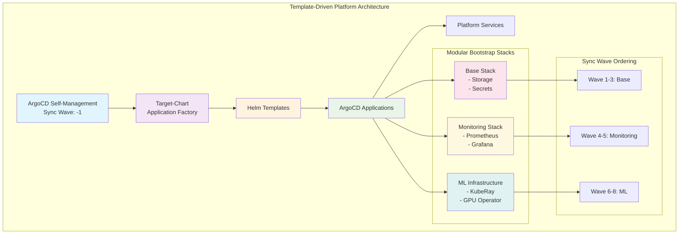

# Platform Infrastructure (Template-Driven Deployment)

This directory contains the template-driven deployment system for platform infrastructure management. It now assumes clusters are provisioned via the `api → config → infrastructure → provisioner → container-orchestration` flow documented in the repo root; once Kubespray (or another provider) brings up Kubernetes, the platform layer can be applied as described below.

## Architecture Overview



## Directory Structure

```
platform/
├── target-chart/              # Application factory (Helm chart)
│   ├── Chart.yaml
│   ├── templates/
│   │   └── application.yaml   # Generates ArgoCD applications
│   ├── values-production.yaml # All 8 applications
│   ├── values-staging.yaml    # 5 applications (no ML)
│   ├── values-development.yaml # Dev environment
│   └── values.yaml           # Base values
├── charts/                   # Individual application charts
│   ├── argocd/              # ArgoCD self-management
│   ├── rook-ceph/           # Storage operator
│   ├── rook-ceph-cluster/   # Storage cluster
│   ├── vault/               # Secrets management
│   ├── prometheus/          # Monitoring
│   ├── grafana/             # Visualization
│   ├── kuberay-crds/        # ML CRDs
│   ├── kuberay-operator/    # ML operator
│   └── gpu-operator/        # GPU management
├── bootstrap/                # Platform deployment
│   ├── platform-root-template-driven.yaml # Main root application
│   ├── bootstrap-template-driven.sh       # Deployment script
│   ├── values-hooks.yaml                  # Hooks configuration
│   ├── infrastructure-validation.yaml     # Platform validation hook
│   ├── sync-failure-notification.yaml     # Failure notification hook
│   └── ARGOCD-SELF-MANAGEMENT.md          # Documentation
├── hooks/                    # ArgoCD hooks for automation
│   ├── validation/          # Pre-sync validation hooks
│   ├── health-checks/       # Post-sync health verification
│   ├── notifications/       # Failure and success notifications
│   └── README.md           # Hooks documentation
└── README.md                # This file
```

## Quick Start

### Prerequisites
- Kubernetes cluster running
- ArgoCD deployed (via Kubespray)
- kubectl and helm installed

### Deploy Complete Platform

```bash
# 1. Deploy template-driven root application (includes ArgoCD self-management)
kubectl apply -f bootstrap/platform-root-template-driven.yaml

# 2. Verify deployment
kubectl get applications -n argocd

# 3. Monitor all platform components
watch kubectl get applications -n argocd
```

### Deploy with Automation Script

```bash
# Use the bootstrap script for guided deployment
./bootstrap/bootstrap-template-driven.sh

# Options:
# - base: Core infrastructure only (storage, secrets)
# - monitoring: Base + monitoring stack  
# - ml: Base + monitoring + ML infrastructure
# - all: Complete platform (production)
```

### Deploy Selective Stacks (Advanced)

```bash
# Generate specific environment configurations
helm template platform-stage target-chart -f target-chart/values-staging.yaml | kubectl apply -f -

# Deploy development environment (minimal apps)  
helm template platform-dev target-chart -f target-chart/values-development.yaml | kubectl apply -f -

# Custom stack via target-chart
helm template my-stack target-chart -f my-custom-values.yaml | kubectl apply -f -
```

## Platform Services

| Service | Sync Wave | Purpose | Stack |
|---------|-----------|---------|-------|
| argocd-self-management | -1 | GitOps self-management | Core |
| rook-ceph | 1 | Storage operator | Base |
| rook-ceph-cluster | 2 | Storage cluster | Base |
| vault | 3 | Secrets management | Base |
| prometheus | 4 | Monitoring | Monitoring |
| grafana | 5 | Visualization | Monitoring |
| kuberay-crds | 6 | ML CRDs | ML |
| kuberay-operator | 7 | ML operator | ML |
| gpu-operator | 8 | GPU management | ML |

## Configuration Management

### Environment-Specific Deployments

```bash
# Production (all 8 applications)
helm template platform-prod target-chart -f target-chart/values-production.yaml

# Staging (5 applications, no ML)
helm template platform-stage target-chart -f target-chart/values-staging.yaml

# Development (custom configuration)
helm template platform-dev target-chart -f my-dev-values.yaml
```

### Modifying Configurations

1. **Application-specific changes**: Edit `charts/{app}/values.yaml`
2. **Stack-specific changes**: Edit `bootstrap/values-{stack}.yaml`
3. **Environment changes**: Edit `target-chart/values-{env}.yaml`

### Adding New Applications

1. Create new chart in `charts/new-app/`
2. Add to appropriate values files
3. Apply bootstrap applications

## Migration from Legacy

The template-driven system replaces the previous static application approach:

- **Before**: 8 static YAML files in `applications/`
- **After**: Dynamic generation from `target-chart/`
- **Legacy files**: Archived in `../../archive/platform-legacy/`

### Rollback Procedure

```bash
# 1. Remove template-driven applications  
kubectl delete -f bootstrap/

# 2. Restore legacy files
mkdir -p applications/
cp ../../archive/platform-legacy/legacy-applications/* applications/

# 3. Apply legacy root application
kubectl apply -f /path/to/legacy/platform-root-app.yaml
```

## Operational Procedures

### Monitoring Deployment Status

```bash
# Check all applications
kubectl get applications -n argocd

# Check specific stack
kubectl get applications -n argocd -l stack=base

# Check sync status
kubectl get applications -n argocd -o custom-columns=NAME:.metadata.name,SYNC:.status.sync.status,HEALTH:.status.health.status
```

### Troubleshooting

**Application Stuck in Sync:**
```bash
kubectl describe application <app-name> -n argocd
```

**Template Generation Issues:**
```bash
helm template test-stack target-chart -f values-file.yaml --debug
```

**Sync Wave Problems:**
```bash
kubectl get applications -n argocd -o custom-columns=NAME:.metadata.name,SYNC-WAVE:.metadata.annotations.argocd\.argoproj\.io/sync-wave
```

## Platform Hooks

The platform includes automated validation, health checks, and failure notifications via ArgoCD hooks:

### Hook Categories

#### Validation Hooks (Pre-Sync)
- **Infrastructure Validation** (Wave -10): Validates ArgoCD, namespaces, CNI, ingress, cert-manager
- **Storage Validation** (Wave -5): Validates storage prerequisites before Rook-Ceph deployment

#### Health Check Hooks (Post-Sync)
- **Rook-Ceph Health Check** (Wave 2): Comprehensive Ceph cluster validation after deployment
- **Monitoring Validation** (Wave 5): Monitoring stack health verification

#### Notification Hooks (On Failure)
- **Sync Failure Notification**: Automated failure alerting and logging

### Hook Configuration

Enable/disable hooks per environment via values files:

```yaml
# Production - all hooks enabled
global:
  hooks:
    enabled: true
    validation:
      infrastructure: true
      storage: true
    healthChecks:
      rookCeph: true
      monitoring: true
    notifications:
      syncFailure: true

# Development - minimal hooks
global:
  hooks:
    enabled: false
    notifications:
      syncFailure: true  # Keep failure notifications
```

### Hook Management

```bash
# View hook execution status
kubectl get jobs -n argocd -l argocd.argoproj.io/hook

# Check hook logs
kubectl logs job/platform-infrastructure-validation -n argocd

# Clean up completed hooks
kubectl delete jobs -n argocd -l argocd.argoproj.io/hook-delete-policy=BeforeHookCreation
```

## Benefits

✅ **Modular Deployment**: Deploy base, monitoring, or ML stacks independently  
✅ **Environment Flexibility**: Easy creation of dev/staging/prod variants  
✅ **Template-Driven**: Zero static manifests, everything generated from values  
✅ **GitOps Compliant**: Complete infrastructure-as-code with ArgoCD self-management  
✅ **Reduced Maintenance**: Single source of truth in values files  
✅ **Application Factory Pattern**: Industry-standard GitOps pattern implementation  
✅ **Automated Validation**: Pre-sync hooks prevent deployment failures  
✅ **Health Monitoring**: Post-sync hooks verify component health  
✅ **Failure Detection**: Immediate notification of sync failures  

## Documentation

- [ArgoCD Self-Management Guide](bootstrap/ARGOCD-SELF-MANAGEMENT.md)
- [Template Testing](validate-applications.sh)
- [Validation Report](validation-report.md)
- [Architecture Specs](../../openspec/changes/template-driven-deployment/)

## Support

For questions about the template-driven deployment system:
1. Check the troubleshooting section above
2. Review the ArgoCD application logs
3. Validate template generation with helm
4. Consult the OpenSpec documentation

---

## Requirements

### Input Files

#### From Config Package (`config/packages/core/`)
- **platform/stacks.yaml** - Platform stack definitions (base, monitoring, ml)
- **Master config selects**: Which platform services to deploy

#### From API Outputs (`api/outputs/<env>/`)
- **metadata.json** - Master metadata file
- **platform.yaml** - Generated platform configuration (Helm values format)
  - Stack enablement flags (base, monitoring, ml)
  - ArgoCD settings
  - Git repository configuration
  - Application sync wave ordering

#### Module Environment File (`platform/environments/<env>.yaml`)
- **configPackage**: Reference to "core"
- **environment**: Environment name
- **ArgoCD settings**:
  - `argocd.admin_password` - ArgoCD admin password
  - `argocd.url` - (optional) Custom ArgoCD URL
- **Sealed Secrets**:
  - `sealed_secrets.public_key_path` - Path to sealed-secrets public key
- **Stack overrides**:
  - `stacks.base.enabled` - Enable/disable base stack
  - `stacks.monitoring.enabled` - Enable/disable monitoring
  - `stacks.ml.enabled` - Enable/disable ML infrastructure
- **Secret specs** (key-value pairs):
  - Environment variables referenced by secret specs
  - Example: `GRAFANA_ADMIN_PASSWORD`, `VAULT_ROOT_TOKEN`
- **Schema**: Validated against `api/schemas/environments/platform.schema.yaml`

### Environment Variables
- `SEALED_SECRETS_CONTROLLER` - Controller name (default: sealed-secrets)
- `SEALED_SECRETS_NAMESPACE` - Namespace (default: sealed-secrets)
- `SSH_PRIVATE_KEY_PATH` - For private Git repos (optional)
- Secret values (referenced in secret specs):
  - `GRAFANA_ADMIN_PASSWORD`
  - `VAULT_ROOT_TOKEN`
  - `DB_PASSWORD`
  - etc. (per secret spec requirements)

### Required Tools
- `kubectl` - Kubernetes CLI (must be configured with cluster access)
- `helm` - Helm v3+
- `kubeseal` - For sealed-secrets generation
- `jq` - JSON parser
- `yq` - YAML parser

### Pre-requisites
- **Running Kubernetes Cluster**: Deployed via container-orchestration module
- **Kubeconfig access**: `kubectl cluster-info` must work
- **ArgoCD**: Will be deployed automatically if not present
- **Sealed Secrets Controller**: Installed via bootstrap script

### Folder Structure Expected
```
api/outputs/<env>/
├── metadata.json
└── platform.yaml                     # Generated Helm values

platform/environments/
└── <env>.yaml                        # Secrets + overrides

platform/bootstrap/secrets/specs/     # Secret specifications
├── grafana-admin.yaml
├── vault-root.yaml
└── ... (per-app secrets)

platform/bootstrap/.generated/        # Generated secrets (gitignored)
├── sealed/                           # SealedSecret manifests
├── push/                             # PushSecret manifests (Vault sync)
└── state/                            # Cached secret values
```

### Secret Spec Format

**CRITICAL**: Secrets are defined via specs, not hardcoded files.

```yaml
# platform/bootstrap/secrets/specs/grafana-admin.yaml
metadata:
  name: grafana-admin
spec:
  namespace: monitoring
  type: Opaque
  optional: false
  data:
    username:
      env: GRAFANA_ADMIN_USER           # From environment variable
      cache: true                        # Cache in state file
    password:
      generate:
        length: 32
        alphabet: alnum                  # alnum, hex, url, base64
      cache: true
      hash:
        method: bcrypt                   # bcrypt, sha512, apr1
    api_key:
      literal: "hardcoded-value"         # Hardcoded (use sparingly)
      cache: false
  vault:                                 # Optional Vault sync
    path: secret/data/grafana
    secretStoreRef:
      name: vault-backend
      kind: ClusterSecretStore
```

---

## Outputs

### Primary Outputs

**Platform Services** deployed via ArgoCD:
- **Base Stack** (if enabled):
  - Rook-Ceph operator + cluster (distributed storage)
  - Vault (secrets management)
- **Monitoring Stack** (if enabled):
  - Prometheus (metrics collection + alerting)
  - Grafana (visualization dashboards)
- **ML Infrastructure** (if enabled):
  - KubeRay CRDs + Operator (Ray ML framework)
  - GPU Operator (NVIDIA GPU management)

### ArgoCD Applications

```
kubectl get applications -n argocd
```

Example applications created:
- `argocd-self` - ArgoCD self-management
- `rook-ceph` - Storage operator
- `rook-ceph-cluster` - Storage cluster
- `vault` - Secrets management
- `prometheus` - Monitoring
- `grafana` - Dashboards
- `kuberay-crds` - ML CRDs
- `kuberay-operator` - ML operator
- `gpu-operator` - GPU management

### Generated Secrets

```
platform/bootstrap/.generated/
├── sealed/
│   ├── monitoring-grafana-admin.yaml         # SealedSecret
│   └── vault-vault-root.yaml                 # SealedSecret
├── push/
│   ├── monitoring-grafana-admin-push.yaml    # PushSecret (Vault sync)
│   └── vault-vault-root-push.yaml            # PushSecret
└── state/
    ├── monitoring-grafana-admin.json         # Cached values
    └── vault-vault-root.json                 # Cached values
```

### Platform Service Endpoints

Depending on stack configuration:
- ArgoCD UI: `https://argocd.<domain>`
- Grafana: `https://grafana.<domain>`
- Prometheus: `https://prometheus.<domain>`
- Vault: `https://vault.<domain>`

---

## Integration Points

### Depends On
- **Container Orchestration Module**: Requires running Kubernetes cluster
- **API Module**: Generates platform.yaml configuration
- **Config Module**: Provides stack definitions

### Consumed By
- **Business Module**: Deploys applications on platform services
- Applications depend on:
  - Storage (Rook-Ceph)
  - Secrets (Vault)
  - Monitoring (Prometheus/Grafana)

---

## Secrets Handling (CRITICAL)

### Secret Rendering Process

```bash
# Render secrets from specs
./platform/bootstrap/scripts/render-secrets.sh

# Render and apply to cluster
./platform/bootstrap/scripts/render-secrets.sh --apply
```

**Process**:
1. Loads environment variables (from `.env.local` or shell)
2. Auto-generates GitHub App tokens (if credentials provided)
3. Reads secret specs from `bootstrap/secrets/specs/`
4. Resolves values:
   - From environment variables (`env` field)
   - From literals (`literal` field)
   - Generated (`generate` field)
5. Applies hashing if specified (`hash` field)
6. Caches values in `.generated/state/` for idempotency
7. Generates SealedSecret using `kubeseal`
8. Creates PushSecret for Vault sync (if `vault` configured)
9. Optionally applies to cluster (`--apply` flag)

### Secret Spec Fields

- **env**: Source from environment variable
- **literal**: Hardcoded value (use sparingly)
- **generate**: Auto-generate (length, alphabet)
- **cache**: Store in state file for idempotency
- **hash**: Apply hashing (bcrypt, sha512, apr1)
- **vault**: Sync to Vault via PushSecret (optional)

### Adding New Secrets

1. Create spec file:
   ```bash
   cat > bootstrap/secrets/specs/my-app-db.yaml <<EOF
   metadata:
     name: my-app-db
   spec:
     namespace: my-app
     type: Opaque
     data:
       username:
         literal: "dbuser"
         cache: true
       password:
         generate:
           length: 32
           alphabet: alnum
         cache: true
   EOF
   ```

2. Render secret:
   ```bash
   ./bootstrap/scripts/render-secrets.sh --apply
   ```

3. Secret available in cluster:
   ```bash
   kubectl get secret my-app-db -n my-app
   ```

---

## Bootstrap Sequence

1. **Install Sealed Secrets Controller**:
   ```bash
   ./bootstrap/scripts/install-sealed-secrets.sh
   ```

2. **Render Bootstrap Secrets**:
   ```bash
   ./bootstrap/scripts/render-secrets.sh --apply
   ```

3. **Deploy ArgoCD** (non-blocking):
   ```bash
   kubectl apply -k bootstrap/argocd/
   ```

4. **Wait for ArgoCD Ready**:
   ```bash
   kubectl wait --for=condition=available deployment/argocd-server -n argocd --timeout=5m
   ```

5. **Apply Platform Root Application**:
   ```bash
   kubectl apply -f bootstrap/platform-root.yaml
   ```

6. **Monitor Application Health**:
   ```bash
   kubectl get applications -n argocd -w
   ```

### Sync Wave Ordering

Applications deploy in order:
- **Wave -1**: ArgoCD self-management
- **Wave 1**: Rook-Ceph operator
- **Wave 2**: Rook-Ceph cluster
- **Wave 3**: Vault
- **Wave 4**: Prometheus
- **Wave 5**: Grafana
- **Wave 6**: KubeRay CRDs
- **Wave 7**: KubeRay operator
- **Wave 8**: GPU operator

---

## Troubleshooting

### Secrets Issues

**Problem**: Secret not generated
**Solution**: Check environment variable is set:
```bash
echo $GRAFANA_ADMIN_PASSWORD
./bootstrap/scripts/render-secrets.sh --apply
```

**Problem**: SealedSecret can't be decrypted
**Solution**: Verify sealed-secrets controller running:
```bash
kubectl get pods -n sealed-secrets
```

### ArgoCD Issues

**Problem**: Application stuck in Progressing
**Solution**: Check application status:
```bash
kubectl describe application <app-name> -n argocd
```

**Problem**: Sync Wave not respected
**Solution**: Verify `argocd.argoproj.io/sync-wave` annotation in templates

### Stack Issues

**Problem**: Monitoring stack not deploying
**Solution**: Check platform.yaml has monitoring enabled:
```bash
jq '.stacks.monitoring.enabled' api/outputs/development/platform.yaml
```
