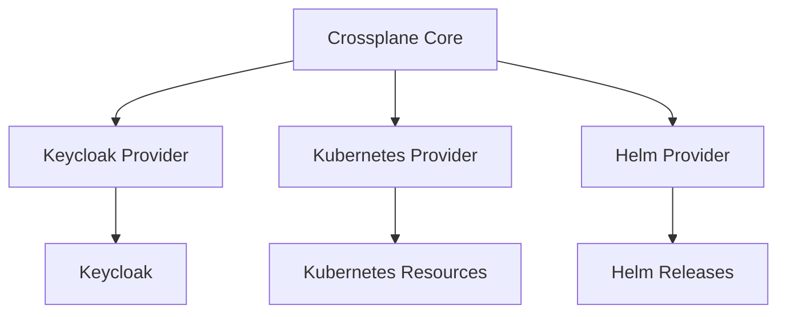
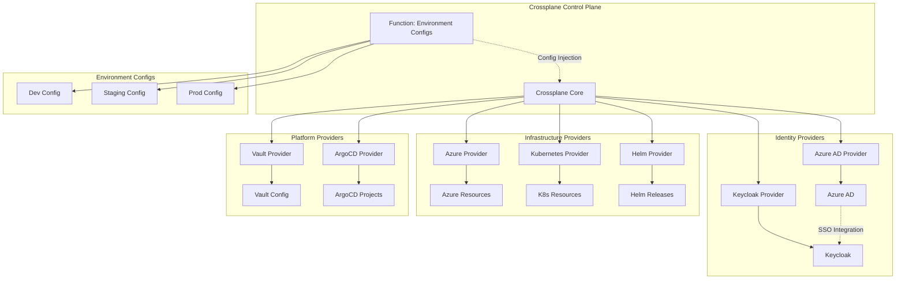
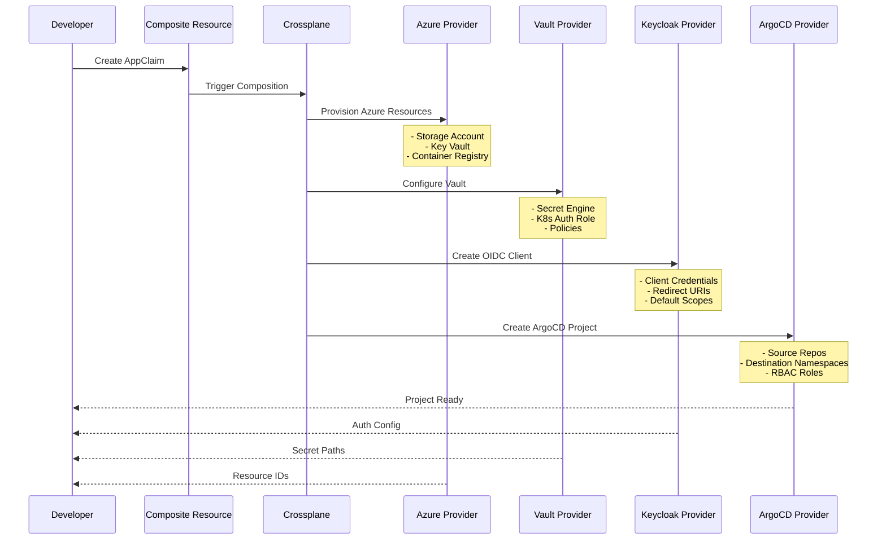

# Crossplane Platform API Enhancement Plan

## Executive Summary

This document proposes enhancements to the ProficientNow Crossplane deployment by integrating five additional providers to create a unified, declarative control plane for infrastructure, identity, secrets, and GitOps workflows.

## Current State

**Existing Providers**:
- `provider-keycloak` v0.5.0 - Identity and access management
- `provider-kubernetes` v0.14.0 - In-cluster resource management
- `provider-helm` v0.19.0 - Helm release management

**Limitations**:
- No cloud provider integration (Azure)
- Vault managed imperatively (manual configuration)
- ArgoCD managed separately (no IaC integration)
- No identity provider integration (Azure AD)
- Limited environment-based configuration patterns

## Proposed Providers

### 1. provider-upjet-azure
**Purpose**: Azure infrastructure management
**Repository**: https://github.com/crossplane-contrib/provider-upjet-azure

**Capabilities**:
- Declarative Azure resource provisioning
- Built on Upjet (auto-generated from Terraform Azure provider)
- XRM-conformant managed resources
- Comprehensive Azure service coverage

**Enhancement Value**:
- Deploy Azure resources alongside Kubernetes workloads
- Unified infrastructure management (cloud + Kubernetes)
- GitOps workflows for Azure infrastructure
- Cost optimization through declarative lifecycle management

### 2. provider-vault
**Purpose**: HashiCorp Vault configuration management
**Repository**: https://github.com/upbound/provider-vault

**Capabilities**:
- Declarative Vault resource management
- Secret engine configuration
- Authentication backend setup
- Policy management
- PKI infrastructure

**Enhancement Value**:
- Replace imperative Vault configuration with declarative CRDs
- Version-controlled Vault infrastructure
- Automated Vault setup across environments
- Consistent policy deployment
- Integration with existing Vault deployment

### 3. provider-argocd
**Purpose**: ArgoCD configuration management
**Repository**: https://github.com/crossplane-contrib/provider-argocd

**Capabilities**:
- ArgoCD Projects management
- Application declarations
- Repository connections
- RBAC configuration
- Cluster registration

**Enhancement Value**:
- Self-service project provisioning
- Standardized ArgoCD patterns
- Automated application onboarding
- GitOps for GitOps (meta-management)
- Integration with Keycloak SSO

### 4. function-environment-configs
**Purpose**: Shared configuration injection for compositions
**Repository**: https://github.com/crossplane-contrib/function-environment-configs

**Capabilities**:
- Environment-specific configuration management
- Label-based config selection
- Config merging and precedence
- Context injection for composition pipelines
- Dynamic value resolution

**Enhancement Value**:
- DRY principle for compositions
- Environment-aware resource provisioning
- Centralized platform configuration
- Reduced duplication across compositions
- Easier multi-environment management

### 5. provider-upjet-azuread
**Purpose**: Azure Active Directory management
**Repository**: https://github.com/crossplane-contrib/provider-upjet-azuread

**Capabilities**:
- Azure AD user/group management
- Enterprise application registration
- Service principal creation
- OAuth app configuration
- Conditional access policies

**Enhancement Value**:
- Unified identity management (Azure AD + Keycloak)
- Automated Azure integration for SSO
- Service principal lifecycle management
- Compliance automation
- Integration with GitHub OAuth (via Azure AD)

## Architecture Enhancement

### Current Architecture


### Proposed Architecture


## Use Case Scenarios

### Scenario 1: Self-Service Application Onboarding

**Objective**: Developer requests new application with complete infrastructure

**Flow**:


**Implementation**:
```yaml
apiVersion: platform.pnats.cloud/v1alpha1
kind: Application
metadata:
  name: my-new-app
spec:
  environment: production
  team: platform-engineering
  azure:
    resourceGroup: rg-my-app-prod
    storage: enabled
    containerRegistry: enabled
  vault:
    secretEngine: kv-v2
    path: apps/my-new-app
  keycloak:
    clientId: my-new-app
    redirectUris:
      - https://my-app.pnats.cloud/oauth/callback
  argocd:
    sourceRepos:
      - https://github.com/pnats/my-new-app
    destinations:
      - namespace: my-new-app
        server: https://kubernetes.default.svc
```

### Scenario 2: Automated Vault Configuration

**Objective**: Replace manual Vault setup with declarative management

**Current Process** (Manual):
1. Exec into Vault pod
2. Run vault commands
3. Create policies manually
4. Configure auth backends
5. Document configuration

**Proposed Process** (Declarative):
```yaml
# Vault Secret Engine
apiVersion: vault.upbound.io/v1alpha1
kind: Mount
metadata:
  name: kv-apps
spec:
  forProvider:
    path: secret
    type: kv-v2
    options:
      version: "2"
  providerConfigRef:
    name: vault-provider-config

---
# Vault Policy
apiVersion: vault.upbound.io/v1alpha1
kind: Policy
metadata:
  name: external-secrets-policy
spec:
  forProvider:
    name: external-secrets
    policy: |
      path "secret/data/*" {
        capabilities = ["read", "list"]
      }
      path "secret/metadata/*" {
        capabilities = ["list"]
      }
  providerConfigRef:
    name: vault-provider-config

---
# Kubernetes Auth Backend
apiVersion: vault.upbound.io/v1alpha1
kind: AuthBackend
metadata:
  name: kubernetes
spec:
  forProvider:
    type: kubernetes
    path: kubernetes
  providerConfigRef:
    name: vault-provider-config

---
# Kubernetes Auth Role
apiVersion: vault.upbound.io/v1alpha1
kind: KubernetesAuthBackendRole
metadata:
  name: external-secrets-role
spec:
  forProvider:
    backend: kubernetes
    roleName: external-secrets
    boundServiceAccountNames:
      - external-secrets
    boundServiceAccountNamespaces:
      - external-secrets
    policies:
      - external-secrets
    ttl: 3600
  providerConfigRef:
    name: vault-provider-config
```

**Benefits**:
- GitOps for Vault configuration
- Reproducible across environments
- Automated disaster recovery
- Drift detection and correction
- Audit trail via Git history

### Scenario 3: Multi-Environment Composition with Environment Configs

**Objective**: Single composition for dev/staging/prod with environment-specific values

**Environment Configs**:
```yaml
# Development Environment
apiVersion: apiextensions.crossplane.io/v1alpha1
kind: EnvironmentConfig
metadata:
  name: dev
  labels:
    environment: dev
data:
  azure:
    location: eastus
    sku: Standard_B2s
  keycloak:
    tokenLifespan: 3600
  vault:
    ttl: 86400

---
# Production Environment
apiVersion: apiextensions.crossplane.io/v1alpha1
kind: EnvironmentConfig
metadata:
  name: prod
  labels:
    environment: prod
data:
  azure:
    location: eastus
    sku: Standard_D4s_v3
  keycloak:
    tokenLifespan: 300
  vault:
    ttl: 3600
```

**Composition**:
```yaml
apiVersion: apiextensions.crossplane.io/v1
kind: Composition
metadata:
  name: application-composition
spec:
  mode: Pipeline
  pipeline:
    # Step 1: Load environment config
    - step: load-environment
      functionRef:
        name: function-environment-configs
      input:
        apiVersion: environment.fn.crossplane.io/v1beta1
        kind: Input
        spec:
          environmentConfigs:
            - type: Selector
              selector:
                matchLabels:
                  - key: environment
                    type: Value
                    valueFromFieldPath: spec.environment

    # Step 2: Patch resources with environment values
    - step: patch-and-transform
      functionRef:
        name: function-patch-and-transform
      input:
        apiVersion: pt.fn.crossplane.io/v1beta1
        kind: Resources
        resources:
          - name: azure-vm
            base:
              apiVersion: compute.azure.upbound.io/v1beta1
              kind: LinuxVirtualMachine
            patches:
              - type: FromEnvironmentFieldPath
                fromFieldPath: azure.location
                toFieldPath: spec.forProvider.location
              - type: FromEnvironmentFieldPath
                fromFieldPath: azure.sku
                toFieldPath: spec.forProvider.size
```

**Benefits**:
- Single source of truth for compositions
- Environment-specific configuration externalized
- Easier to manage and audit
- Consistent patterns across environments
- Reduced duplication

### Scenario 4: Azure AD + Keycloak Integration

**Objective**: Unified identity management with Azure AD as primary IDP

**Implementation**:
```yaml
# Azure AD Enterprise Application
apiVersion: applications.azuread.upbound.io/v1beta1
kind: Application
metadata:
  name: keycloak-saml
spec:
  forProvider:
    displayName: Keycloak SAML
    identifierUris:
      - https://keycloak.pnats.cloud/realms/proficientnow
    web:
      redirectUris:
        - https://keycloak.pnats.cloud/realms/proficientnow/broker/azure-ad/endpoint
  providerConfigRef:
    name: azuread-provider-config

---
# Keycloak Identity Provider (Azure AD)
apiVersion: identityprovider.keycloak.crossplane.io/v1alpha1
kind: IdentityProvider
metadata:
  name: azure-ad
spec:
  forProvider:
    realmId: proficientnow
    alias: azure-ad
    providerId: saml
    displayName: "Azure Active Directory"
    config:
      singleSignOnServiceUrl: "https://login.microsoftonline.com/{tenant}/saml2"
      signingCertificateSecretRef:
        name: azure-ad-cert
        key: certificate
      nameIDPolicyFormat: "urn:oasis:names:tc:SAML:2.0:nameid-format:persistent"
      syncMode: "IMPORT"
  providerConfigRef:
    name: keycloak-provider-config
```

**User Flow**:
1. User accesses application
2. Application redirects to Keycloak
3. Keycloak offers "Sign in with Azure AD"
4. User authenticates via Azure AD
5. Azure AD returns SAML assertion
6. Keycloak creates/updates user
7. Application receives JWT token

**Benefits**:
- Enterprise SSO via Azure AD
- Centralized user directory
- Conditional access policies
- MFA enforcement
- Compliance (audit logs)

### Scenario 5: ArgoCD Project Automation

**Objective**: Automated ArgoCD project creation for new teams/applications

**Implementation**:
```yaml
apiVersion: argocd.crossplane.io/v1alpha1
kind: Project
metadata:
  name: team-platform
spec:
  forProvider:
    metadata:
      name: team-platform
    spec:
      description: "Platform Engineering Team"

      # Source repositories
      sourceRepos:
        - https://github.com/pnats/*
        - https://github.com/proficientnow/*

      # Destination clusters/namespaces
      destinations:
        - namespace: platform-*
          server: https://kubernetes.default.svc
        - namespace: monitoring
          server: https://kubernetes.default.svc

      # RBAC
      roles:
        - name: admin
          description: "Admin privileges"
          policies:
            - p, proj:team-platform:admin, applications, *, team-platform/*, allow
          groups:
            - platform-admins  # From Keycloak

        - name: developer
          description: "Developer privileges"
          policies:
            - p, proj:team-platform:developer, applications, get, team-platform/*, allow
            - p, proj:team-platform:developer, applications, sync, team-platform/*, allow
          groups:
            - platform-developers  # From Keycloak

      # Cluster resource restrictions
      clusterResourceWhitelist:
        - group: ""
          kind: Namespace
        - group: rbac.authorization.k8s.io
          kind: ClusterRole
        - group: rbac.authorization.k8s.io
          kind: ClusterRoleBinding

      # Namespace resource restrictions
      namespaceResourceBlacklist:
        - group: ""
          kind: ResourceQuota
        - group: ""
          kind: LimitRange

  providerConfigRef:
    name: argocd-provider-config
```

**Benefits**:
- Standardized project patterns
- Automated RBAC integration with Keycloak
- Consistent security boundaries
- Self-service for new teams
- GitOps for ArgoCD configuration

## Implementation Plan

### Phase 1: Foundation (Week 1-2)
**Goal**: Add providers and establish baseline

**Tasks**:
1. Add `provider-vault` to Crossplane
   - Configure ProviderConfig with Vault connection
   - Migrate existing Vault configuration to CRDs
   - Validate secret engines and policies

2. Add `function-environment-configs`
   - Create environment configs (dev, staging, prod)
   - Test config injection in sample composition
   - Document environment config patterns

**Deliverables**:
- Vault fully managed via Crossplane
- Environment config framework established
- Updated Crossplane values.yaml
- Documentation updates

### Phase 2: GitOps Integration (Week 3-4)
**Goal**: Integrate ArgoCD management

**Tasks**:
1. Add `provider-argocd`
   - Configure ProviderConfig with ArgoCD API
   - Create projects for existing teams
   - Integrate Keycloak RBAC

2. Create ArgoCD Compositions
   - Project composition pattern
   - Application composition pattern
   - Reusable building blocks

**Deliverables**:
- ArgoCD projects managed via CRDs
- Self-service project provisioning
- Keycloak + ArgoCD RBAC integration
- Composition library

### Phase 3: Cloud Integration (Week 5-6)
**Goal**: Azure provider integration

**Tasks**:
1. Add `provider-upjet-azure`
   - Configure ProviderConfig with Azure credentials
   - Define resource groups and base infrastructure
   - Create compositions for common patterns

2. Add `provider-upjet-azuread`
   - Configure ProviderConfig with Azure AD credentials
   - Integrate Azure AD with Keycloak
   - Automate service principal creation

**Deliverables**:
- Azure resources manageable via Crossplane
- Azure AD identity federation
- Cloud + Kubernetes unified management
- Multi-cloud composition patterns

### Phase 4: Platform API (Week 7-8)
**Goal**: High-level abstractions for developers

**Tasks**:
1. Create XRDs (Composite Resource Definitions)
   - `Application` - Full application stack
   - `DatabaseInstance` - Managed database
   - `ServicePrincipal` - Azure identity
   - `VaultPath` - Secret storage path

2. Build Compositions
   - Wire together all providers
   - Environment-aware provisioning
   - Standardized naming/tagging

3. Documentation
   - Developer guide
   - API reference
   - Migration guide

**Deliverables**:
- Platform API for developers
- Self-service infrastructure
- Comprehensive documentation
- Example applications

## Technical Specifications

### Provider Versions

```yaml
providers:
  # Existing
  keycloak:
    package: xpkg.upbound.io/crossplane-contrib/provider-keycloak
    version: v0.5.0

  kubernetes:
    package: xpkg.upbound.io/crossplane-contrib/provider-kubernetes
    version: v0.14.0

  helm:
    package: xpkg.upbound.io/crossplane-contrib/provider-helm
    version: v0.19.0

  # New additions
  vault:
    package: xpkg.upbound.io/upbound/provider-vault
    version: v0.3.0

  azure:
    package: xpkg.upbound.io/upbound/provider-azure
    version: v1.3.0

  azuread:
    package: xpkg.upbound.io/upbound/provider-azuread
    version: v1.3.0

  argocd:
    package: xpkg.upbound.io/crossplane-contrib/provider-argocd
    version: v0.5.0

functions:
  environment-configs:
    package: xpkg.upbound.io/crossplane-contrib/function-environment-configs
    version: v0.10.0
```

### ProviderConfig Requirements

**Vault Provider**:
```yaml
apiVersion: vault.upbound.io/v1beta1
kind: ProviderConfig
metadata:
  name: vault-provider-config
spec:
  credentials:
    source: Secret
    secretRef:
      name: vault-token
      namespace: crossplane-system
      key: token
  address: http://vault-active.vault.svc.cluster.local:8200
```

**Azure Provider**:
```yaml
apiVersion: azure.upbound.io/v1beta1
kind: ProviderConfig
metadata:
  name: azure-provider-config
spec:
  credentials:
    source: Secret
    secretRef:
      name: azure-credentials
      namespace: crossplane-system
      key: creds
```

**Azure AD Provider**:
```yaml
apiVersion: azuread.upbound.io/v1beta1
kind: ProviderConfig
metadata:
  name: azuread-provider-config
spec:
  credentials:
    source: Secret
    secretRef:
      name: azuread-credentials
      namespace: crossplane-system
      key: creds
```

**ArgoCD Provider**:
```yaml
apiVersion: argocd.crossplane.io/v1alpha1
kind: ProviderConfig
metadata:
  name: argocd-provider-config
spec:
  credentials:
    source: Secret
    secretRef:
      name: argocd-admin-secret
      namespace: crossplane-system
      key: token
  serverAddr: argocd-server.argocd.svc.cluster.local
  insecure: true  # TLS termination at ingress
```

## Benefits Summary

### Developer Experience
- **Self-Service**: Provision complete application stacks with single CRD
- **Standardization**: Consistent patterns across all environments
- **Speed**: Minutes instead of days for infrastructure setup
- **Guardrails**: Policy-driven provisioning prevents misconfigurations

### Operations
- **GitOps**: All infrastructure version-controlled
- **Automation**: Reduced manual intervention
- **Consistency**: Drift detection and correction
- **Auditability**: Complete change history

### Security
- **Least Privilege**: Automated IAM via service principals
- **Secret Management**: Centralized in Vault
- **Compliance**: Policy enforcement via Kyverno + Crossplane
- **Identity Federation**: Azure AD + Keycloak integration

### Cost Management
- **Resource Tagging**: Automated and consistent
- **Lifecycle Management**: Declarative cleanup
- **Right-Sizing**: Environment-specific configurations
- **Waste Reduction**: Automated deprovisioning

## Risk Assessment

### Technical Risks

**Risk**: Provider immaturity or bugs
- **Mitigation**: Start with Vault and ArgoCD (more mature), test thoroughly before production

**Risk**: Crossplane performance with many providers
- **Mitigation**: Monitor resource usage, scale control plane as needed

**Risk**: Breaking changes in provider APIs
- **Mitigation**: Pin provider versions, test upgrades in non-prod

### Operational Risks

**Risk**: Learning curve for team
- **Mitigation**: Phased rollout, comprehensive documentation, training sessions

**Risk**: Migration complexity from imperative to declarative
- **Mitigation**: Keep existing processes running, migrate incrementally

**Risk**: Troubleshooting complexity
- **Mitigation**: Enhanced observability, runbooks, escalation paths

## Success Metrics

### Quantitative
- **Time to provision**: < 5 minutes for complete application stack
- **Manual interventions**: 80% reduction in infrastructure tickets
- **Drift incidents**: Zero (automated reconciliation)
- **Configuration errors**: 70% reduction via policy enforcement

### Qualitative
- Developer satisfaction with self-service
- Operations team confidence in automation
- Security team confidence in compliance
- Business stakeholder visibility into infrastructure

## Next Steps

1. **Review and Approve**: Stakeholder review of this plan
2. **Proof of Concept**: Validate key scenarios with providers
3. **Budget Approval**: Azure costs, team time allocation
4. **Kickoff**: Phase 1 implementation
5. **Iteration**: Gather feedback, adjust approach

## Appendices

### A. Composition Examples

See separate document: `COMPOSITION_EXAMPLES.md`

### B. Migration Guide

See separate document: `MIGRATION_GUIDE.md`

### C. Troubleshooting Guide

See separate document: `TROUBLESHOOTING.md`

### D. API Reference

Generated from XRDs after implementation
