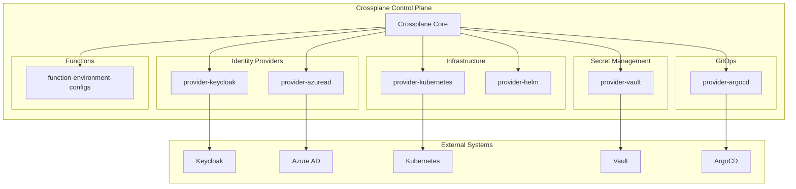

# Crossplane Control Plane

Crossplane control plane for declarative infrastructure management across Keycloak, Vault, ArgoCD, Azure AD, Kubernetes, and Helm.

## Overview

Crossplane extends Kubernetes with infrastructure management capabilities, allowing you to provision and manage cloud infrastructure, secret management systems, identity providers, and GitOps platforms using Kubernetes-native APIs.

## Installed Providers

### Core Infrastructure Providers

**provider-kubernetes** (v0.14.0)
- In-cluster Kubernetes resource management
- Namespace, ConfigMap, Secret, ServiceAccount provisioning
- RBAC, NetworkPolicy, ResourceQuota management
- Authentication: Injected ServiceAccount identity

**provider-helm** (v0.19.0)
- Helm chart deployment and management
- Release lifecycle management
- Chart repository integration
- Authentication: Injected ServiceAccount identity

### Identity & Access Management Providers

**provider-keycloak** (v0.5.0)
- Declarative Keycloak realm configuration
- OIDC/SAML client management
- Identity provider (IDP) configuration
- Group and role management
- Authentication: Keycloak admin credentials per realm

**provider-azuread** (v1.4.1)
- Azure Active Directory management
- Application registrations (OIDC/SAML)
- Service principals and groups
- SAML/OIDC federation with Keycloak
- Authentication: Azure service principal
- Status: Disabled by default (requires Azure credentials)

### Secret Management Provider

**provider-vault** (v0.8.0)
- HashiCorp Vault configuration management
- Secret engine mounts (KV v2, PKI, Transit, Database)
- Authentication backend configuration (Kubernetes, OIDC, LDAP)
- Policy and role management
- Kubernetes auth role creation for External Secrets Operator
- Authentication: Vault token

### GitOps Provider

**provider-argocd** (v0.7.0)
- ArgoCD declarative configuration
- Project and RBAC management
- Application deployment definitions
- Repository and cluster registration
- Authentication: ArgoCD API token

## Composition Functions

**function-environment-configs** (v0.3.0)
- Shared configuration injection for compositions
- Environment-specific parameter overrides
- Multi-tenant configuration management
- Reduces duplication across compositions

## Architecture



## Configuration

### Provider Configuration

All providers are enabled by default except Azure AD. Configuration is managed via `values.yaml`:

```yaml
providers:
  keycloak:
    enabled: true
  kubernetes:
    enabled: true
  helm:
    enabled: true
  vault:
    enabled: true
  azuread:
    enabled: true  # Set to true to enable
  argocd:
    enabled: true

providerConfig:
  vault:
    enabled: true
    address: "http://vault-active.vault.svc.cluster.local:8200"
    tokenSecretName: "vault-admin-token"

  azuread:
    enabled: false  # Enable after creating credentials
    tenantId: "your-azure-tenant-id"
    credentialSecretName: "azuread-service-principal"

  argocd:
    enabled: true
    serverAddr: "argocd-server.argocd.svc:443"
    tokenSecretName: "argocd-admin-token"
```

### Required Secrets

**Vault Provider**:
```bash
kubectl create secret generic vault-admin-token \
  --from-literal=token="<vault-root-token>" \
  -n crossplane-system
```

**ArgoCD Provider**:
```bash
# Generate ArgoCD API token first
kubectl create secret generic argocd-admin-token \
  --from-literal=token="<argocd-api-token>" \
  -n crossplane-system
```

**Azure AD Provider** (if enabled):
```bash
kubectl create secret generic azuread-service-principal \
  --from-literal=credentials='{"clientId":"<sp-client-id>","clientSecret":"<sp-secret>","tenantId":"<tenant-id>"}' \
  -n crossplane-system
```

## Usage Examples

### Vault Configuration

Declarative Vault secret engine and policy management:

```yaml
apiVersion: mount.vault.upbound.io/v1alpha1
kind: Mount
metadata:
  name: app-secrets
spec:
  forProvider:
    path: secret/applications/myapp
    type: kv-v2
  providerConfigRef:
    name: default
```

See `examples/vault-resources.yaml` for comprehensive examples.

### ArgoCD Project Management

Declarative ArgoCD project with RBAC:

```yaml
apiVersion: project.argocd.crossplane.io/v1alpha1
kind: Project
metadata:
  name: backend-team
spec:
  forProvider:
    metadata:
      name: backend
    spec:
      sourceRepos:
        - "https://github.com/org/backend-*"
      destinations:
        - namespace: "backend-*"
          server: "https://kubernetes.default.svc"
      roles:
        - name: developer
          groups:
            - "backend-team"
```

See `examples/argocd-resources.yaml` for comprehensive examples.

### Azure AD Integration

Automate Keycloak ↔ Azure AD SAML federation:

```yaml
apiVersion: application.azuread.upbound.io/v1beta1
kind: Application
metadata:
  name: keycloak-saml
spec:
  forProvider:
    displayName: "Platform SSO"
    identifierUris:
      - "https://keycloak.example.com/realms/platform"
    web:
      - redirectUris:
          - "https://keycloak.example.com/realms/platform/broker/azuread/endpoint"
```

See `examples/azuread-resources.yaml` for comprehensive examples.

### Environment Configs

Shared configuration for compositions:

```yaml
apiVersion: apiextensions.crossplane.io/v1alpha1
kind: EnvironmentConfig
metadata:
  name: platform-defaults
data:
  domain: example.com
  storageClass: fast-ssd
  defaultReplicas: 2
```

See `examples/environment-configs.yaml` for comprehensive examples.

## Integration Patterns

### Pattern 1: Automated Vault Setup

Replace manual Vault configuration with declarative resources managed in Git.

**Benefits**:
- Version-controlled Vault configuration
- Reproducible setup across environments
- Audit trail for policy changes

### Pattern 2: GitOps ArgoCD Management

Manage ArgoCD projects and applications as code alongside application definitions.

**Benefits**:
- Self-service project creation
- Consistent RBAC patterns
- Integration with Keycloak groups

### Pattern 3: Azure AD Federation

Automate SAML/OIDC federation between Keycloak and Azure AD.

**Benefits**:
- No manual Azure portal configuration
- Declarative SSO setup
- Reproducible across environments

### Pattern 4: Shared Configuration

Use EnvironmentConfigs to eliminate duplication across compositions.

**Benefits**:
- Single source of truth for platform defaults
- Environment-specific overrides
- Easier maintenance

## Deployment

Crossplane must be deployed as Phase 0 before other security stack components:

```bash
cd platform/stacks/security/charts/crossplane
helm dependency update
helm install crossplane . -n crossplane-system --create-namespace

# Wait for providers to become healthy
kubectl wait --for=condition=ready pod -l app=crossplane -n crossplane-system --timeout=300s
kubectl get providers -n crossplane-system -w
```

See `../../DEPLOYMENT_ORDER.md` for complete deployment sequence.

## Troubleshooting

### Provider Not Healthy

```bash
# Check provider pods
kubectl get pods -n crossplane-system -l pkg.crossplane.io/provider

# Check provider logs
kubectl logs -l pkg.crossplane.io/provider=provider-vault -n crossplane-system

# Verify ProviderConfig
kubectl describe providerconfig default
```

### Composition Errors

```bash
# Check composite resource events
kubectl describe <resource-type> <resource-name>

# Check managed resources
kubectl get managed

# Check Crossplane controller logs
kubectl logs -l app=crossplane -n crossplane-system
```

### Authentication Issues

**Vault**: Ensure vault-admin-token secret exists and token is valid
**ArgoCD**: Ensure argocd-admin-token secret exists and token hasn't expired
**Azure AD**: Verify service principal has correct Directory API permissions

## Advanced Features

### Composition Revisions

Enabled by default. Allows safe composition updates with versioning.

### Environment Configs

Enabled by default. Supports shared configuration injection.

### High Availability

Crossplane runs with 2 replicas for fault tolerance.

### RBAC Manager

Automatically manages RBAC for Crossplane-managed resources.

## References

- [Crossplane Documentation](https://docs.crossplane.io/)
- [ENHANCEMENT_PLAN.md](./ENHANCEMENT_PLAN.md) - Comprehensive integration plan
- [examples/](./examples/) - Example resources for all providers
- [Security Stack README](../../README.md) - Overall security architecture
