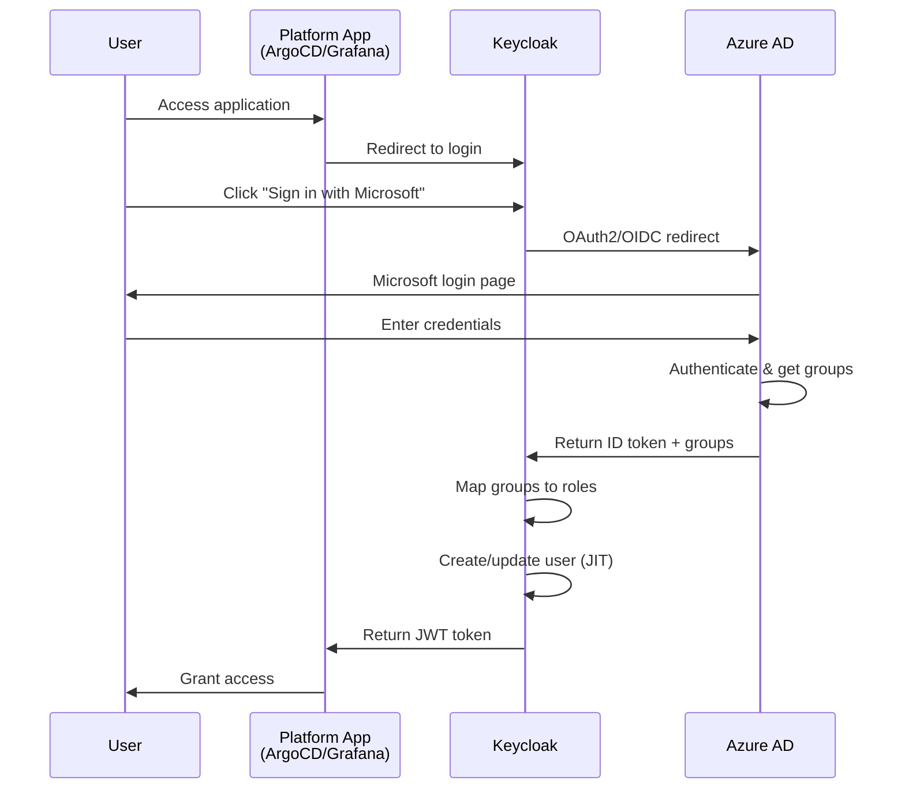

# Azure AD → Keycloak Integration Guide

Complete guide for integrating Microsoft Azure AD with Keycloak to enable single sign-on for platform applications.

## Overview

This integration allows Microsoft users from your Azure AD tenant to:
1. Authenticate using their Microsoft credentials
2. Access Keycloak-protected platform applications (ArgoCD, Grafana, Backstage)
3. Have their Azure AD groups mapped to Keycloak roles/groups
4. Experience seamless SSO across all platform services

## Architecture



## Prerequisites

1. **Azure AD Tenant**: Active Azure AD tenant with admin access
2. **Azure AD Users**: Microsoft users you want to grant platform access
3. **Crossplane**: Deployed with Azure AD provider enabled
4. **Keycloak**: Deployed and configured (proficientnow realm)

## Step-by-Step Setup

### Step 1: Enable Azure AD Provider in Crossplane

Update `crossplane/values.yaml`:

```yaml
providers:
  azuread:
    enabled: true

providerConfig:
  azuread:
    enabled: true
    tenantId: "your-azure-tenant-id"  # Get from Azure portal
    credentialSecretName: "azuread-service-principal"
```

### Step 2: Create Azure Service Principal

You need a service principal with Directory API permissions to manage Azure AD resources via Crossplane.

**Option A: Using Azure CLI**:

```bash
# Login to Azure
az login

# Get your tenant ID
TENANT_ID=$(az account show --query tenantId -o tsv)
echo "Tenant ID: $TENANT_ID"

# Create service principal
SP_OUTPUT=$(az ad sp create-for-rbac \
  --name "crossplane-azuread-provider" \
  --role "Application Administrator" \
  --scopes /subscriptions/$(az account show --query id -o tsv))

# Extract credentials
CLIENT_ID=$(echo $SP_OUTPUT | jq -r '.appId')
CLIENT_SECRET=$(echo $SP_OUTPUT | jq -r '.password')

echo "Client ID: $CLIENT_ID"
echo "Client Secret: $CLIENT_SECRET"
```

**Option B: Using Azure Portal**:

1. Go to Azure Portal → Azure Active Directory → App registrations
2. Click "New registration"
   - Name: `crossplane-azuread-provider`
   - Supported account types: "Accounts in this organizational directory only"
3. After creation, copy the **Application (client) ID** and **Directory (tenant) ID**
4. Go to "Certificates & secrets" → "New client secret"
   - Description: `Crossplane provider secret`
   - Expires: Choose duration
   - Copy the secret **Value** (you won't see it again!)
5. Go to "API permissions" → "Add a permission" → "Microsoft Graph" → "Application permissions"
   - Add these permissions:
     - `Application.ReadWrite.All`
     - `Directory.ReadWrite.All`
     - `Group.ReadWrite.All`
     - `User.Read.All`
   - Click "Grant admin consent"

### Step 3: Create Kubernetes Secret for Azure AD Provider

```bash
# Create secret with service principal credentials
kubectl create secret generic azuread-service-principal \
  --from-literal=credentials="{\"clientId\":\"$CLIENT_ID\",\"clientSecret\":\"$CLIENT_SECRET\",\"tenantId\":\"$TENANT_ID\"}" \
  -n crossplane-system
```

### Step 4: Deploy Crossplane Configuration

Apply the updated Crossplane configuration:

```bash
cd platform/stacks/security/charts/crossplane
helm upgrade crossplane . -n crossplane-system

# Wait for Azure AD provider to become healthy
kubectl wait --for=condition=healthy provider/provider-azuread -n crossplane-system --timeout=300s
```

### Step 5: Create Azure AD App Registration for Keycloak

Apply the Crossplane resources:

```bash
# Apply Azure AD federation configuration
kubectl apply -f examples/azuread-keycloak-federation.yaml

# Wait for resources to be created
kubectl get applications.azuread.upbound.io -n crossplane-system
kubectl get serviceprincipal.azuread.upbound.io -n crossplane-system
```

### Step 6: Get Azure AD Application Details

```bash
# Get the Application (Client) ID from Crossplane
kubectl get application.azuread.upbound.io keycloak-oidc-federation \
  -o jsonpath='{.status.atProvider.applicationId}'

# Get the client secret from the generated secret
kubectl get secret azuread-keycloak-oidc-credentials -n keycloak \
  -o jsonpath='{.data.password}' | base64 -d

# Get your tenant ID
echo $TENANT_ID
```

### Step 7: Update Keycloak Configuration

Update `keycloak/values.yaml` with your Azure AD details:

```yaml
identityProviders:
  - alias: azuread
    enabled: true
    providerId: oidc
    displayName: "Microsoft / Azure AD"
    config:
      clientId: "<CLIENT_ID_FROM_STEP_6>"
      clientSecretSecretName: azuread-keycloak-oidc-credentials
      clientSecretSecretKey: password

      # Replace <AZURE_TENANT_ID> with your actual tenant ID
      authorizationUrl: "https://login.microsoftonline.com/<AZURE_TENANT_ID>/oauth2/v2.0/authorize"
      tokenUrl: "https://login.microsoftonline.com/<AZURE_TENANT_ID>/oauth2/v2.0/token"
      # ... (other URLs with your tenant ID)
```

### Step 8: Deploy Keycloak with Azure AD Integration

```bash
cd platform/stacks/security/charts/keycloak
helm upgrade keycloak . -n keycloak

# Wait for Keycloak to restart
kubectl rollout status deployment keycloak-keycloak -n keycloak
```

### Step 9: Create Azure AD Groups

Create groups in Azure AD for platform access control:

**Option A: Via Crossplane** (recommended):

The `azuread-keycloak-federation.yaml` already defines three groups:
- Platform Admins
- Platform Developers
- Platform Viewers

They will be created automatically by Crossplane.

**Option B: Via Azure Portal**:

1. Go to Azure Portal → Azure Active Directory → Groups
2. Click "New group"
   - Group type: Security
   - Group name: `Platform Admins`
   - Group description: `Full admin access to ProficientNow platform`
   - Members: Add users
3. Repeat for "Platform Developers" and "Platform Viewers"

### Step 10: Add Users to Azure AD Groups

**Get User Object IDs**:

```bash
# List all users to find object IDs
az ad user list --query "[].{Name:displayName, Email:mail, ObjectId:id}" -o table

# Or search for specific user
az ad user show --id "user@yourdomain.com" --query "{Name:displayName, ObjectId:id}"
```

**Add Users to Groups via Crossplane**:

Edit `crossplane/examples/azuread-keycloak-federation.yaml` and uncomment the GroupMember section:

```yaml
apiVersion: groupmember.azuread.upbound.io/v1beta1
kind: GroupMember
metadata:
  name: admin-user-john-doe
spec:
  forProvider:
    groupObjectIdSelector:
      matchLabels:
        platform-group: admins
    memberObjectId: "<USER_OBJECT_ID_FROM_ABOVE>"
  providerConfigRef:
    name: default
```

Apply:
```bash
kubectl apply -f crossplane/examples/azuread-keycloak-federation.yaml
```

**Or via Azure Portal**:

1. Go to Azure AD → Groups → "Platform Admins"
2. Click "Members" → "Add members"
3. Search and select users
4. Click "Select"

### Step 11: Configure Group Mapping in Keycloak

Azure AD groups need to be mapped to Keycloak groups for proper RBAC.

**Option A: Automatic Group Sync** (if Azure AD returns group claims):

The Keycloak configuration already includes a group mapper that will automatically sync Azure AD groups.

**Option B: Manual Group Mapping**:

1. Login to Keycloak Admin Console: `https://keycloak.pnats.cloud`
2. Select `proficientnow` realm
3. Go to "Identity Providers" → "azuread" → "Mappers"
4. Create a hardcoded group mapper:
   - Name: `azure-admins-to-platform-admins`
   - Mapper Type: `Hardcoded Attribute`
   - User Attribute: Leave empty
   - Attribute Value: `platform-admins`
   - Click "Save"

### Step 12: Test the Integration

1. **Logout from Keycloak** (if logged in)

2. **Access a platform application**:
   - Go to: `https://argocd.pnats.cloud`

3. **Login flow**:
   - Click "LOG IN VIA KEYCLOAK" or similar
   - You'll see Keycloak login page
   - Click "Microsoft / Azure AD" button
   - Redirect to Microsoft login
   - Enter your Azure AD credentials
   - Consent to permissions (first time only)
   - Redirect back to Keycloak
   - Redirect back to application
   - **You're logged in!**

4. **Verify user creation**:
   ```bash
   # Check if user was created in Keycloak
   kubectl exec -n keycloak deployment/keycloak-keycloak -- \
     /opt/keycloak/bin/kcadm.sh get users \
     -r proficientnow \
     --server http://localhost:8080 \
     --realm master \
     --user admin \
     --password <admin-password>
   ```

## User Experience

### First-Time Login

1. User visits platform application (e.g., ArgoCD, Grafana)
2. Application redirects to Keycloak
3. User sees Keycloak login page with options:
   - Username/password (local accounts)
   - **Sign in with GitHub**
   - **Sign in with Microsoft** ← User clicks this
4. Redirected to Microsoft login page
5. User enters Microsoft credentials
6. Microsoft asks for consent (first time only)
7. Redirected back to Keycloak
8. Keycloak creates user account automatically (JIT provisioning)
9. User groups are synced from Azure AD
10. Redirected to application
11. **Access granted based on group membership**

### Subsequent Logins

1. User visits application
2. If SSO session still active, user is logged in automatically
3. Otherwise, click "Sign in with Microsoft" and authenticate
4. No account creation needed (already exists)
5. Groups refreshed from Azure AD

### Group-Based Access Control

**Azure AD Group** → **Keycloak Group** → **Application Role**

| Azure AD Group | Keycloak Group | ArgoCD Role | Grafana Role |
|---|---|---|---|
| Platform Admins | platform-admins | admin | Admin |
| Platform Developers | platform-developers | developer | Editor |
| Platform Viewers | platform-viewers | viewer | Viewer |

## Troubleshooting

### Issue: "Sign in with Microsoft" button doesn't appear

**Solution**: Check Keycloak identity provider configuration:

```bash
# Verify identity provider is created
kubectl get identityprovider.keycloak.crossplane.io -n keycloak

# Check Keycloak logs
kubectl logs -l app.kubernetes.io/name=keycloak -n keycloak --tail=100
```

### Issue: Redirect URI mismatch error

**Error**: `AADSTS50011: The redirect URI 'https://keycloak.pnats.cloud/realms/proficientnow/broker/azuread/endpoint' does not match...`

**Solution**:
1. Check Azure AD app registration redirect URIs
2. Verify exact match with Keycloak broker endpoint
3. Ensure HTTPS (not HTTP)

```bash
# Get the correct redirect URI from Keycloak
echo "https://keycloak.pnats.cloud/realms/proficientnow/broker/azuread/endpoint"
```

### Issue: User created but no groups assigned

**Solution 1**: Ensure Azure AD returns groups in token:

1. Go to Azure Portal → App registrations → Your app → Token configuration
2. Click "Add groups claim"
3. Select "Security groups"
4. For ID tokens, select "Group ID"

**Solution 2**: Check group mapper in Keycloak:

1. Keycloak Admin → proficientnow realm → Identity Providers → azuread → Mappers
2. Verify "groups" mapper exists
3. Check claim name matches Azure AD token

### Issue: Client secret expired

Azure AD client secrets expire. To rotate:

```bash
# Create new secret in Azure AD
az ad app credential reset --id <APP_ID>

# Update Kubernetes secret
kubectl create secret generic azuread-keycloak-oidc-credentials \
  --from-literal=password="<NEW_SECRET>" \
  -n keycloak \
  --dry-run=client -o yaml | kubectl apply -f -

# Restart Keycloak to pick up new secret
kubectl rollout restart deployment keycloak-keycloak -n keycloak
```

### Issue: Permission denied errors

**Solution**: Verify service principal has correct permissions:

```bash
# Check service principal app roles
az ad sp show --id <SP_OBJECT_ID> --query appRoles
```

Required permissions:
- `Application.ReadWrite.All`
- `Directory.ReadWrite.All`
- `Group.ReadWrite.All`
- `User.Read.All`

Ensure "Grant admin consent" was clicked.

## Security Considerations

### Token Lifetime

- Keycloak access tokens: 5 minutes
- Keycloak SSO session: 30 minutes idle / 10 hours max
- Azure AD tokens: Configured in Azure AD (default: 1 hour)

### User Provisioning

- **JIT (Just-In-Time)**: Users created on first login automatically
- **No user import**: Users remain in Azure AD, synced on login
- **Profile updates**: `syncMode: IMPORT` - updates user data on each login

### Group Sync

- Groups synced from Azure AD on each login
- Group changes in Azure AD reflected after next user login
- Manual group assignments in Keycloak may be overwritten

### Secret Management

- Client secret stored in Kubernetes secret
- Generated automatically by Crossplane
- Rotated via Azure AD app registration

## Advanced Configuration

### Restrict to Specific Azure AD Groups

Limit platform access to only users in specific Azure AD groups:

**In Azure AD App Registration**:
1. Go to Enterprise applications → Your app → Properties
2. Set "User assignment required" to "Yes"
3. Go to "Users and groups"
4. Assign only the groups that should have access

### Enable MFA Requirement

Force multi-factor authentication for platform access:

**In Azure AD**:
1. Go to Azure AD → Security → Conditional Access
2. Create new policy:
   - Name: "Require MFA for Platform"
   - Users: Select your platform groups
   - Cloud apps: Select your Keycloak app
   - Grant: Require multi-factor authentication

### Custom Claims

Add additional user attributes from Azure AD:

1. In Azure AD app → Token configuration → Add optional claim
2. In Keycloak → Identity Providers → azuread → Mappers
3. Create new mapper for each claim

## Maintenance

### Regular Tasks

- **Rotate client secret**: Every 6-12 months
- **Review group memberships**: Monthly
- **Audit user access**: Quarterly
- **Test SSO flow**: After Keycloak/Azure AD updates

### Monitoring

Monitor integration health:

```bash
# Check Keycloak identity provider status
kubectl get identityprovider.keycloak.crossplane.io -n keycloak

# Check Azure AD provider health
kubectl get provider provider-azuread -n crossplane-system

# Monitor authentication events in Keycloak logs
kubectl logs -l app.kubernetes.io/name=keycloak -n keycloak -f | grep azuread
```

## References

- [Keycloak Identity Brokering Documentation](https://www.keycloak.org/docs/latest/server_admin/#_identity_broker)
- [Azure AD OAuth 2.0 Documentation](https://learn.microsoft.com/en-us/azure/active-directory/develop/v2-oauth2-auth-code-flow)
- [Crossplane Azure AD Provider](https://marketplace.upbound.io/providers/upbound/provider-azuread/)
