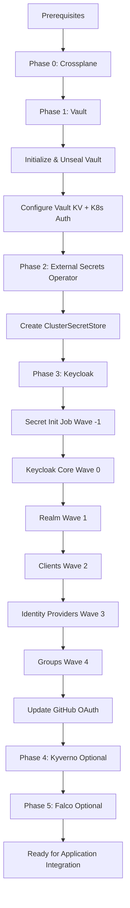

# Security Stack Deployment Order

This document defines the correct deployment order for the security stack to ensure all dependencies are met.

## Prerequisites (Must exist before deploying anything)

### 1. Infrastructure Components
- **Kubernetes Cluster** (v1.28+)
- **Storage Class**: `plt-blk-hdd-repl` (Ceph RBD)
- **Ingress Controller**: nginx-ingress with TLS support
- **cert-manager**: For automatic TLS certificate management
- **DNS**: External-DNS or manual DNS records

### 2. Networking
- **Load Balancer** or **NodePort** access for ingress
- **DNS Records** configured:
  - `vault.pnats.cloud` → Ingress IP
  - `keycloak.pnats.cloud` → Ingress IP
  - `*.pnats.cloud` (wildcard recommended)

---

## Deployment Order

### Phase 0: Crossplane (Control Plane Foundation)

**Why First?**: Crossplane provides the foundation for declarative infrastructure management, including Keycloak provider needed for Phase 3.

```bash
# 1. Deploy Crossplane Core
cd platform/stacks/security/charts/crossplane
helm dependency update
helm install crossplane . -n crossplane-system --create-namespace

# 2. Wait for Crossplane to be ready
kubectl wait --for=condition=ready pod -l app=crossplane -n crossplane-system --timeout=300s

# 3. Verify providers are being installed (will take a few minutes)
kubectl get providers -n crossplane-system -w
# Wait for providers to show HEALTHY=True:
# - provider-keycloak
# - provider-kubernetes
# - provider-helm
# - provider-vault
# - provider-azuread (if enabled)
# - provider-argocd

# 4. Verify functions
kubectl get functions -n crossplane-system
# Should show: function-environment-configs

# 5. Verify ProviderConfigs
kubectl get providerconfig -A
```

**Verification**:
```bash
kubectl get pods -n crossplane-system
kubectl get providers
kubectl get functions
# All providers should show INSTALLED=True and HEALTHY=True
# Function should show INSTALLED=True and HEALTHY=True
```

**Note**: Azure AD provider is disabled by default. To enable, configure credentials in values.yaml.

---

### Phase 1: Vault (Secret Backend)

**Why First?**: Vault is the centralized secret storage that External Secrets Operator will sync from.

```bash
# 1. Deploy Vault
cd platform/stacks/security/charts/vault
helm dependency update
helm install vault . -n vault --create-namespace

# 2. Wait for Vault to be ready
kubectl wait --for=condition=ready pod -l app.kubernetes.io/name=vault -n vault --timeout=300s

# 3. Initialize and unseal Vault (CRITICAL - save keys securely!)
kubectl exec -n vault vault-0 -- vault operator init -key-shares=5 -key-threshold=3

# 4. Unseal Vault (repeat for each pod)
kubectl exec -n vault vault-0 -- vault operator unseal <UNSEAL_KEY_1>
kubectl exec -n vault vault-0 -- vault operator unseal <UNSEAL_KEY_2>
kubectl exec -n vault vault-0 -- vault operator unseal <UNSEAL_KEY_3>

# 5. Enable KV v2 secrets engine
kubectl exec -n vault vault-0 -- vault secrets enable -path=secret kv-v2

# 6. Configure Kubernetes auth for External Secrets
kubectl exec -n vault vault-0 -- vault auth enable kubernetes
kubectl exec -n vault vault-0 -- vault write auth/kubernetes/config \
  kubernetes_host="https://kubernetes.default.svc:443"

# 7. Create policy for External Secrets
kubectl exec -n vault vault-0 -- vault policy write external-secrets-policy - <<EOF
path "secret/data/*" {
  capabilities = ["read", "list"]
}
EOF

# 8. Create Kubernetes role
kubectl exec -n vault vault-0 -- vault write auth/kubernetes/role/external-secrets \
  bound_service_account_names=external-secrets \
  bound_service_account_namespaces=external-secrets \
  policies=external-secrets-policy \
  ttl=1h
```

**Verification**:
```bash
kubectl get pods -n vault
kubectl exec -n vault vault-0 -- vault status
```

---

### Phase 2: External Secrets Operator (Secret Sync)

**Why Second?**: ESO needs Vault to be operational to sync secrets from it.

```bash
# 1. Deploy External Secrets Operator
cd platform/stacks/security/charts/external-secrets
helm dependency update
helm install external-secrets . -n external-secrets --create-namespace

# 2. Wait for ESO to be ready
kubectl wait --for=condition=ready pod -l app.kubernetes.io/name=external-secrets -n external-secrets --timeout=300s

# 3. Verify CRDs are installed
kubectl get crd | grep external-secrets

# 4. Create ClusterSecretStore (connects to Vault)
kubectl apply -f templates/cluster-secret-store.yaml

# 5. Verify connection to Vault
kubectl get clustersecretstore vault-backend -o jsonpath='{.status.conditions[?(@.type=="Ready")].status}'
# Should show: True
```

**Verification**:
```bash
kubectl get pods -n external-secrets
kubectl get clustersecretstore
kubectl describe clustersecretstore vault-backend
```

---

### Phase 3: Keycloak (Identity Provider)

**Why Third?**: Keycloak needs Crossplane to be ready and will use ESO for future secret management.

#### Keycloak Internal Deployment Order (ArgoCD Sync Waves)

When deploying Keycloak, ArgoCD will automatically follow this order:

```
Wave -1: Secret Initialization (PreSync Hook)
   ↓
   │  - ServiceAccount, Role, RoleBinding for secret-init job
   │  - secret-init-job creates:
   │    • keycloak-admin-secret (if not exists)
   │    • keycloak-postgresql-secret (if not exists)
   │    • keycloak-github-oauth (placeholder if not exists)
   ↓
Wave 0: Keycloak Core + Crossplane ProviderConfig
   ↓
   │  - Keycloak StatefulSet + PostgreSQL
   │  - Keycloak Service
   │  - Keycloak Ingress
   │  - ProviderConfig (Crossplane → Keycloak API connection)
   ↓
Wave 1: Realm Configuration
   ↓
   │  - Realm: proficientnow
   │  - Realm settings (password policy, token lifespans, etc.)
   ↓
Wave 2: OIDC Clients
   ↓
   │  - Client: argocd (+ proficientnow-argocd-client-secret)
   │  - Client: grafana (+ proficientnow-grafana-client-secret)
   │  - Client: backstage (+ proficientnow-backstage-client-secret)
   ↓
Wave 3: Identity Providers
   ↓
   │  - IdentityProvider: github
   │  - IdentityProvider: google (disabled)
   ↓
Wave 4: Groups (RBAC)
   ↓
   │  - Group: platform-admins
   │  - Group: platform-developers
   │  - Group: platform-viewers
```

#### Deployment Commands

```bash
# 1. Deploy Keycloak
cd platform/stacks/security/charts/keycloak
helm dependency update
helm install keycloak . -n keycloak --create-namespace

# 2. Monitor deployment (watch sync waves execute)
kubectl get jobs,pods -n keycloak -w

# 3. Check secret initialization job logs
kubectl logs -l app.kubernetes.io/component=secret-init -n keycloak

# 4. Retrieve auto-generated admin password
kubectl get secret keycloak-admin-secret -n keycloak -o jsonpath='{.data.admin-password}' | base64 -d

# 5. Wait for Keycloak to be ready
kubectl wait --for=condition=ready pod -l app.kubernetes.io/name=keycloak -n keycloak --timeout=600s

# 6. Verify Crossplane resources
kubectl get realm,client,identityprovider,group -n keycloak

# 7. Update GitHub OAuth credentials (replace placeholder)
kubectl delete secret keycloak-github-oauth -n keycloak
kubectl create secret generic keycloak-github-oauth \
  --from-literal=client-id='YOUR_GITHUB_CLIENT_ID' \
  --from-literal=client-secret='YOUR_GITHUB_CLIENT_SECRET' \
  -n keycloak

# 8. Restart Keycloak to pick up GitHub OAuth
kubectl rollout restart deployment keycloak-keycloak -n keycloak
```

**Verification**:
```bash
# Check all components
kubectl get pods -n keycloak
kubectl get realm,client,identityprovider,group -n keycloak
kubectl get providerconfig -n keycloak

# Access Keycloak admin console
echo "https://keycloak.pnats.cloud"
# Login with admin and auto-generated password
```

---

### Phase 4: Kyverno (Policy Engine) - Optional but Recommended

**Why After Identity/Secrets?**: Kyverno enforces policies but doesn't block the security stack itself.

```bash
# 1. Deploy Kyverno
cd platform/stacks/security/charts/kyverno
helm dependency update
helm install kyverno . -n kyverno --create-namespace

# 2. Wait for Kyverno to be ready
kubectl wait --for=condition=ready pod -l app.kubernetes.io/name=kyverno -n kyverno --timeout=300s

# 3. Verify policies are installed
kubectl get clusterpolicies
kubectl get policies -A

# 4. Check policy reports
kubectl get policyreports -A
kubectl get clusterpolicyreports
```

**Verification**:
```bash
kubectl get pods -n kyverno
kubectl get clusterpolicies
# Should see policies like: require-non-root-user, disallow-privilege-escalation, etc.

# Test a policy (should fail)
kubectl run test-root --image=nginx --dry-run=server
# Should show policy violation warnings
```

**Note**: All policies are set to `Audit` mode by default. Change to `Enforce` in production after validation.

---

### Phase 5: Falco (Runtime Security) - Optional but Recommended

**Why Last?**: Falco monitors runtime behavior and should be deployed after the platform is operational.

```bash
# 1. Deploy Falco
cd platform/stacks/security/charts/falco
helm dependency update
helm install falco . -n falco --create-namespace

# 2. Wait for Falco DaemonSet to be ready
kubectl wait --for=condition=ready pod -l app.kubernetes.io/name=falco -n falco --timeout=300s

# 3. Verify Falco is collecting events
kubectl logs -l app.kubernetes.io/name=falco -n falco --tail=50

# 4. Test Falco detection (spawn shell in container)
kubectl run test-shell --image=busybox --rm -it -- sh
# Falco should detect and log this event
```

**Verification**:
```bash
kubectl get pods -n falco
kubectl get daemonset -n falco

# Check Falco logs for detections
kubectl logs -l app.kubernetes.io/name=falco -n falco | grep "Shell spawned"

# Check Falcosidekick for alerts
kubectl get pods -n falco -l app=falcosidekick
```

---

## Complete Deployment Order Summary



**Complete Stack Components**:
1. **Crossplane** - Control plane for declarative infrastructure
2. **Vault** - Secret management backend
3. **External Secrets** - Kubernetes secret sync
4. **Keycloak** - Identity and access management
5. **Kyverno** - Policy engine for compliance
6. **Falco** - Runtime threat detection

---

## Post-Deployment Tasks

### 1. Create Users in Keycloak

**Option A: Via Admin Console**
```
1. Go to https://keycloak.pnats.cloud
2. Login with admin credentials
3. Select realm "proficientnow"
4. Users → Add User
5. Set credentials (uncheck "Temporary")
6. Join group (platform-admins/platform-developers/platform-viewers)
```

**Option B: Via GitHub OAuth**
- Users login with "Sign in with GitHub"
- Admin assigns group membership after first login

### 2. Configure Application OIDC Integration

**ArgoCD**:
```bash
# Extract client secret
CLIENT_SECRET=$(kubectl get secret proficientnow-argocd-client-secret -n keycloak -o jsonpath='{.data.client-secret}' | base64 -d)

# Update ArgoCD ConfigMap and Secret
# (See Keycloak README for full config)
```

**Grafana**:
```bash
# Extract client secret
CLIENT_SECRET=$(kubectl get secret proficientnow-grafana-client-secret -n keycloak -o jsonpath='{.data.client-secret}' | base64 -d)

# Update Grafana values.yaml
# (See Keycloak README for full config)
```

### 3. Store Additional Secrets in Vault

```bash
# Example: Store application secrets
kubectl exec -n vault vault-0 -- vault kv put secret/myapp/database \
  username="myapp_user" \
  password="secure_password"

# Create ExternalSecret to sync to K8s
kubectl apply -f - <<EOF
apiVersion: external-secrets.io/v1beta1
kind: ExternalSecret
metadata:
  name: myapp-database
  namespace: myapp
spec:
  refreshInterval: 1h
  secretStoreRef:
    name: vault-backend
    kind: ClusterSecretStore
  target:
    name: myapp-database
    creationPolicy: Owner
  data:
    - secretKey: username
      remoteRef:
        key: secret/myapp/database
        property: username
    - secretKey: password
      remoteRef:
        key: secret/myapp/database
        property: password
EOF
```

---

## Troubleshooting

### Vault Not Unsealing
```bash
# Check Vault status
kubectl exec -n vault vault-0 -- vault status

# Unseal manually
kubectl exec -n vault vault-0 -- vault operator unseal <KEY>
```

### External Secrets Not Syncing
```bash
# Check ClusterSecretStore status
kubectl describe clustersecretstore vault-backend

# Check Vault connectivity
kubectl run vault-test --rm -i --tty --image=curlimages/curl -- \
  curl -v http://vault-active.vault.svc.cluster.local:8200/v1/sys/health
```

### Keycloak Crossplane Resources Not Creating
```bash
# Check ProviderConfig
kubectl describe providerconfig keycloak-provider-config -n keycloak

# Check Crossplane provider logs
kubectl logs -l pkg.crossplane.io/provider=provider-keycloak -n crossplane-system

# Verify Keycloak is accessible internally
kubectl run curl-test --rm -i --tty --image=curlimages/curl -- \
  curl -v http://keycloak-keycloak:80/health/ready
```

### Secret Init Job Failing
```bash
# Check job logs
kubectl logs -l app.kubernetes.io/component=secret-init -n keycloak

# Check RBAC permissions
kubectl auth can-i create secrets --as=system:serviceaccount:keycloak:keycloak-secret-init -n keycloak
```

---

## Deployment Time Estimates

- **Crossplane**: 3-5 minutes (+ 2-3 minutes for providers to become healthy)
- **Vault**: 5-10 minutes (including initialization)
- **External Secrets Operator**: 2-3 minutes
- **Keycloak**: 10-15 minutes (including all Crossplane resources)
- **Kyverno** (Optional): 2-3 minutes
- **Falco** (Optional): 3-5 minutes
- **Total Core Stack**: ~25-35 minutes
- **Total with Optional**: ~30-45 minutes

---

## Security Notes

1. **Vault Unseal Keys**: Store the 5 unseal keys and root token securely (use a password manager or secure vault)
2. **Keycloak Admin Password**: Retrieved from auto-generated secret, rotate periodically
3. **GitHub OAuth**: Replace placeholder credentials immediately
4. **PostgreSQL Credentials**: Never rotate unless absolutely necessary (will break database connection)
5. **Network Policies**: Enabled by default, ensure proper pod-to-pod communication
6. **TLS Certificates**: Managed by cert-manager, automatic renewal via Let's Encrypt

---

## Quick Reference

| Component | Namespace | Ingress URL | Admin Access | Purpose |
|-----------|-----------|-------------|--------------|---------|
| Crossplane | `crossplane-system` | N/A | N/A | Infrastructure control plane |
| Vault | `vault` | `https://vault.pnats.cloud` | Root token from init | Secret management |
| External Secrets | `external-secrets` | N/A | N/A (operator only) | Secret sync |
| Keycloak | `keycloak` | `https://keycloak.pnats.cloud` | `admin` / auto-generated | Identity & access |
| Kyverno | `kyverno` | N/A | N/A | Policy engine |
| Falco | `falco` | N/A | N/A | Runtime security |

**Credential Locations**:
- Vault root token: Manual initialization output (save securely!)
- Keycloak admin: `kubectl get secret keycloak-admin-secret -n keycloak -o jsonpath='{.data.admin-password}' | base64 -d`
- PostgreSQL: `kubectl get secret keycloak-postgresql-secret -n keycloak -o yaml`
- Client secrets: `kubectl get secrets -n keycloak | grep client-secret`

**Monitoring & Status**:
```bash
# Check all security stack components
kubectl get pods -n crossplane-system
kubectl get pods -n vault
kubectl get pods -n external-secrets
kubectl get pods -n keycloak
kubectl get pods -n kyverno
kubectl get pods -n falco

# Check providers
kubectl get providers

# Check policies
kubectl get clusterpolicies

# Check Falco alerts
kubectl logs -l app.kubernetes.io/name=falco -n falco --tail=100
```
