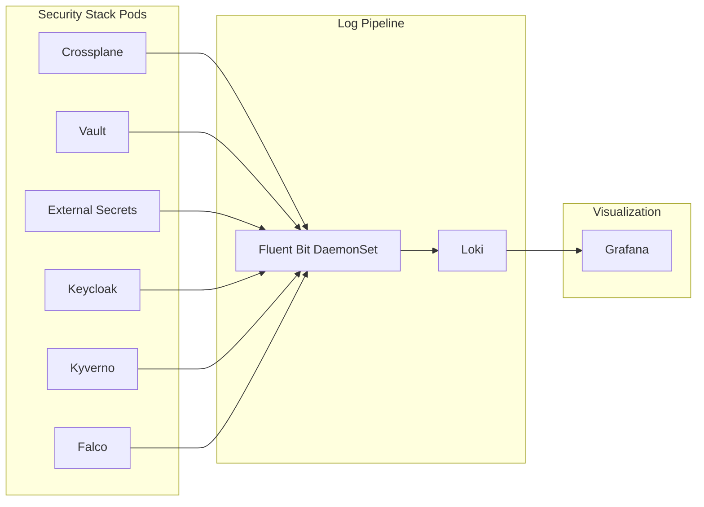

# Security Stack Monitoring & Observability

Comprehensive monitoring, metrics, logging, and tracing configuration for the security stack.

## Overview

All security stack components are instrumented with:
- **Prometheus metrics** via ServiceMonitor CRDs
- **Grafana dashboards** for visualization
- **Prometheus alerts** for critical conditions
- **Log aggregation** integration points
- **Distributed tracing** support (where applicable)

## Metrics Endpoints

### Crossplane
- **Endpoint**: `:8080/metrics`
- **ServiceMonitor**: Auto-created when `monitoring.serviceMonitor.enabled: true`
- **Key Metrics**:
  - `crossplane_managed_resource_exists` - Total managed resources
  - `crossplane_managed_resource_synced` - Resource sync status
  - `crossplane_managed_resource_reconcile_total` - Reconciliation count
  - `crossplane_provider_installed` - Provider installation status
  - `crossplane_provider_healthy` - Provider health status

### Vault
- **Endpoint**: `:8200/v1/sys/metrics`
- **ServiceMonitor**: Auto-created when `vault.serverTelemetry.serviceMonitor.enabled: true`
- **Key Metrics**:
  - `vault_core_unsealed` - Seal status (0=sealed, 1=unsealed)
  - `vault_core_active` - Active instance count
  - `vault_core_handle_request_count` - Request rate
  - `vault_core_handle_request_sum` - Request latency
  - `vault_token_count_by_policy` - Active tokens by policy
  - `vault_secret_kv_count` - Total secrets
  - `vault_audit_log_request_count` - Audit log entries

### External Secrets Operator
- **Endpoint**: `:8080/metrics`
- **ServiceMonitor**: Auto-created when installed
- **Key Metrics**:
  - `externalsecret_sync_calls_total` - Sync attempts
  - `externalsecret_sync_calls_error` - Sync errors
  - `externalsecret_status_condition` - ExternalSecret conditions
  - `secretstore_status_condition` - SecretStore health

### Keycloak
- **Endpoint**: `:8080/metrics` (requires keycloak-metrics-spi)
- **Key Metrics**:
  - `keycloak_logins_total` - Total login attempts
  - `keycloak_login_errors_total` - Failed logins
  - `keycloak_registrations_total` - User registrations
  - `keycloak_user_event_total` - User events
  - `keycloak_admin_event_total` - Admin events

### Kyverno
- **Endpoint**: `:8000/metrics`
- **ServiceMonitor**: Auto-created when `metrics.enabled: true`
- **Key Metrics**:
  - `kyverno_policy_rule_results_total` - Policy evaluations
  - `kyverno_admission_requests_total` - Admission requests
  - `kyverno_admission_review_duration_seconds` - Admission latency
  - `kyverno_policy_changes_total` - Policy modifications

### Falco
- **Endpoint**: `:8765/metrics`
- **ServiceMonitor**: Auto-created when `serviceMonitor.enabled: true`
- **Key Metrics**:
  - `falco_events_total` - Total security events
  - `falco_alerts_total` - Alerts fired by severity
  - `falco_rules_loaded` - Active rules
  - `falco_drop_events_total` - Dropped events

## Grafana Dashboards

### Dashboard Deployment

Dashboards are deployed as ConfigMaps with the label `grafana_dashboard: "1"`. Grafana automatically discovers and imports them.

**Enabled dashboards**:
1. **Crossplane Overview** (`crossplane-overview`)
   - Managed resources count
   - Provider health status
   - Resource reconciliation rates
   - Resource sync status
   - Provider installation status

2. **Vault Overview** (`vault-overview`)
   - Seal status
   - Active instances
   - Request rate by path
   - Request latency
   - Active tokens
   - Total secrets
   - Audit log activity

3. **External Secrets Operator** (`external-secrets-overview`)
   - Sync success/failure rates
   - ExternalSecret status
   - SecretStore health
   - Secret refresh intervals

4. **Keycloak Authentication** (`keycloak-auth`)
   - Login success/failure rates
   - Active sessions
   - User registrations
   - Authentication methods used
   - Token issuance rates

5. **Kyverno Policy Enforcement** (`kyverno-policies`)
   - Policy violations
   - Admission request rates
   - Policy evaluation latency
   - Policy changes over time

6. **Falco Security Events** (`falco-security`)
   - Security alerts by severity
   - Alert trends
   - Top triggered rules
   - Event drop rate

### Accessing Dashboards

```bash
# Access Grafana
kubectl port-forward svc/grafana -n monitoring 3000:80

# Open browser
open http://localhost:3000

# Navigate to Dashboards → Browse → Security folder
```

## Prometheus Alerts

### Vault Alerts

```yaml
- alert: VaultSealed
  expr: vault_core_unsealed == 0
  for: 5m
  severity: critical
  description: Vault is sealed and cannot serve requests

- alert: VaultDown
  expr: up{job="vault"} == 0
  for: 5m
  severity: critical
  description: Vault instance is down

- alert: VaultHighRequestLatency
  expr: rate(vault_core_handle_request_sum[5m]) / rate(vault_core_handle_request_count[5m]) > 1000
  for: 10m
  severity: warning
  description: Vault request latency is above 1 second
```

### Crossplane Alerts

```yaml
- alert: CrossplaneProviderUnhealthy
  expr: crossplane_provider_healthy == 0
  for: 10m
  severity: warning
  description: Crossplane provider is unhealthy

- alert: CrossplaneResourceSyncFailing
  expr: rate(crossplane_managed_resource_reconcile_total{result="error"}[5m]) > 0.1
  for: 15m
  severity: warning
  description: Crossplane resource sync failures increasing
```

### External Secrets Alerts

```yaml
- alert: ExternalSecretSyncFailing
  expr: rate(externalsecret_sync_calls_error[5m]) > 0
  for: 10m
  severity: critical
  description: ExternalSecret sync failures detected

- alert: SecretStoreUnhealthy
  expr: secretstore_status_condition{condition="Ready",status="False"} == 1
  for: 5m
  severity: critical
  description: SecretStore is not ready
```

### Keycloak Alerts

```yaml
- alert: KeycloakHighLoginFailureRate
  expr: rate(keycloak_login_errors_total[5m]) > 10
  for: 5m
  severity: warning
  description: High rate of login failures detected

- alert: KeycloakDown
  expr: up{job="keycloak"} == 0
  for: 5m
  severity: critical
  description: Keycloak instance is down
```

### Kyverno Alerts

```yaml
- alert: KyvernoPolicyViolations
  expr: rate(kyverno_policy_rule_results_total{result="fail"}[5m]) > 1
  for: 10m
  severity: warning
  description: Increased policy violations detected

- alert: KyvernoHighAdmissionLatency
  expr: histogram_quantile(0.99, rate(kyverno_admission_review_duration_seconds_bucket[5m])) > 5
  for: 10m
  severity: warning
  description: Kyverno admission latency is high
```

### Falco Alerts

```yaml
- alert: FalcoSecurityEventsHigh
  expr: rate(falco_events_total[5m]) > 100
  for: 5m
  severity: warning
  description: High rate of security events detected

- alert: FalcoCriticalAlerts
  expr: rate(falco_alerts_total{priority="Critical"}[5m]) > 0
  for: 1m
  severity: critical
  description: Critical security alerts detected by Falco
```

## Log Aggregation

### Log Collection Architecture



### Log Format Standards

**Structured JSON Logging**:
```json
{
  "timestamp": "2025-11-25T17:45:00Z",
  "level": "info",
  "component": "crossplane",
  "message": "Successfully reconciled managed resource",
  "resource": {
    "kind": "Vault",
    "name": "app-secrets",
    "namespace": "crossplane-system"
  },
  "trace_id": "abc123...",
  "span_id": "def456..."
}
```

### Fluent Bit Configuration

```yaml
[INPUT]
    Name              tail
    Path              /var/log/containers/*crossplane*.log,/var/log/containers/*vault*.log,/var/log/containers/*keycloak*.log
    Parser            docker
    Tag               security.*
    Refresh_Interval  5

[FILTER]
    Name                kubernetes
    Match               security.*
    Kube_URL            https://kubernetes.default.svc:443
    Merge_Log           On
    Keep_Log            Off
    K8S-Logging.Parser  On
    K8S-Logging.Exclude On

[FILTER]
    Name   record_modifier
    Match  security.*
    Record stack security

[OUTPUT]
    Name   loki
    Match  security.*
    Host   loki.monitoring.svc
    Port   3100
    Labels job=security-stack,namespace=$kubernetes['namespace_name'],pod=$kubernetes['pod_name']
```

### LogQL Query Examples

**Vault audit logs**:
```logql
{namespace="vault",container="vault"} |= "audit" | json
```

**Keycloak login failures**:
```logql
{namespace="keycloak"} |= "login" |= "error" | json | level="error"
```

**Crossplane reconciliation errors**:
```logql
{namespace="crossplane-system"} |= "reconcile" |= "error" | json
```

**Falco security alerts**:
```logql
{namespace="falco"} |= "priority" | json | priority=~"Critical|Error"
```

## Distributed Tracing

### OpenTelemetry Integration

Components supporting OpenTelemetry tracing:
- Crossplane (via otel-collector sidecar)
- Keycloak (via OpenTelemetry Java agent)
- Custom applications using the stack

### Trace Context Propagation

**W3C Trace Context Headers**:
```
traceparent: 00-0af7651916cd43dd8448eb211c80319c-b7ad6b7169203331-01
tracestate: congo=t61rcWkgMzE
```

### Jaeger Configuration

```yaml
apiVersion: v1
kind: ConfigMap
metadata:
  name: otel-collector-config
  namespace: monitoring
data:
  config.yaml: |
    receivers:
      otlp:
        protocols:
          grpc:
            endpoint: 0.0.0.0:4317
          http:
            endpoint: 0.0.0.0:4318

    processors:
      batch:
        timeout: 10s
        send_batch_size: 1024

    exporters:
      jaeger:
        endpoint: jaeger-collector.monitoring.svc:14250
        tls:
          insecure: true

    service:
      pipelines:
        traces:
          receivers: [otlp]
          processors: [batch]
          exporters: [jaeger]
```

### Trace Query Examples

**Find slow Vault operations**:
```
service.name=vault AND duration > 500ms
```

**Trace Keycloak authentication flow**:
```
service.name=keycloak AND operation=/auth/realms/proficientnow/protocol/openid-connect/token
```

## Monitoring Best Practices

### Metric Collection
- **Scrape Interval**: 30s for most components, 15s for critical (Vault seal status)
- **Retention**: 15 days in Prometheus, 90 days in Thanos (if configured)
- **High Cardinality**: Avoid labels with unbounded values

### Alert Configuration
- **Critical Alerts**: Page on-call (VaultSealed, SecretStore failures)
- **Warning Alerts**: Ticket creation (high latency, policy violations)
- **Info Alerts**: Dashboard annotations (deployments, config changes)

### Dashboard Organization
- **Security Overview**: Single-pane-of-glass for all security components
- **Component-Specific**: Detailed metrics per service
- **SLI/SLO Tracking**: Service level indicators and objectives

### Log Retention
- **Security Logs**: 90 days minimum (compliance requirement)
- **Audit Logs**: 1 year (Vault, Keycloak authentication)
- **Debug Logs**: 7 days (troubleshooting)

## Troubleshooting Monitoring

### Metrics Not Appearing

```bash
# Check ServiceMonitor exists
kubectl get servicemonitor -n <namespace>

# Check Prometheus targets
kubectl port-forward svc/prometheus -n monitoring 9090:9090
# Open http://localhost:9090/targets

# Check pod annotations
kubectl get pod -n <namespace> <pod-name> -o yaml | grep prometheus

# Manual metric scrape test
kubectl exec -n <namespace> <pod-name> -- curl localhost:8080/metrics
```

### Dashboards Not Loading

```bash
# Check ConfigMap exists
kubectl get cm -n <namespace> -l grafana_dashboard=1

# Check Grafana sidecar logs
kubectl logs -n monitoring -l app.kubernetes.io/name=grafana -c grafana-sc-dashboard

# Verify dashboard JSON syntax
kubectl get cm <dashboard-cm> -n <namespace> -o yaml | yq '.data'
```

### Alerts Not Firing

```bash
# Check PrometheusRule exists
kubectl get prometheusrule -n <namespace>

# Check Prometheus rule evaluation
kubectl port-forward svc/prometheus -n monitoring 9090:9090
# Open http://localhost:9090/alerts

# Test alert expression manually
# Go to http://localhost:9090/graph and run the expr
```

## Security Considerations

### Metrics Security
- Unauthenticated metrics endpoints (internal cluster only)
- Network policies restrict access to monitoring namespace
- RBAC controls Prometheus ServiceAccount permissions

### Log Security
- Sensitive data (passwords, tokens) automatically redacted
- Audit logs include authentication context
- Log encryption at rest in Loki

### Trace Security
- PII/secrets excluded from trace attributes
- Trace sampling to reduce overhead (10% default)
- Trace data retention limited to 7 days

## References

- [Prometheus Operator Documentation](https://prometheus-operator.dev/)
- [Grafana Dashboard Best Practices](https://grafana.com/docs/grafana/latest/dashboards/build-dashboards/best-practices/)
- [OpenTelemetry Documentation](https://opentelemetry.io/docs/)
- [Loki LogQL Reference](https://grafana.com/docs/loki/latest/query/)
