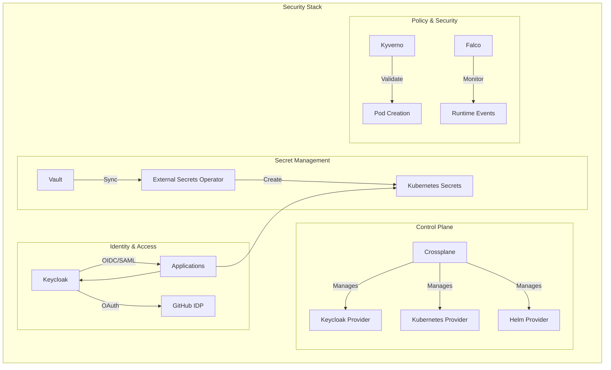
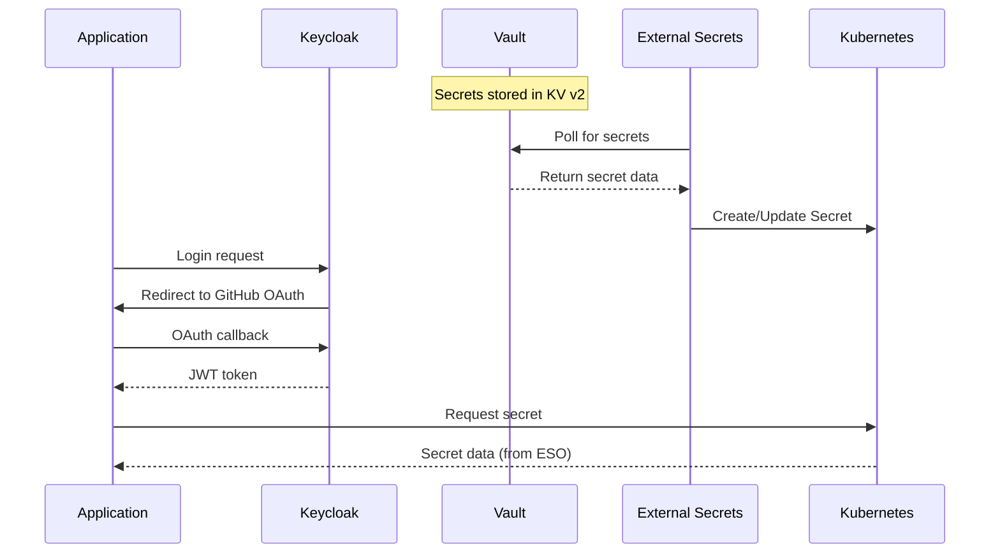
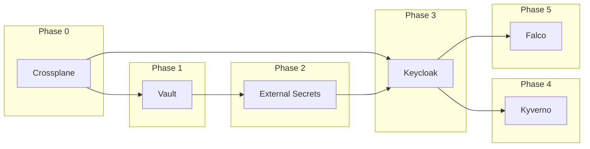

# Security Stack

Enterprise security infrastructure providing identity management, secret management, and secure authentication/authorization for the ProficientNow platform. Apply after the core module pipeline (`api → config → infrastructure → provisioner → container-orchestration`) to ensure namespaces/secrets exist.

## Deployment Order

**IMPORTANT**: This stack has dependencies and must be deployed in the correct order.

📖 **[See Complete Deployment Order →](./DEPLOYMENT_ORDER.md)**

**Phases**:
1. **Phase 0**: Crossplane → Providers (Keycloak, Kubernetes, Helm)
2. **Phase 1**: Vault → Initialize & Unseal → Configure
3. **Phase 2**: External Secrets Operator → ClusterSecretStore
4. **Phase 3**: Keycloak → Auto-secret init → Crossplane config
5. **Phase 4**: Kyverno (Optional) → Policy enforcement
6. **Phase 5**: Falco (Optional) → Runtime threat detection

**Deployment time**: ~25-35 minutes (core) | ~30-45 minutes (with optional)

## Architecture

### Component Overview

The security stack consists of six integrated components:

#### Core Components (Required)
1. **Crossplane** - Control plane for declarative infrastructure management
2. **Vault** - HashiCorp Vault for centralized secret management
3. **External Secrets Operator** - Kubernetes operator for secret synchronization
4. **Keycloak** - Identity and Access Management with SSO (GitOps with Crossplane)

#### Optional Components (Recommended for Production)
5. **Kyverno** - Kubernetes-native policy engine for security and compliance
6. **Falco** - Cloud-native runtime security and threat detection

### Architecture Diagram

### Data Flow

## Components

### 1. Crossplane

**Location**: `charts/crossplane/`
**Namespace**: `crossplane-system`

**Purpose**: Infrastructure control plane for declarative resource management

**Implementation**:
- 2 replica deployment for HA
- RBAC manager for automatic permission management
- Composition revisions enabled
- Environment configs enabled
- Priority class: `system-cluster-critical`

**Providers Installed**:
- `provider-keycloak` v0.5.0 - Declarative Keycloak management via CRDs
- `provider-kubernetes` v0.14.0 - In-cluster Kubernetes resource management
- `provider-helm` v0.19.0 - Helm release management
- `provider-vault` v0.8.0 - Declarative Vault configuration management
- `provider-azuread` v1.4.1 - Azure Active Directory management
- `provider-argocd` v0.7.0 - ArgoCD declarative configuration

**Composition Functions**:
- `function-environment-configs` v0.3.0 - Shared configuration injection for compositions

**ProviderConfigs**:
- Kubernetes: Uses injected identity (ServiceAccount)
- Helm: Uses injected identity (ServiceAccount)
- Keycloak: Configured per realm in Keycloak chart
- Vault: Token-based authentication to Vault internal service
- Azure AD: Service principal (disabled by default, requires Azure credentials)
- ArgoCD: API token authentication to ArgoCD internal service

**Enhanced Capabilities**:
- Automated Vault configuration (secret engines, auth backends, policies)
- ArgoCD project and application management via GitOps
- Azure AD integration for SAML/OIDC federation with Keycloak
- Shared configuration patterns via EnvironmentConfig resources

**Files**:
- `templates/providers.yaml` - Provider and function installations (ArgoCD sync-wave: 1)
- `templates/provider-configs.yaml` - Provider authentication configs (ArgoCD sync-wave: 2-3)
- `examples/` - Example resources for all providers
- `ENHANCEMENT_PLAN.md` - Comprehensive provider integration plan

### 2. HashiCorp Vault

**Location**: `charts/vault/`
**Namespace**: `vault`

**Purpose**: Centralized secret storage and management

**Implementation**:
- KV secrets engine v2 for versioned secrets
- Raft storage backend for HA
- Kubernetes authentication method
- Auto-unseal capability
- Audit logging enabled
- Storage: `plt-blk-hdd-repl`

**Endpoints**:
- UI: `https://vault.pnats.cloud`
- Internal API: `http://vault-active.vault.svc.cluster.local:8200`

**Authentication Methods**:
- Kubernetes auth for ESO integration
- Token auth for admin access

**Secret Engines**:
- KV v2 at path `secret/`
- PKI for certificate management
- Transit for encryption as a service

### 3. External Secrets Operator

**Location**: `charts/external-secrets/`
**Namespace**: `external-secrets`

**Purpose**: Synchronize secrets from Vault to Kubernetes

**Implementation**:
- 2 replica deployment for HA
- Webhook server (2 replicas) for CRD validation
- ClusterSecretStore for Vault backend
- Prometheus metrics enabled
- ServiceMonitor for metrics scraping

**CRDs**:
- `ClusterSecretStore` - Vault connection configuration
- `ExternalSecret` - Per-namespace secret sync definitions
- `SecretStore` - Namespace-scoped store configurations

**Secret Sync Flow**:
1. ExternalSecret references ClusterSecretStore
2. ESO authenticates to Vault via Kubernetes auth
3. ESO fetches secret from Vault path
4. ESO creates/updates Kubernetes Secret
5. Refresh interval: configurable per ExternalSecret

### 4. Keycloak

**Location**: `charts/keycloak/`
**Namespace**: `keycloak`

**Purpose**: Identity and Access Management with SSO

**Implementation**:
- 2 replica deployment for HA
- Embedded PostgreSQL (Bitnami) with `plt-blk-hdd-repl` storage
- Crossplane-managed configuration (GitOps)
- Automated secret initialization (PreSync job)
- HPA enabled (1-5 replicas)

**Crossplane Resources** (ArgoCD Sync Waves):
- Wave -1: Secret initialization job
- Wave 0: ProviderConfig (Crossplane → Keycloak API)
- Wave 1: Realm (`proficientnow`)
- Wave 2: OIDC Clients (ArgoCD, Grafana, Backstage)
- Wave 3: Identity Providers (GitHub)
- Wave 4: Groups (platform-admins, platform-developers, platform-viewers)

**Pre-configured Elements**:

**Realm**: `proficientnow`
- Password policy: 12+ chars, mixed case, digits, special chars
- Token lifespan: 5min access, 30min SSO idle, 10hr max session
- Brute force protection enabled
- Email verification optional

**OIDC Clients**:
- `argocd` - GitOps platform with auto-generated K8s secret
- `grafana` - Observability platform with auto-generated K8s secret
- `backstage` - Developer portal with auto-generated K8s secret

**Identity Providers**:
- `github` - GitHub OAuth integration (requires GitHub OAuth app)

**Groups**:
- `platform-admins` - Full admin access to all clients
- `platform-developers` - Read-write access
- `platform-viewers` - Read-only access

**Client Secrets**: Auto-generated Kubernetes secrets contain:
- `client-id` - OIDC client ID
- `client-secret` - Client secret
- `issuer-url` - Full issuer URL
- `token-url` - Token endpoint
- `auth-url` - Authorization endpoint
- `userinfo-url` - UserInfo endpoint
- `jwks-url` - JWKS endpoint

**Endpoints**:
- UI: `https://keycloak.pnats.cloud`
- Admin Console: `https://keycloak.pnats.cloud/admin/master/console/`
- Realm endpoint: `https://keycloak.pnats.cloud/realms/proficientnow`

**Vault Root Token Sync**:
- The Vault chart defines a PostSync Job (`rootTokenSync`) that reads the `vault-init` secret (root token generated during auto-initialization) and writes it to `crossplane-system/vault-admin-token`. This secret is what Crossplane’s provider-vault consumes, so no manual `.env` value for `VAULT_ADMIN_TOKEN` is required.

### 5. Kyverno (Optional)

**Location**: `charts/kyverno/`
**Namespace**: `kyverno`

**Purpose**: Kubernetes-native policy engine for security and compliance

**Implementation**:
- Admission Controller (2 replicas) - Validates/mutates resources on admission
- Background Controller - Generates policy reports for existing resources
- Cleanup Controller - TTL and resource cleanup
- Reports Controller - Policy violation reports
- Grafana dashboard enabled
- ServiceMonitor enabled

**Policy Categories**:

**Pod Security Policies** (Audit mode by default):
- `require-non-root-user` - Containers must run as non-root
- `disallow-privilege-escalation` - Prevent privilege escalation
- `require-ro-filesystem` - Root filesystem must be read-only
- `drop-all-capabilities` - Drop all Linux capabilities
- `restrict-host-namespaces` - Disallow hostNetwork/hostIPC/hostPID

**Resource Management Policies**:
- `require-resource-limits` - CPU and memory limits required
- `require-resource-requests` - CPU and memory requests required

**Image Security Policies**:
- `require-imagepullpolicy` - ImagePullPolicy must be Always or IfNotPresent
- `disallow-latest-tag` - Disallow :latest tag on images

**Namespace Exemptions**:
- `kube-system`, `kube-public`, `kube-node-lease`
- `kyverno`, `cert-manager`, `crossplane-system`

**CRDs**:
- `ClusterPolicy` - Cluster-wide policies
- `Policy` - Namespace-scoped policies
- `PolicyReport` - Per-namespace violation reports
- `ClusterPolicyReport` - Cluster-wide violation reports

**Files**:
- `templates/policies/pod-security.yaml` - Pod security standards
- `templates/policies/resource-management.yaml` - Resource quota policies
- `templates/policies/image-security.yaml` - Image validation policies

### 6. Falco (Optional)

**Location**: `charts/falco/`
**Namespace**: `falco`

**Purpose**: Cloud-native runtime security and threat detection

**Implementation**:
- DaemonSet deployment (runs on all nodes)
- eBPF driver (no kernel module required)
- Falcosidekick for alert routing
- Falcosidekick WebUI for visualization
- JSON output format
- Priority class: `system-node-critical`
- Tolerations for master/control-plane nodes

**Detection Rules**:

**Shell Detection**:
- Shell spawned in container
- Shell spawned by non-shell process

**Privilege Escalation**:
- Privileged container started
- Container running with sensitive mount points

**File Access**:
- Sensitive file read (/etc/shadow, SSH keys, etc.)
- Configuration file modification

**Network Activity**:
- Unexpected outbound connection
- Connection to suspicious domains

**Custom Rules**: Platform-specific rules in `customRules` section

**Alert Destinations** (configurable):
- Slack webhook
- Generic webhook
- Elasticsearch

**Lists and Macros**:
- `falco_privileged_images` - Allowed privileged images
- `shell_binaries` - Shell executable list
- `sensitive_files` - Files to monitor
- `allowed_network_processes` - Whitelisted network processes
- `allowed_ips` - Internal cluster networks

**ServiceMonitor**: Enabled for Prometheus metrics

## Integration Patterns

### Pattern 1: Vault + External Secrets

Applications retrieve secrets from Kubernetes that are automatically synced from Vault.

**Vault Secret Storage** → **ESO Sync** → **Kubernetes Secret** → **Application**

### Pattern 2: Keycloak OIDC Authentication

Applications use OIDC for user authentication instead of managing credentials.

**User** → **Application** → **Keycloak** → **GitHub OAuth** → **JWT Token** → **Application**

### Pattern 3: Crossplane Declarative Management

Infrastructure resources managed as Kubernetes CRDs via Crossplane providers.

**values.yaml** → **Helm** → **Crossplane CRD** → **Provider** → **External System**

### Pattern 4: Kyverno Policy Enforcement

All pod creations validated against security policies before admission.

**Pod Creation** → **Kyverno Admission** → **Policy Validation** → **Allow/Deny**

### Pattern 5: Falco Runtime Monitoring

Runtime behavior continuously monitored for security threats.

**Container Runtime** → **eBPF Events** → **Falco Rules** → **Alert** → **Falcosidekick**

## Dependencies

## Security Guarantees

### Secret Management
- Secrets never committed to Git in plain text
- Vault provides encryption at rest
- ESO provides automatic secret rotation
- Kubernetes secrets created on-demand

### Identity Management
- SSO via Keycloak reduces credential sprawl
- GitHub OAuth leverages existing identity provider
- OIDC tokens with short lifespan (5 minutes)
- Group-based RBAC for authorization

### Policy Enforcement
- Kyverno validates resources before admission
- Audit mode allows policy testing without blocking
- Policy reports provide compliance visibility
- Namespace exemptions for system components

### Runtime Security
- Falco detects anomalous behavior in real-time
- eBPF provides low-overhead monitoring
- Alerting to multiple destinations
- Custom rules for platform-specific threats

## Monitoring & Observability

### Metrics Endpoints

All components expose Prometheus metrics via ServiceMonitors:

- Crossplane: Provider health, reconciliation stats
- Vault: Seal status, secret counts, request rates
- External Secrets: Sync success/failure rates
- Keycloak: Login attempts, user events
- Kyverno: Policy violations, admission latency
- Falco: Alert counts, rule matches

### Health Checks

- Vault: `/v1/sys/health`
- Keycloak: `/health/ready`, `/health/live`
- ESO: `/healthz`, `/readyz`
- Kyverno: `/health/liveness`, `/health/readiness`
- Falco: DaemonSet pod status

## Support

- **Platform Team**: snoorullah@proficientnowtech.com
- **Documentation**: `./DEPLOYMENT_ORDER.md` for detailed procedures

## References

- [Crossplane Documentation](https://docs.crossplane.io/)
- [Vault Documentation](https://developer.hashicorp.com/vault/docs)
- [External Secrets Documentation](https://external-secrets.io)
- [Keycloak Documentation](https://www.keycloak.org/documentation)
- [Kyverno Documentation](https://kyverno.io/docs/)
- [Falco Documentation](https://falco.org/docs/)
